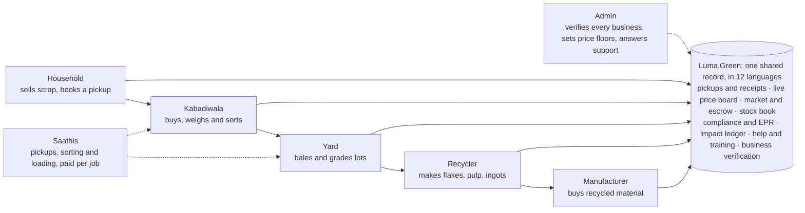
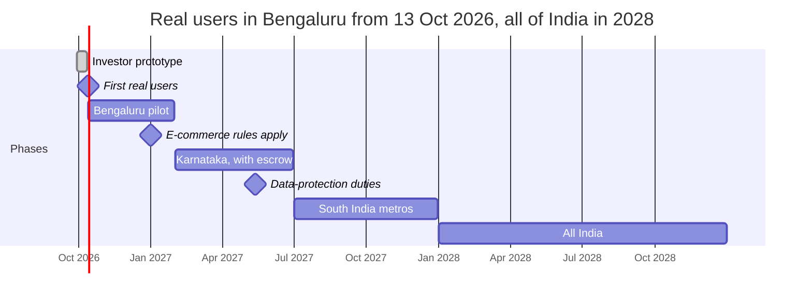

# Luma.Green Platform Plan

As of 29 September 2026. The living copy of this plan, with comments, is the Luma.Green Platform Plan doc; this file is its export.

Luma.Green aims to be the platform India's scrap trade runs on: households, kabadiwalas, Saathis, yards, recyclers and manufacturers on one ledger, with live prices, compliance built in, and help in 12 languages. This plan covers who uses it, what we build, in what order, and why.

## At a glance

Luma.Green puts India's scrap chain on one shared record: five kinds of buyer and seller, the Saathis who do the physical work, and one admin who verifies businesses and guards prices.

Material moves up the chain and money moves back: cash or UPI at the door, escrow between businesses.

Material moves right and money moves left. Every hand-off writes a receipt to the shared record, and that record powers the price board, stock, compliance and impact figures for everyone on it.

## Who uses it

Almost every user needs the same two things: parties they can trust and a weighed record of every hand-off. The Solid Waste Management Rules 2026, in force since 1 April 2026, make that a legal need too: bulk generators and sorting yards must register on a central portal and deal only with registered parties ([SWM Rules 2026](https://cpcb.gov.in/uploads/MSW/SWM_2026.pdf)). A 2014 city study found 80–85% of Bengaluru's dry waste passing through informal hands ([BBMP](<https://apps.bbmpgov.in/SWM/Home/Documents/ReportsandStudies/Extracting%20Value%20from%20Bengaluru%27s%20Dry%20Waste%20Chain_Full%20Report%20(Nov%202014).pdf>)).

| Who                                    | What they need                                                     | Phone and language                                                                                                                                                   | How Luma.Green serves them                                                                                              | When      |
| -------------------------------------- | ------------------------------------------------------------------ | -------------------------------------------------------------------------------------------------------------------------------------------------------------------- | ----------------------------------------------------------------------------------------------------------------------- | --------- |
| Household (apartment or house)         | A fair price, a pickup that turns up, a receipt                    | Own or shared smartphone; 57% of urban users prefer Indian languages ([IAMAI](https://www.iamai.in/sites/default/files/research/Kantar_%20IAMAI%20report_2024_.pdf)) | Book in four taps without an account, see each shop's offer, follow a tracking link, get an itemised receipt and points | Prototype |
| Kabadiwala                             | Steady supply, fair weighing, a buyer for sorted stock             | Basic Android, WhatsApp; icons, numbers and voice over text                                                                                                          | Pickup requests, weigh and pay, own prices above the floor, stock, sell to yards                                        | Prototype |
| Saathi (waste picker, gig worker)      | Daily paid work, dignity, an ID that is recognised                 | Basic or shared phone; Kannada, Tamil, Telugu, Bengali; low literacy                                                                                                 | Job cards with the pay shown first, earnings, training, verification with NGO partners                                  | Prototype |
| Dry-waste centre or picker cooperative | Buyers, fair prices, records for city agreements and loans         | Phone and a paper logbook                                                                                                                                            | Runs as a yard account: stock, buyer prices, records                                                                    | Pilot     |
| Yard (aggregator)                      | Supply from shops, graded bales to recyclers, working capital      | Phone plus desktop; a weighbridge                                                                                                                                    | Market to buy and sell, escrow, stock, trade receipts, e-way bill flags                                                 | Prototype |
| Recycler                               | Sorted, traceable feedstock; EPR returns                           | Desktop and phone; English and Hindi                                                                                                                                 | Verified supply, lot history, EPR totals by financial year                                                              | Prototype |
| Manufacturer                           | Graded recycled input, recycled-content targets                    | Desktop, ERP                                                                                                                                                         | Recycled material offers, escrow, compliance and EPR record                                                             | Prototype |
| Brand with EPR duties                  | Proof that collection really happened                              | Desktop                                                                                                                                                              | Evidence of chain of custody through registered processors, never self-issued certificates                              | Scale     |
| Apartment committee, office, hotel     | Registered vendors, monthly kilograms by stream                    | Phone and laptop                                                                                                                                                     | Scheduled pickups by verified vendors, monthly reports                                                                  | Scale     |
| NGO or waste-picker union              | Livelihoods and IDs; apps that include pickers, not bypass them    | Field staff on phones                                                                                                                                                | Partner console, co-run Saathi onboarding                                                                               | Pilot     |
| City official                          | Ward-level counts for the SWM rules and city rankings              | Desktop dashboards                                                                                                                                                   | Read-only ward totals, shared only with consent                                                                         | Scale     |
| CSR team, lender, auditor              | Proof of impact, trade history, audit trail                        | Desktop                                                                                                                                                              | Impact dashboard, consented trade exports, read-only audit access                                                       | Scale     |
| Luma.Green team                        | Verify every business in 12–24 h, set price floors, answer support | Desktop and phone                                                                                                                                                    | Admin console: verification queue, price tables, support inbox                                                          | Prototype |

**Languages in the pilot:** Kannada, Tamil, Telugu and Urdu first (Urdu is right to left), then Hindi and English, matched to the pilot wards. The app ships in 12 languages; Urdu layout needs a native speaker's check before 13 October.

## The market

Material reaching Indian mills is worth at least ₹1.8–2.1 lakh crore (about $20–24B) a year, and the first mile that feeds it is informal. That is our own floor estimate (cited volumes × current factory prices, ferrous scrap and recovered paper only) and it includes imports: roughly ₹1.3–1.5 lakh crore of it is collected in India.

- **Who does the work:** 1.5–4 million waste pickers, plus kabadiwalas and two or three tiers of dealers, move 60–70% of urban recyclables ([Down To Earth](https://www.downtoearth.org.in/waste/indias-waste-economy-runs-on-invisible-workers-climate-policy-keeps-forgetting-them)). They are paid in cash, often undocumented, often on a first smartphone.
- **Hand-offs:** four to six sit between a household and a factory. Each adds sorting, baling, freight, credit and a margin, so yards must also be able to buy from other yards.
- **Demand is not the problem:** India imports about 7 Mt of recovered paper a year while domestic recovery is about 30% ([Waste & Recycling Magazine](https://www.wasterecyclingmag.com/news/india-s-recovered-fibre-sector-requires-reforms-to-reach-full-potential)), and a quarter of the 41 Mt of steel scrap used in FY2024-25 was imported ([Eco-Business](https://www.eco-business.com/news/india-needs-more-scrap-to-boost-green-steelmaking-can-it-find-it/)). Collection is the bottleneck.
- **Bengaluru, the pilot:** 5,000–6,000 t of waste a day; waste pickers process about 800 t/day of recyclables; 119–164 of the 198 ward dry-waste centres still operate (the counts differ), with waste-picker ID cards expired and city agreements lapsed ([Citizen Matters](https://citizenmatters.in/invisible-workers-visible-waste-bengalurus-waste-pickers-struggle-without-recognition/)).

### Where value leaks

A Bengaluru household gets 23–50% of the factory price for common scrap. Sorting, grade, freight and credit explain part of each gap, not all of it.

| Material       | Door price, Bengaluru (₹/kg) | Factory price (₹/kg)                   | Household gets |
| -------------- | ---------------------------- | -------------------------------------- | -------------- |
| Copper         | 500–588                      | 1,394 (MCX, 28 Sep 2026)               | about 35–42%   |
| Brass          | 400–439                      | 950–990 (Delhi)                        | about 40–46%   |
| Aluminium      | 150–154                      | 293–365 (Delhi)                        | about 50%      |
| Iron and steel | 22–39                        | 36.5–41.5 (BigMint index, 23 Sep 2026) | about 55–100%  |
| PET bottles    | 10                           | 44 (Bengaluru)                         | about 23%      |
| Cardboard      | 3–8                          | 14–18 (baled, to mills)                | about 20–55%   |
| Glass          | 1–2 (often not bought)       | 5–12 (crushed cullet)                  | about 10–40%   |

Door prices: [The Kabadiwala](https://www.thekabadiwala.com/scrap-rates/Bangalore) and [scraprates.in](https://scraprates.in/bangalore); factory prices: [Upstox/MCX](https://upstox.com/commodity-market-trading/mcx-copper-price/), [Shree Metal](https://shreemetalprices.com/delhi-scrap-prices-today/), [BigMint](https://www.bigmint.co/insights/detail/india-bigmints-ferrous-scrap-index-slips-further-on-cautious-steel-market-sentiment-792405), [ScrapC](https://scrapc.com/news/pet-bottle-price/). Re-check door prices with 10–20 Bengaluru shops before they seed the live table.

The other leaks, each a feature:

1. **Rigged scales.** In 2023 police arrested 17 Bengaluru shopkeepers whose scales had remote-controlled chips ([Deccan Herald](https://www.deccanherald.com/india/karnataka/bengaluru/weighing-scale-racket-in-bengaluru-busted-by-kamakshipalya-police-1201713.html)); Bengaluru Urban logged 5,375 weights-and-measures cases in 17 months. A receipt both sides see is a trust feature.
2. **Moisture and dirt.** Wet cardboard loses 30–50% of its value. Business trades need gross weight, deduction, reason and net weight written down.
3. **Cash, credit and GST.** Since 10 Oct 2024 a registered buyer of metal scrap from an unregistered seller pays the GST under reverse charge, which squeezes yards' working capital.
4. **Price crashes.** Waste-paper collection fell 50–55% in the 2023 slump; in September 2026 mills cut scrap buying by 50–60%. A fixed minimum price can end up above the market within weeks.
5. **Nobody has the data.** Official e-waste figures range from 1.4 Mt (pollution board) to 6.19 Mt (NITI Aayog). A receipt at every hand-off, with weight, material, price, place and date, is itself an asset.

## What already exists

Of 29 platforms reviewed, none connects household bookings, kabadiwala tools and yard-to-recycler trade on one shared record; Kabadiwalla Connect in Chennai comes closest, but its household app is dormant. Household pickup is proven but thin-margin: Recykal shut its \~0.5-million-download consumer app because each pickup took 45–60 minutes ([Forbes India](https://www.forbesindia.com/article/take-one-big-story-of-the-day/how-recykal-is-cleaning-up-the-mess/70177/1)). Luma.Green wins on the traced first mile, reliability and local languages, not on the marketplace idea itself.

| Player                                                                                                                   | What it does                                                               | Scale (self-reported)                        | What it leaves open                                                                                                                                      |
| ------------------------------------------------------------------------------------------------------------------------ | -------------------------------------------------------------------------- | -------------------------------------------- | -------------------------------------------------------------------------------------------------------------------------------------------------------- |
| [The Kabadiwala + Scrapr](https://www.scrapr.app/city/bangalore)                                                         | Household pickup; partner kabadiwalas in metros, incl. 25+ Bengaluru areas | 15 cities, 5,000+ kabadiwalas, $3.33M raised | English-only app, 15 kg minimum, no photo estimate, no business chain                                                                                    |
| [ScrapUncle](https://inc42.com/buzz/cleantech-startup-scrapuncle-raises-inr-22-cr-to-expand-presence-across-delhi-ncr/)  | Own agents and collection centres, Delhi NCR                               | 300K+ pickups, ₹22 Cr raised (Jan 2026)      | Household can't choose the buyer; capital-heavy                                                                                                          |
| [Recykal.Market](https://recykal.market/plastic/)                                                                        | B2B marketplace, auctions, EPR, deposit refunds                            | ₹1,498 Cr gross revenue FY26                 | GST-verified sellers only: the informal first mile is shut out                                                                                           |
| [Attero MetalMandi](https://thebetterindia.com/448893/attero-nitin-e-waste-recycling-metalmandi-selsmart-india/)         | Metal and e-waste scrap app with AI quotes                                 | 2 lakh+ downloads, 15,000 t/month            | Built for dealers; one recycler's funnel                                                                                                                 |
| [ScrapCart](https://scrapcart.com/)                                                                                      | Factory scrap auctions, escrow partner, lab tests                          | 200+ verified buyers                         | Factories only                                                                                                                                           |
| [Karo Sambhav](https://news.microsoft.com/source/asia/features/karo-sambhav-responsible-e-waste-recycling-india/)        | EPR producer body; barcode per item                                        | 5,000 aggregators, 28 states                 | Compliance service, not a trading tool                                                                                                                   |
| [Hasiru Dala Innovations](https://hasirudalainnovations.com/)                                                            | Waste-picker-run dry-waste centres, bulk pickups                           | 33 centres, 370+ bulk clients (c. 2020)      | Stock kept on paper, entered monthly. A partner for supply, but a rival in traceable plastic sold to brands: agree who owns the brand relationship first |
| [Bintix](https://www.bintix.com/)                                                                                        | Scheduled household dry-waste pickup; sells packaging data to brands       | \~41,000 households, 6 metros                | No rate list; no choice of buyer                                                                                                                         |
| [CPCB EPR exchange](https://cpcb.gov.in/openpdffile.php?id=TGF0ZXN0RmlsZS80MzBfMTczNTYzNzY5Nl9tZWRpYXBob3RvMTM5ODcucGRm) | The only legal market for EPR certificates; full escrow                    | 4% fee; launch unconfirmed (Mar 2026)        | Informal collectors excluded                                                                                                                             |

The gaps Luma.Green fills:

1. **One record from door to factory.** Nobody links the household receipt to the yard, recycler and mill.
2. **A phone stock book for small yards** and dry-waste centres, in Indian languages. Today it is paper.
3. **Proof of origin** that registered recyclers and EPR bodies need, now for non-ferrous metals too ([Trilegal](https://trilegal.com/knowledge_repository/trilegal-update-environment-law-monthly-updates-july-2025/)).
4. **Prices as actually paid** at each hand-off, not quotes.
5. **Trust for small lots** through verification, a weight both sides see and escrow, instead of lab tests.

What we copy from them: prices shown before booking (Kabadiwala), instant payment at the door (ScrapUncle), escrow for business trades (ScrapCart), barcode-level traceability (Karo Sambhav). What we avoid: gold or "returns" as rewards (EpiCircle) and surprise pickup fees.

## Live pricing

Luma.Green builds its price board from its own verified rate cards and trades, one dated price per city, material and level each day. Exchange prices can't be the source: MCX allows only delayed data on public sites under an agreement ([MCX](https://www.mcxindia.com/technology/datafeed)), and LME charges US$25,000 a year to redistribute ([LME](https://www.lme.com/en/market-data/market-data-licensing/data-distribution)).

Today a Bengaluru household gets about ₹10/kg for newspaper against roughly ₹20/kg for mill-grade paper, and ₹60/kg for aluminium cans that trade as scrap at ₹120–290/kg ([IndiaMART asking prices, Delhi](https://dir.indiamart.com/delhi/aluminum-ubc-scrap.html)). No one publishes a dated, sourced household price. That board is the product.

| Level | Who pays whom           | Shown                           |
| ----- | ----------------------- | ------------------------------- |
| L1    | Kabadiwala → household  | Pilot, public                   |
| L2    | Yard → kabadiwala       | Pilot, to signed-in kabadiwalas |
| L3    | Recycler → yard         | At scale                        |
| L4    | Manufacturer → recycler | At scale                        |

**What counts as a price.** Completed trades weigh 1.0, but only if weighed, confirmed by both sides and paid by a recorded method. Rate cards from verified shops and the admin's weekly phone survey weigh 0.5. Exchange prices and IndiaMART asking prices weigh 0: the admin reads them for judgment only.

**The daily calculation** (06:00 IST, re-runnable by the admin):

1. Take the last 7 days (14 if fewer than 3 businesses report).
2. Drop prices outside the admin's plausible band, from unverified businesses, and self-trades. Merge related accounts (same phone, GSTIN, PAN or UPI ID).
3. Keep one value per business; with 4 or more, drop any more than 30% from the median.
4. Publish the weighted median as "typical", with the low–high range, rounded to ₹0.50 on screen.
5. Mark it **Live** only with 3+ independent businesses, one with a trade; otherwise **Guide**, showing the admin's fallback and its review date.
6. Hold any move over ±10% a day (paper, plastic) or ±5% (metals) until the admin confirms. Never show a household price below the floor.

**Keeping it honest.** Paper and plastic rate cards stay fresh 14 days, metals 7, with a one-tap "are your prices still right?" reminder. If over 20% of a shop's pickups pay more than 5% below its posted card, the card leaves the board. Karnataka's ₹2,384 crore fake scrap-invoice case (May 2026) shows why circular trades must be filtered ([News Karnataka](https://newskarnataka.com/bengaluru/karnataka-uncovers-%E2%82%B92384-crore-fake-gst-credit-racket/16052026/)).

**The admin stays in control.** Floors and fallbacks are dated per city and material. The console suggests values (fallback = 28-day median; floor = 75% of it) and every change goes in the audit log. Floors protect households; shops price freely above them, which lowers the risk that a shared floor reads as coordinated buying prices under the Competition Act (counsel to confirm).

**In the prototype now:** a public Bengaluru board with 30 days of sample prices, the 7-day change and a sparkline per material, admin floors and fallbacks, and each kabadiwala's own rate card that can't go below the floor. Every number carries a "Sample data" label until real trades flow. Area boards (area → city → state → national) and a licensed metals reference come at scale.

## Law and compliance built in

Compliance is a feature users pay attention to, so each rule becomes a screen, a reminder or a document the app fills in. Every threshold, rate and date lives in an admin-editable rulebook with an effective-from date: at least six of these numbers changed between July 2024 and January 2027. This is research, not legal advice; a lawyer and a tax adviser review it before real money moves.

| Area                    | The rule                                                                                                                                                                                                                                                                                                                                             | What Luma.Green does                                                                                                                           |
| ----------------------- | ---------------------------------------------------------------------------------------------------------------------------------------------------------------------------------------------------------------------------------------------------------------------------------------------------------------------------------------------------- | ---------------------------------------------------------------------------------------------------------------------------------------------- |
| Money                   | Holding users' money needs RBI payment-aggregator authorisation (₹15 crore net worth) ([RBI](https://www.rbi.org.in/Scripts/BS_ViewMasDirections.aspx?id=12896))                                                                                                                                                                                     | Pilot records cash and UPI only. Business escrow later runs through an authorised aggregator's marketplace product; the prototype simulates it |
| GST on metal scrap      | Since 10 Oct 2024 a registered buyer from an unregistered seller pays GST under reverse charge and self-invoices within 30 days; 2% TDS on contracts over ₹2.5 lakh ([Notification 06/2024](https://gstcouncil.gov.in/sites/default/files/2024-10/ctr-06-2024.pdf), [25/2024](https://gstcouncil.gov.in/sites/default/files/2024-10/ct-25-2024.pdf)) | Receipts pick the right document from the seller's GST status and material code                                                                |
| E-way bills             | Motor-vehicle loads over ₹50,000 need one; a handcart or cycle doesn't ([Rule 138](https://taxinformation.cbic.gov.in/content/html/tax_repository/gst/rules/cgst_rules/active/chapter16/rule138_v1.00.html))                                                                                                                                         | Trades above the limit are flagged on the trade and its receipt                                                                                |
| Weighing                | Electronic scales re-verified every 12 months, beam scales every 24 ([Legal Metrology Rules r.27](https://indiankanoon.org/doc/67045693/))                                                                                                                                                                                                           | Scale records with a reminder 30 days ahead; "scale verified until" on the shop card                                                           |
| Pollution-board consent | KSPCB consents run 5 years (Red, Orange) or 10 (Green), checked on the [XGN register](https://xgn.karnataka.gov.in/CSHARP/ALLConsentOrder.aspx)                                                                                                                                                                                                      | Consent number and expiry captured at onboarding, shown with days left on the compliance screen                                                |
| Hazardous streams       | E-waste, batteries, tyres and used oil may go only to registered recyclers, refurbishers or collection agents                                                                                                                                                                                                                                        | Those materials can only be sold to businesses whose registration the admin verified                                                           |
| E-commerce rules        | From 1 Jan 2027: grievance officer, 48-hour acknowledgement, seller details, ranking explained, yearly dark-pattern audit ([G.S.R. 789(E)](https://consumeraffairs.gov.in/public/upload/admin/cmsfiles/whatsnews/E_Commerce_Amendment_Rules_2026_2026-09-11_18-12-39.pdf))                                                                           | Support desk with timers, shop cards with address and rating, "why this shop?" explanation                                                     |
| Personal data           | DPDP core duties from about 13 May 2027; penalties to ₹250 crore ([DPDP Rules 2025](https://www.dpdpa.com/DPDP_Rules_2025_English_only.pdf))                                                                                                                                                                                                         | Consent per role, rights requests within 30 days, a 6-hour CERT-In breach runbook; phones masked until a shop accepts a pickup                 |
| Gig workers             | Karnataka's 2025 Act: registration within 45 days, a welfare fee of 1% per payout, capped per job ([SCC Online](https://www.scconline.com/blog/post/2026/02/18/karnataka-government-notifies-gig-workers-welfare-fee-mandatory/))                                                                                                                    | Saathi work register, written terms, fee calculator                                                                                            |

**EPR, the second price.** Six producer-responsibility regimes are live: plastic packaging, e-waste (including solar panels), batteries, tyres, used oil and end-of-life vehicles. Certificates are made only from a registered recycler's records, which must be backed by invoices, entered in date order and capped at plant capacity. CSE reported about 7 lakh fake plastic certificates, 38 times what recyclers could have produced ([CSE](https://www.cseindia.org/is-the-polluter-really-paying-in-india-s-plastic-packaging-waste-management-ecosystem--12445)); the NGT's 2024 case named a Karnataka recycler ([SCC Online](https://www.scconline.com/blog/post/2024/07/31/ngt-issues-notice-cpcb-moefcc-recovery-of-6-lakh-fake-epr-certificates-from-plastic-recycling-companies/)).

| Regime                                                                                     | FY2026-27 target                                                                    | Certificates made by                      | Portal                 |
| ------------------------------------------------------------------------------------------ | ----------------------------------------------------------------------------------- | ----------------------------------------- | ---------------------- |
| [Plastic packaging](https://cpcb.gov.in/uploads/plasticwaste/PWM-Amendment-Rules-2022.pdf) | Recycle 70% of rigid, 50% of flexible and multilayer; 40% recycled content in rigid | Registered plastic processors             | eprplastic.cpcb.gov.in |
| [E-waste](https://cpcb.gov.in/uploads/Projects/E-Waste/FAQ_ewaste_23012024.pdf)            | 70% of estimated e-waste (80% from 2027-28)                                         | Registered recyclers and refurbishers     | eprewaste.cpcb.gov.in  |
| [Batteries](https://cpcb.gov.in/uploads/hwmd/Battery-WasteManagementRules-2024.pdf)        | Recovery 90% (portable, EV), 60% (automotive, industrial)                           | Recyclers registered with the state board | eprbattery.cpcb.gov.in |
| [Tyres](https://eprtyres.cpcb.gov.in/rules/pdf/amendment-Rules-2024.pdf)                   | 100% of tyres sold two years earlier                                                | Registered recyclers, retreaders          | eprtyres.cpcb.gov.in   |
| [Used oil](https://eprusedoil.cpcb.gov.in/public/images/Annexure3.pdf)                     | 20% of oil sold in 2024-25                                                          | Re-refiners, co-processors                | eprusedoil.cpcb.gov.in |
| [End-of-life vehicles](https://eprelv.cpcb.gov.in/static/doc/ELV_Rules_2025.pdf)           | 8% of the steel in vehicles sold in 2006-07 or 2011-12                              | Registered scrapping facilities           | eprelv.cpcb.gov.in     |

Luma.Green doesn't trade certificates. Today they transfer on CPCB's portals; a CPCB-authorised exchange built by MSTC (approval pending as of June 2026) will host trading and bars brokers. Luma.Green supplies what the certificates rest on: a chain of custody from the first kabadiwala, receipts for sellers without a GSTIN, and exports shaped like each portal's forms. Records are tamper-evident and stated as supporting evidence, never as certification. The prototype's compliance screen already shows recyclers and manufacturers kilograms by family for the April–March year and which rules apply.

## Carbon and renewable energy

Recycling earns no compliance carbon credits in India today, so Luma.Green's job now is to record every kilo well enough that any future credit can be claimed, once. India's compliance market (CCTS) expects its first trades around October 2026, but none of its approved offset methodologies covers material recycling: 8 per [IETA](https://www.ieta.org/uploads/wp-content/Resources/Busines-briefs/2025/IETA_Business_Brief-India_July_final-one.pdf) in 2025, while the ICM portal now lists 12, to recheck before any pitch.

**Plastic credits are the realistic route, with a catch.** One credit is one tonne of plastic collected or recycled, selling for $106–804 on [PCX](https://www.pcxsolutions.org/plastic-crediting-process), against a 2024 voluntary carbon average of $6.34 per tonne of CO2e ([Ecosystem Marketplace](https://3298623.fs1.hubspotusercontent-na1.net/hubfs/3298623/SOVCM%202025/Ecosystem%20Marketplace%20State%20of%20the%20Voluntary%20Carbon%20Market%202025.pdf)). But under Verra's collection methodology, plastic already covered by mandatory EPR is not additional unless compliance is below 50% ([PWRM0001](https://verra.org/wp-content/uploads/2022/06/PWRM0001_Plastic-Waste-Collection-Methodology-v1.1.pdf)). Plastic-credit revenue stays out of the base case.

**What every credit route asks for, and Luma.Green records:**

- a lot ID for every hand-off, linked to the lots it came from, with a mass balance at each sorting run (tracing is by mass balance, not by following one household's bottle into a bale)
- gross, deduction and net dry weight in grams, from a named scale with its stamping date
- both sides' confirmation, the payment reference and the receiver's pollution-board consent
- where and when: exact sites for businesses, ward-level only for households
- one claim per lot across EPR certificates, plastic credits and carbon credits, so nothing is counted twice

The impact screen shows CO2e avoided as an estimate from sample data and says so. The pilot adds two more numbers beside it, kept apart: credit-ready (evidence complete) and issued (verified by a standard).

**Solar: the best offer is for yards and recyclers, not homes.** Karnataka has 938 MW of rooftop solar, about 2.9% of India's 32.6 GW ([MNRE](https://cdnbbsr.s3waas.gov.in/s3716e1b8c6cd17b771da77391355749f3/uploads/2026/09/202609081073775955.pdf)), though KERC opened net metering to every consumer up to 1 MW in August 2026. Homes on the state's free-power scheme (Gruha Jyothi) already get their first units free, so their savings are small.

| Case (BESCOM, net metering)             | System | Cost after subsidy | Saved a month   | Pays back in  |
| --------------------------------------- | ------ | ------------------ | --------------- | ------------- |
| Home paying its bill, 350 units a month | 3 kW   | ₹57,000            | ₹1,815–2,246    | 2.2–2.8 years |
| Home on the free-power scheme           | 2 kW   | ₹30,000            | ₹148–300        | 11–34 years   |
| Sorting yard, 2,500 units a month       | 15 kW  | ₹4.06 lakh         | ₹6,600–10,816   | 3.2–5.4 years |
| Plastic recycler, 60,000 units a month  | 200 kW | ₹54.2 lakh         | ₹1.32–1.83 lakh | 2.5–3.5 years |

Worked from [KERC's 2026 solar tariff](https://kerc.karnataka.gov.in/uploads/48561787653428.pdf), MNRE cost benchmarks and the [PM Surya Ghar](https://pib.gov.in/newsite/erelcontent.aspx?relid=292054) subsidy (homes only, up to ₹78,000). Next: a "your yard could save ₹X a month" card on business dashboards, and old panels, inverters and batteries as scrap categories routed to authorised recyclers, since solar makers must store waste modules under the e-waste rules.

**In the prototype now:** a `/solar` calculator for homes and businesses with the subsidy, a lead form, and an impact screen with kilos recycled, CO2e avoided and a credit-ready ledger explainer. The calculator assumes ₹55,000–65,000 per kW, typical quotes above MNRE's ₹45,000 benchmark; its tariff and cost figures move into editable tables in the pilot.

## Fitting into what exists

Luma.Green records each hand-off once and exports it in the formats the trade already runs on, rather than replacing city systems, CPCB portals or factory software. One yard-to-factory truckload already needs about six documents (purchase order, weighbridge slip, quality report, receipt note, GST invoice, e-way bill), spread across Tally, WhatsApp and paper.

| System                                                                                                | What we exchange                                                                                            | How                                                     | When                        |
| ----------------------------------------------------------------------------------------------------- | ----------------------------------------------------------------------------------------------------------- | ------------------------------------------------------- | --------------------------- |
| City: Greater Bengaluru Authority, its 5 corporations, BSWML                                          | Ward totals out (kg by material, verified shops and Saathis); ward boundaries and dry-waste centre lists in | Data MoU, read-only dashboard, monthly CSV              | Pilot                       |
| [CPCB SWM portal](https://cpcb.gov.in/uploads/MSW/SWM_2026.pdf) (registration live since 31 May 2026) | Each party's registration number; weighed quarterly returns                                                 | Export shaped like its forms; no public API             | Pilot                       |
| Swachh Survekshan and Garbage Free Cities ratings (MoHUA)                                             | Monthly dry-waste processed and where it went                                                               | Export the city uploads                                 | Pilot                       |
| Dry-waste centres and MRFs                                                                            | Luma.Green is their register: daily weight sheet, sale register, monthly report                             | Built in                                                | Pilot                       |
| NAMASTE waste-picker scheme                                                                           | Scrap-sale receipts as proof of occupation; the scheme ID on the Saathi profile                             | City or NGO login                                       | Pilot                       |
| KSPCB consents ([XGN register](https://xgn.karnataka.gov.in/CSHARP/ALLConsentOrder.aspx))             | Consent number, category and validity                                                                       | Admin checks by hand (the lookup sits behind a CAPTCHA) | Fields now, checks in pilot |
| CPCB EPR portals                                                                                      | Chain-of-custody exports for recyclers' claims                                                              | Export                                                  | Scale                       |
| GSTN, through a licensed GST provider                                                                 | GSTIN check at onboarding; later e-invoices and e-way bills                                                 | API                                                     | Pilot, then scale           |
| DigiLocker, through API Setu                                                                          | A consented licence or PAN to verify a Saathi; no Aadhaar number stored                                     | API                                                     | Pilot                       |
| [Tally](https://help.tallysolutions.com/import-data-in-tally/) (2.7 million+ businesses)              | Purchase, receipt-note and sales vouchers with HSN and kg                                                   | CSV and Excel laid out like Tally's import files        | Pilot                       |
| WhatsApp                                                                                              | Document packs and status updates                                                                           | Phone share sheet and wa.me links; no paid API yet      | Pilot                       |
| Waste-picker groups (Hasiru Dala, the union)                                                          | Co-design, Saathi and dry-waste-centre onboarding                                                           | Partnership                                             | Pilot                       |

**Logistics: pool the business loads, not the household ones.** Hired transport can't pay for a household pickup: [Porter's](https://porter.in/trucks/bangalore) cheapest Bengaluru mini-truck starts at ₹230 a trip, over ₹9/kg for a 25 kg lot when newspaper fetches about ₹10/kg. Household pickups ride on kabadiwalas' own vehicles, with a limit per time slot and a drop-off nudge for small loads. The logistics features go into pooled kabadiwala-to-yard loads: fill one vehicle from several shops, estimate freight, weigh at both ends and flag the gap, and check whether an e-way bill is needed.

**Payments: record now, escrow through a licensed partner later.** The pilot moves no money: it records cash, UPI and bank references. Escrow later costs about 0.1–0.25% per held transfer through a payment aggregator, but RBI's September 2025 rules allow split settlement only once Luma has ₹40 lakh of its own turnover ([RBI](https://www.rbi.org.in/Scripts/NotificationUser.aspx?Id=12896&Mode=0)). Until then, the route is a bank escrow with a trustee or each yard onboarded as its own merchant. Collecting trade money would also make Luma.Green withhold 0.5% GST TCS and 0.1% income-tax TDS on every trade. The prototype's escrow is simulated and says so.

## Support, help and training

For kabadiwalas and Saathis who read little, the help that works is a real person on WhatsApp or the phone, backed by picture-and-voice step cards. Microsoft Research's India trials found text interfaces unusable for first-time low-literacy users, and a live operator about 10 times more accurate than text ([Microsoft Research](https://www.microsoft.com/en-us/research/publication/designing-mobile-interfaces-for-novice-and-low-literacy-users/)). WhatsApp support chats that the user starts cost nothing ([Meta](https://developers.facebook.com/docs/whatsapp/pricing/)).

**In the prototype now:**

- A public help centre at `/help` with search across every guide and answer, and topics from signing in to disputes and privacy.
- A hub for each of the six roles (household, kabadiwala, Saathi, yard, recycler, manufacturer): 45 guides of 3–6 illustrated steps, 8–12 FAQs each, tutorial slots marked "video coming soon", and a short training path with progress and a completion badge.
- A contact form that lands in the admin's support inbox with the person's role and topic.
- 12 original illustrations (a kabadi shop, a scale, an auto-rickshaw pickup, yard bales, a Saathi in gloves, a solar roof), drawn for Luma.Green.
- The app's menu opens each person's own help hub.

**Service levels for the pilot** (to publish only once at least two people share the rota; one founder can't meet them alone):

| Channel                               | Hours                | First reply                        | Resolved within                                 |
| ------------------------------------- | -------------------- | ---------------------------------- | ----------------------------------------------- |
| WhatsApp, text or voice note          | 8 AM–8 PM, every day | 15 minutes                         | Same day for pickup-day problems, else 24 hours |
| Phone, same number                    | 8 AM–8 PM            | Answer, or call back in 30 minutes | As above                                        |
| Help form in the app                  | Any time             | 2 hours in working hours           | 24 hours                                        |
| Business applications                 | —                    | —                                  | A decision in 12–24 hours                       |
| Safety: harm, threat, theft, accident | Any time             | Call back in 10 minutes            | Same day; pause the account if needed           |
| Saathi pay or termination complaint   | —                    | 48 hours                           | 14 days                                         |

**Training, next:** a doorstep onboarding kit for every pilot kabadiwala and yard; "Saathi Ready", a first-job module with a picture quiz; 30–60 second show-me videos shot with real Bengaluru kabadiwalas; voice on every card, recorded by native speakers.

**Design for low literacy.** About 1 in 5 Indian adults cannot read, and 88% of India's mobile browsing is Chrome on Android ([StatCounter](https://gs.statcounter.com/browser-market-share/mobile/india)). So field screens lead with pictures, numbers and voice. Done in this build: rupees in lakh grouping in every language, trade steps and dialogs that fit a 375 px phone. Next: buttons of at least 44 px on field screens, a "Hear it" button, automatic SMS-code fill-in, and PNG app icons so Chrome offers "Install".

## Standards the industry can adopt

Luma.Green publishes open material codes and six trade norms that any scrap business can adopt without using the app. Nothing is invented: India's customs tariff already uses ISRI grade names for scrap (10 copper grades under 7404 00 12, about 40 aluminium grades under 7602 00 10), so each code links a doorstep word to a tariff line, an ISRI or IS 2549 grade and an EPR category.

**Luma Material Codes.** The prototype ships 26 codes; v0.1 of the open standard grows to 60 in three tiers: household (what a family sells), trade (what a kabadiwala sorts for a yard) and industrial (what a recycler makes). Codes are ASCII, never renamed or reused, and carry local names as search and voice aliases. A sample:

| Code (v0.1) | Material                  | Doorstep names                    | Tariff line (HSN) | Reference grade             |
| ----------- | ------------------------- | --------------------------------- | ----------------- | --------------------------- |
| PAP-ONP     | Old newspapers            | raddi (Hindi, Marathi, Kannada)   | 4707 30 00        | ISRI 58; moisture ≤12%      |
| PAP-OCC     | Cardboard boxes           | gatta (Hindi), attai (Tamil)      | 4707 10 00        | ISRI 11: prohibitives ≤1%   |
| PLA-PET     | PET bottles               | Teri (Delhi), botal               | 3915 90 42        | Resin 1; EPR plastic Cat I  |
| PLA-FILM    | Carry bags, film          | Panni (Delhi)                     | 3915 10 00        | Resin 4; EPR plastic Cat II |
| FER-HMS1    | Heavy melting steel No. 1 | bhari loha                        | 7204 49 00        | ISRI 200–202; IS 2549:2023  |
| NFE-BRASS   | Yellow brass              | peetal (Hindi), hittale (Kannada) | 7404 00 22        | ISRI Honey                  |

Sources: [ISRI Scrap Specifications 2024](https://www.isrispecs.org/wp-content/uploads/2024/04/isri-specs2024final.pdf), tariff lines for [copper](https://www.eximguru.com/indian-customs-duty/7404-copper-waste-and-scrap.aspx), [paper](https://www.eximguru.com/hs-codes/4707-recovered-waste-and-scrap-paper.aspx), [plastics](https://www.eximguru.com/hs-codes/3915-waste-parings-and-scrap-of.aspx) and [ferrous scrap](https://www.eximguru.com/hs-codes/7204-ferrous-waste-and-scrap-remelting.aspx), [Plastic Recycling Decoded (CSE)](https://www.cseindia.org/content/downloadreports/10885). The street names need checking with 10 Bengaluru kabadiwalas: seesa (lead) and sheesha (glass) sound alike.

**The six norms:**

1. **Grade it.** Dry, sorted, within the code's contamination limit. Food-soiled paper, thermocol and multi-layer packets are "low value or not bought", said up front.
2. **Weigh it fairly.** A stamped scale, the reading shown to the seller, the weight recorded in grams.
3. **Write a receipt at every hand-off.** Gross weight, deduction and its reason, net weight, rate, total, payment method, and the HSN code on business receipts.
4. **Keep the chain.** Every lot links back to the receipts it came from, so a recycler can show where material began.
5. **Deal only with verified businesses.** GSTIN where registered, pollution-board consent, and a recycler's EPR registration before it buys e-waste, batteries or tyres.
6. **Protect business payments.** Money is held until the buyer confirms delivery.

**Tax on each family** (Notification 9/2025, from 22 Sep 2025): 5% for paper, glass cullet and rags; 18% for plastics, metal scrap, e-waste and batteries ([gazette copy](https://cdn.taxo.online/wp-content/uploads/2025/09/09_2025-CTR.pdf)). Metal scrap sold by an unregistered seller to a registered buyer is taxed on the buyer under reverse charge ([VJM Global](https://www.vjmglobal.com/blog/tds-and-gst-under-rcm-on-supply-of-metal-scrap)).

**Run as an open standard:** public change requests, version numbers, a CSV and JSON download, crosswalks to HSN, ISRI, EN 643, IS 2549 and the EPR categories, and an invitation to trade bodies to co-own it. The prototype's `/standards` page publishes the codes and norms today.

## Roadmap

Luma.Green goes from this prototype to real users in Bengaluru on 13 Oct 2026, then one state, one region and the country, each step opened by a gate. Two rule changes set the pace in 2027: the e-commerce duties from 1 Jan and the data-protection duties from about 13 May.

The gates, as targets we set ourselves:

1. **Go live (13 Oct 2026):** SMS sign-in, admin verification and the A-to-Z test all pass; 10 kabadiwalas and 2 yards verified in Bengaluru.
2. **Leave the pilot (end of Jan 2027):** 1,000 completed pickups; most bookings accepted within 2 hours; the price board Live for the 5 biggest materials; grievance desk and seller details in place for the e-commerce rules.
3. **Karnataka (Feb–Jun 2027):** business escrow through an RBI-authorised aggregator; dry-waste centres on board as yards; privacy centre ready before 13 May 2027.
4. **South India metros (Jul–Dec 2027):** a new city opens with the nearest city's fallback prices × a city factor; area price boards; the material codes offered to trade bodies.
5. **All India (2028):** state-by-state consent and trade-licence checks, and the first-mile scrap index published monthly.

## Built first

The first build makes the whole chain work end to end on the dev deployment, with a seeded Bengaluru demo world and nine demo logins: [pull request #24](https://github.com/ungaaaabungaaa/Luma.Green/pull/24). Every screen reads and writes live data, in 12 languages, phone first; no money moves and escrow is simulated.

| Area                            | What works                                                                                                                                                        | How it was checked                                                                                                                                        |
| ------------------------------- | ----------------------------------------------------------------------------------------------------------------------------------------------------------------- | --------------------------------------------------------------------------------------------------------------------------------------------------------- |
| Households                      | Sell in four steps with each shop's offer; tracking link with the receipt and points                                                                              | Booked a pickup in the browser, followed it to the paid receipt                                                                                           |
| Kabadiwalas                     | Requests (address hidden until accepted), trip, weigh and pay, own prices above the floor, stock, sell to yards                                                   | Accepted, weighed and paid that pickup; a price below the floor was refused; listed 100 kg                                                                |
| Yards, recyclers, manufacturers | Buy and sell up the chain, escrow steps, numbered trade receipts, e-way bill flags                                                                                | Dispatched, confirmed delivery (escrow released), requested a lot, opened a trade receipt                                                                 |
| Saathis                         | Jobs near home first, take and mark done, earnings                                                                                                                | Finished one job and took another                                                                                                                         |
| Every business                  | Impact (kg, CO2e by material) and compliance (GST, consent days left, checklist, EPR record by financial year)                                                    | Checked for the yard and the manufacturer                                                                                                                 |
| Admin                           | Verification queue with SLA, per-role checklist, private document viewer, decisions that create the business, price floors, support inbox                         | 122 automated tests; the live document route answers CORS and refuses requests without a token (the browser walk-through needs the admin's authenticator) |
| Public site and help            | The chain's story, price board with 30-day charts, open material codes, solar calculator, how it works; help centre with 45 illustrated guides, FAQs and training | Every page checked at 375 px; Kannada and Urdu (right to left) spot-checked                                                                               |

Across the build: 900+ unit and integration tests (convex-test for every Convex function), 33 end-to-end tests on a production build, lint and typecheck, and screenshots of 17 screens in the README with an A-to-Z test plan.

**Fixed while testing:** signed-in people were sometimes sent to the login page; rupees now group in lakhs (₹4,01,000); the price dialog and solar planner no longer overflow a phone; trade steps fit at 375 px; the app header's logo was missing on phones; the compliance screen called trade receipts "tax invoices"; "How it works" still told the old carbon-credit story; the demo stock now covers every seeded trade.

## Risks and open questions

The biggest risks are legal timing, overclaiming, and the politics of the informal sector, not technology. Each has a guard in the plan.

| Risk                                     | Why it matters                                                                               | Our guard                                                                                                                                |
| ---------------------------------------- | -------------------------------------------------------------------------------------------- | ---------------------------------------------------------------------------------------------------------------------------------------- |
| Legal review lands after real users      | The pilot starts 13 Oct; terms, receipts and the rulebook need a lawyer and a CA             | Book the review for 6–12 Oct. Open with household pickups and kabadiwala tools; switch on business trades and Saathi jobs once it clears |
| Overclaiming traceability                | A 2,000 kg bale can't be traced to single household bottles; yards pool and re-sort          | Trace by mass balance and say so; records are supporting evidence, never certification                                                   |
| Exchange prices on public pages          | MCX and LME forbid unlicensed display, and factory prices can turn kabadiwalas against us    | No exchange number on any public screen; reference prices stay with the admin                                                            |
| Shared price floors read as price-fixing | Competition Act s.3 covers coordinated buying prices                                         | Floors framed as household protection; shops price freely above them; counsel to confirm                                                 |
| Price crashes                            | Waste-paper collection fell 50–55% in 2023; a stale floor stops trade                        | Floors as a share of the reference price, a suspend switch, dated rows                                                                   |
| Hazardous material to the wrong buyer    | E-waste, batteries, tyres and used oil may go only to registered handlers                    | Sell only to businesses whose registration the admin verified; decide whether to hide them from the household pilot                      |
| Gig-worker law                           | National social-security rules and Karnataka's 2025 Act may treat us as an aggregator        | Saathi work register, written terms, fee calculator; counsel on classification                                                           |
| Making informal shops visible            | SWM Rules 2026 fine unregistered collectors and sorters                                      | City exports carry totals only; business data shared with consent; a "help me register" task                                             |
| Data retention                           | DPDP wants logs kept a year; we promise to delete household photos at 90 days                | Delete images, keep a hash and metadata; counsel to reconcile                                                                            |
| Weights read as certified                | App weights are not Legal Metrology instruments                                              | Receipts say "recorded weight"; the stamped scale stays the legal record                                                                 |
| Waste-picker politics                    | Bengaluru's picker agreements have lapsed; an app seen as bypassing pickers meets resistance | Co-design with Hasiru Dala and the union; pickers must earn more, not less                                                               |
| Support promises one person can't keep   | 15-minute replies and 10-minute safety callbacks                                             | A rota of at least two before 13 Oct; auto-accept limited to shop hours                                                                  |
| Plastic-credit revenue                   | Collection already covered by EPR may not be additional                                      | Kept out of the base case                                                                                                                |
| Escrow eligibility                       | Split settlement needs ₹40 lakh of our own turnover                                          | Bank escrow with a trustee, or each yard as its own merchant                                                                             |
| Demo data mistaken for real firms        | Real GSTINs or consent numbers in a pitch would mislead                                      | Demo GSTINs fail the GSTIN checksum, names are invented, and every screen with sample figures says so                                    |

**Decisions for the founders:**

- [ ] Keep e-waste and batteries out of the household pilot until authorised-buyer routing exists?
- [ ] Which reference-price source to license, if any (delayed MCX, BigMint)?
- [ ] Interview 10–20 kabadiwalas on margins and street names before households see reference prices.
- [ ] Pilot wards, and the language order (Kannada, Tamil, Telugu, Urdu, then Hindi and English).
- [ ] What businesses pay after the pilot (free until then).
- [ ] Confirm Karnataka's e-way bill limit for moves within the state, and whether EPR now covers non-ferrous metal scrap.

## Sources

Eighteen researchers opened 339 pages on 29 Sep 2026, most of them gazettes, regulators' portals and dated news; every figure above links to its page. The full list, grouped by topic, is in [docs/plan/sources.md](plan/sources.md).
