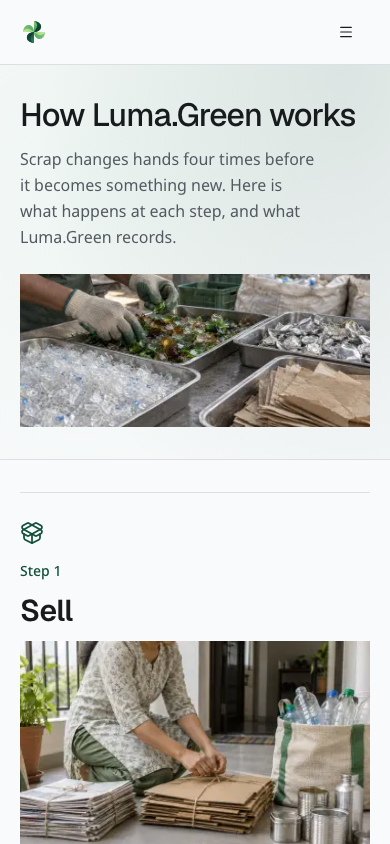
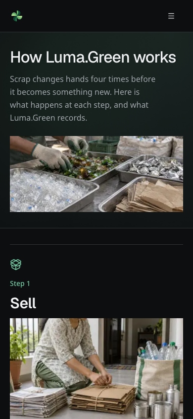
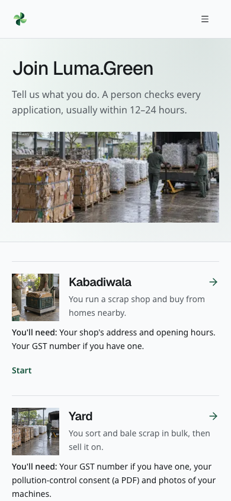
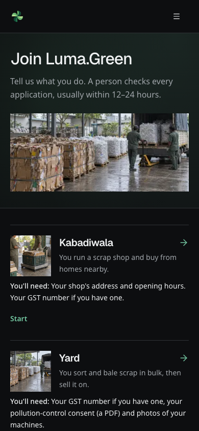
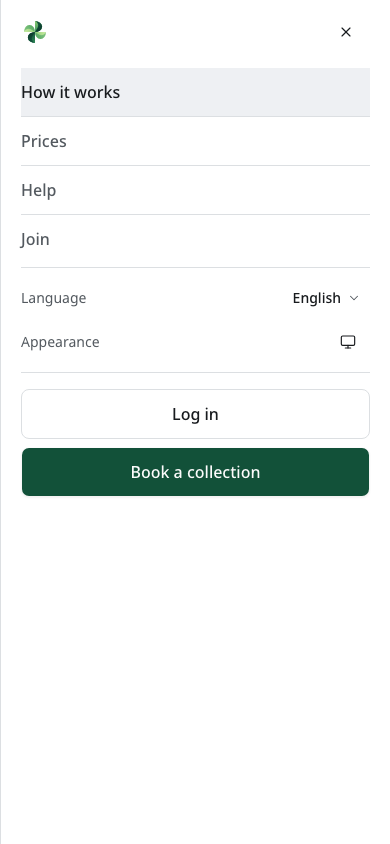
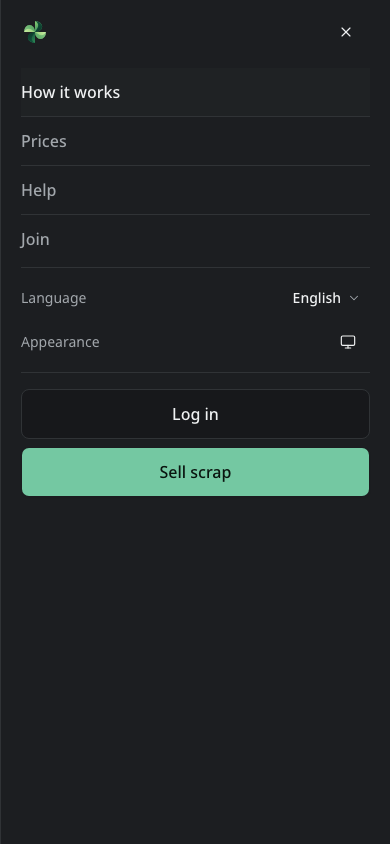
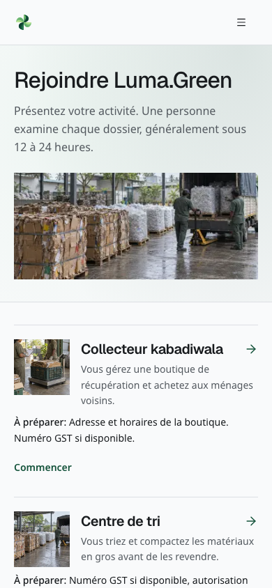
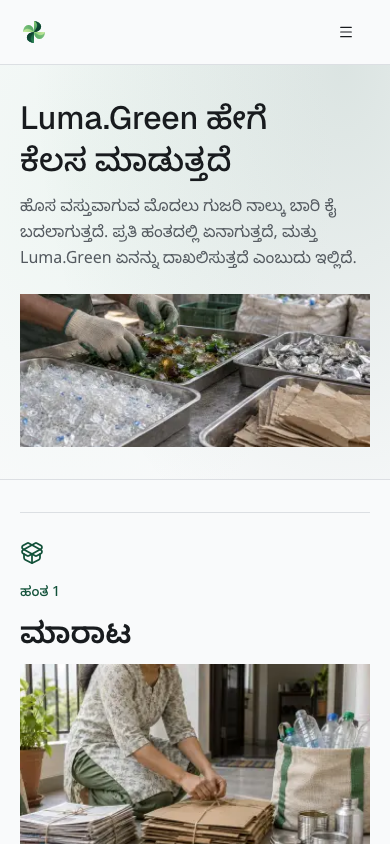

# Luma Green

Cleaner Tomorrow in Motion.

**Product review and team test pack — 2 October 2026**

From a household pickup to a recorded material trade, the platform gives each
person in the recycling chain a clear next action. The team has built the
working software foundation. The next task is to prove it with controlled
accounts, approved providers and a measured Bengaluru pilot.

This pack is for the founder, team and early investor conversations. It shows
product scope and engineering work. It does not claim customers, revenue,
transaction volume, market share, investment returns or regulatory approval.
Demo quotes are labelled. The entity is not registered yet.

## 1. The product in one minute

Luma.Green connects households, kabadiwalas, sorting yards, recyclers,
manufacturers and Saathis. An admin verifies applicants and manages prices and
support. Each role gets a workspace for its part of the material journey.

The first loop is simple: select scrap, compare available shop offers, book a
pickup, record the actual weight, record cash or UPI payment, and keep the
receipt. The second loop moves available material from shop to yard, recycler
and manufacturer. Stock reservations and audit records connect these actions.

The proposed long-term value is continuity: fewer disconnected records between
people who handle the same material. Whether that saves time and improves
recovery must be measured in the pilot. Carbon credit issuance and retirement
remain future work, not a current certificate or revenue stream.

## 2. What the team has built

| Area       | Current scope                                                                 | Evidence boundary                                                                           |
| ---------- | ----------------------------------------------------------------------------- | ------------------------------------------------------------------------------------------- |
| Recovery   | Material basket, offers, pickup/drop-off, tracking, weighing and receipts     | Complete live flow needs controlled accounts, configured backend and SMS                    |
| Trade      | Role-based market, listings, reservations, trades, stock and receipts         | Escrow is simulated; no payment provider moves money                                        |
| People     | Five application types, saved drafts, document checks and admin review        | Approval, file access and lifecycle cases need staging execution                            |
| Work       | Saathi jobs, acceptance, completion and earnings views                        | No automated wage payout or employment-status determination                                 |
| Operations | Admin verification, prices, support and bounded pilot reports                 | Reports must separate real and demo records; truncation is reported                         |
| Access     | Phone OTP with optional user authenticator; admin password, TOTP and recovery | Local previews create no session; SMS/email and recovery custody need controlled acceptance |
| Languages  | 33 maintained catalogues and 26 material names per locale                     | Structural/ICU coverage is complete; native-speaker review remains                          |
| Updates    | Private inbox, read states and optional browser/mobile/desktop alerts         | Credential setup, signed builds and physical delivery remain separate gates                 |
| Devices    | Responsive web, Expo mobile shell and Electron desktop shell                  | Signed releases, stores, physical-device checks and updates remain gates                    |

These numbers describe code and catalogue coverage. They are not adoption or
performance figures. The material catalogue is a product reference; sample
rates and emission factors are not verified market or certification data.

## 3. A calmer interface with useful detail

The interface uses open sections, dividers and compact lists. Main public pages
have relevant banners, six new work scenes and practical preparation, weighing and business-verification detail. Image corners remain unchanged. On phones and tablets,
navigation, language, appearance and account actions sit inside the menu.

Headings and descriptions follow a consistent spacing rhythm. Compact controls
stay on one line; longer headings and body text can wrap. Selected sections use
subtle text and colour effects. Reduced-motion preferences disable animation.

## 4. Home in light and dark

These browser captures show disconnected local UI, without customer data. Each
light and dark pair uses the same route and viewport; it proves appearance only.
A connected demo can show labelled sample prices. An unavailable feed keeps its
loading or unavailable state.

<!-- pair -->

<!-- /pair -->

## 5. How it works in light and dark

The banner provides context. The following steps explain who handles material
and what gets recorded. The image is decorative artwork in the real page, not
a fabricated product screenshot.

<!-- pair -->

<!-- /pair -->

## 6. Join and the compact menu

Role requirements stay close to the role description. Language, appearance and
account actions follow navigation without an empty full-height gap.

<!-- pair -->

<!-- /pair -->

<!-- pair -->

<!-- /pair -->

## 7. Translated examples

French and Kannada show the same workflow with different script and text
length. Arabic uses right-to-left layout. Japanese loads its configured script
font. These are review examples; language fluency still needs a human reviewer.

<!-- pair -->

<!-- /pair -->

<!-- pair -->

<!-- /pair -->

## 8. How the system is built

The business API connects approved owners to their ERP or reporting system. It reads scoped business, material, stock and trade records. Keys expire and can be revoked; the API cannot change the ledger or move money. Optional industry news needs an approved provider plan and remains unavailable without configuration.

| Layer        | Choice                                                 | Why it matters to this product                                                         |
| ------------ | ------------------------------------------------------ | -------------------------------------------------------------------------------------- |
| Web          | Next.js 16, React 19, TypeScript                       | Server components and static public pages reduce browser work; types protect contracts |
| Interface    | Tailwind 4, vendored shadcn/Radix, shared Lucide icons | Shared controls, keyboard behavior, semantic themes and consistent spacing             |
| Data         | Convex and guarded server functions                    | Live operational views, transaction boundaries and audit records                       |
| Identity     | Better Auth on Convex                                  | Phone access plus a separate admin authentication flow                                 |
| Forms        | React Hook Form and Zod                                | Shared rules check fields in the browser and on the server                             |
| Localisation | next-intl, Geist and Noto script fonts                 | Locale-aware navigation, numbers, dates and RTL layout                                 |
| Quality      | Vitest, Testing Library, Playwright, strict lint/types | Logic, role guards, browser behavior and responsive layout checks                      |
| Delivery     | GitHub checks and Vercel; Expo and Electron shells     | Reviewed web releases with separate native release gates                               |

Money uses integer paise; mass uses integer grams. Formatting happens at the
edge in the selected language. Shared private data must not enter a public
cache. Public editorial pages are prerendered; operational views stay live and
permission checked. Static rendering already gives public content on the first
response, so forcing request-time rendering would add work without a benefit.

## 9. What the evidence means

The delivery handoff records the exact current commits and test results. The
maintained user guide contains detailed screen instructions and clearly marked
protected-screen fixtures. This pack adds a team execution manual. A manual
case is a task to run, not a result that has already passed.

| Evidence                           | What it can establish                                                | What it cannot establish                                      |
| ---------------------------------- | -------------------------------------------------------------------- | ------------------------------------------------------------- |
| Unit and policy tests              | Logic, schema rules, permissions and expected failures under test    | Real account approval or physical operations                  |
| Browser checks and visual review   | Layout, navigation, local validation and configured script rendering | SMS receipt, real payment or field usability                  |
| Labelled protected-screen fixtures | Current component appearance with synthetic records                  | Sign-in, backend writes or production permissions             |
| Build and hosted CI                | The named revision builds and passes the named suite                 | All integrations are configured correctly                     |
| Provider acceptance record         | The named provider accepted a controlled request                     | Handset delivery or the whole end-to-end journey              |
| Pilot evidence                     | The observed users and workflows in the recorded period              | Market-wide impact, carbon certification or guaranteed growth |

## 10. A seven-minute team demonstration

1. Open Home on a phone-sized viewport. Show the material story, labelled demo prices or the disconnected price state,
   labelled demo quotes and primary actions.
2. Open How it works. Explain household, shop, yard, recycler and manufacturer
   hand-offs. State which information is recorded at each step.
3. Open Join. Compare applicant requirements. Show the language menu in Kannada
   and Arabic, then return to the demo language.
4. Open phone sign-in in the disconnected build. Continue to the labelled OTP
   preview. Explain that this preview sends no code and grants no access.
5. Use the labelled fixture harness to show a shop request, weighing, trade and
   admin review. Keep the fixture banner visible. Use staging instead when the
   test lead has approved controlled accounts and data.
6. Show safe account-security and inbox fixtures with no keys or codes. Then open the maintained guide and choose one role case from the attached manual.
   Explain setup, expected result and the evidence that the tester must save.
7. Close with the next milestone: a controlled, measurable Bengaluru pilot.
   Assign an owner to each unresolved account and operational gate.

## 11. Accounts and APIs to finish

Before the next Convex release, combine and review this branch's backend changes with the parallel ecosystem branch. Do not overwrite that work's production additions with an older schema or function set. This review records local implementation and tests; it does not claim a new backend release.

The repository has the integration code. Creating an account, approving its
templates and proving a real request are separate jobs. Do not paste secrets
into this pack or a ticket. Use the provider dashboard and a team password
manager. The full values and locations are in the account/deployment checklist.

| Priority and owner               | Service or decision                                                                                  | Completion evidence                                                                        |
| -------------------------------- | ---------------------------------------------------------------------------------------------------- | ------------------------------------------------------------------------------------------ |
| Pilot — founder + engineering    | Register entity, choose domain ownership, verify Vercel production binding and HTTPS                 | Owner, billing, DNS, canonical origin and deployed revision recorded                       |
| Pilot — engineering              | Separate Convex development, staging/demo and production; connect each frontend to the right backend | Matching deployment IDs, schema, guards, backup and restore drill                          |
| Pilot — founder + operations     | MSG91 account; DLT principal entity, sender and approved OTP/Flow templates                          | Approval IDs stored securely; controlled send accepted and handset receipt observed        |
| Pilot — engineering              | Better Auth secret, allowed origins, admin setup and recovery custody                                | Controlled login, sign-out, TOTP, role denial and recovery tests                           |
| Pilot — operations               | Verified shops, locations/radii, real price source and support contact                               | Admin-reviewed records, prices with owner/date and support drill                           |
| Optional — engineering           | Resend sender for admin recovery; VAPID keys; Expo/EAS and APNs/FCM push setup                       | Admin reset keeps 2FA; controlled inbox/permission/revocation and physical-delivery checks |
| Optional — engineering           | OpenRouter or approved self-hosted vision gateway                                                    | Spend cap, labelled photo evaluation, manual fallback and privacy review                   |
| Optional — product + engineering | PostHog/GA4 and Sentry                                                                               | Consent-based safe page view and scrubbed error received in each enabled provider          |
| Optional — founder               | Google Search Console and Bing Webmaster Tools                                                       | Domain ownership accepted and sitemap fetched                                              |
| Native — release owner           | Apple/Google developer accounts, signing and store submissions; desktop signing/update hosting       | Named signed builds, real-device results and tested update/rollback                        |
| Later — founder + finance        | Payment provider, escrow model and partner/legal terms                                               | Approved money flow and settlement/reconciliation plan before implementation               |

Industry API access also requires the additive backend migration and owner acceptance checks. Optional news needs a suitable NewsAPI plan, a daily quota and a controlled live request; local tests do not establish provider access.

Razorpay, Cloudflare R2, Mapbox and WhatsApp Business are not prerequisites
for manual-entry pilot operation. Do not buy them only because their names
appear in a roadmap. Files currently use Convex storage; location can use the
browser. Resend is optional for admin password recovery. Push credentials are optional for device alerts; inbox records do not prove alert delivery. Apple Developer, Google Play and Expo/EAS accounts are not yet set up. Optional AI does not set prices.

Setup references: [account checklist](../operations/launch-checklist.md),
[service inventory](../operations/services.md),
[SMS operations](../operations/sms-notifications.md),
[observability](../operations/observability.md),
[native releases](../operations/app-releases.md).

## 12. Demo data and gentle load testing

The offline plan defines 48 business examples, 82 synthetic identities, all 26
materials and connected sample listings, trades, bookings, stock movements and
jobs. A fixed seed and timestamp make the logical dataset reproducible. Its
validator checks references, integer units and balance rules.

It is not installed in a database. Identity mapping, upload ownership, missing
industry outputs and deployment isolation still need decisions. The same
reviewed manifest can later drive both approved targets; copying live user
records is not part of that plan. Do not use the legacy whole-table reset.

The owner has authorised a separate additive price-only seed for demonstration.
Show those values with the sample-price notice when the backend is connected;
keep unavailable/loading states for missing connections and pending reads.
Do not present sample prices or history as verified market quotes. This limited
price seed does not authorise importing the wider demo identity and trade data. The
gentle stress plan must run on disposable staging, with bounded concurrency,
stop limits and scoped cleanup. It does not authorise stress tests against
production. See the [demo plan](../product/demo-seed-plan.md).

## 13. The next six months

The proposed sequence is: prove one pilot loop, improve repeatability, validate
the chain trade, prepare integrations, then decide what merits expansion.
Each month has an owner and a verifiable exit. The full plan follows the manual
in this document. Dates are planning targets, not commercial promises.

The immediate decision is not how many features can be added. It is whether
the team can complete a pickup, produce a trustworthy receipt, resolve an
exception and reproduce the evidence. Use the test manual below to make that
decision visible.

## 14. Legal and trademark work

India is the first jurisdiction; the entity is not registered. The appended
checklist covers entity choice, founder/IP records, a trademark search and
filing brief, terms/privacy/partner documents, data protection and regulated
recycling roles. No registration, name clearance, contract approval or legal
opinion is claimed. A qualified adviser must settle entity and filing choices.

Do not display the registered trademark symbol before registration is granted.
Keep identity evidence and signed legal documents in restricted storage, with
owners and versions; this repository holds the work checklist only.
