# Luma Green platform user guide

How to use the recycling platform and its admin console

Edition: 7 October 2026, verified accounts, business workspaces, stakeholder requests and payment limits. Source baseline: f5c5b91. Each capture manifest records the exact reviewed source and image hashes. Launch target: Saturday, 10 October 2026; check the release handoff for current deployment and setup status.

This guide explains verified email and phone accounts, business workspaces, stakeholder requests, material collection, trade, quality evidence, sourcing and production records. Use the steps for your assigned role and workspace. Read the screenshot labels before using an example as a reference.

For the current candidate, automated checks, deployment status and open setup tasks, read the [release handoff](../delivery/handoff.md). Local test results do not prove live email or SMS delivery, provider approval or payment execution. Use the [manual test document](../testing/team-end-to-end-manual.md) to record your team's own results.

Audience: households, kabadiwalas, preprocessors, recyclers, manufacturers, Saathis, invited team members, stakeholder applicants and the platform owner.

This guide explains the current application. Use the release handoff to check the deployed version. Signed mobile and desktop releases, live account setup and provider checks remain launch tasks.

---

## 01 / Start here

Luma.Green records material collection and movement through the recycling chain. A household sells recyclable materials. A kabadiwala collects and sorts it. A preprocessor buys and prepares bulk material. A recycler supplies recovered material. A manufacturer buys it. A Saathi takes local jobs.

### Your first ten minutes

Use this guide beside the application. The chapter numbers are the same in the Word and Google Docs copies. Read one numbered step, do that step, then check its result. Do not press the next action until the current result is visible.

1. Ask the owner for the current test address and your assigned account alias. The local address works only on the Mac running the test services. It does not open that Mac's app from a teammate's separate laptop. Use the owner's deployed test address when one is supplied.
2. Open the address in a browser. Start with English for the first run. Select another language after you understand the route. Use the appearance control to choose light or dark mode.
3. Read the home page. Open **View material prices**. A sample-data notice means the values are test examples. An unavailable price is not a zero price.
4. Open **Sign in**, or add /login to the supplied address. Use **Email** with the account from the restricted credentials annex. Keep the password out of this guide, screenshots and bug reports. For an existing verified test account, use **Sign in**, not **Create account**.
5. After sign-in, open the account menu. Open **Workspaces and team**. For a business account, check the selected business and your role. For a household, applicant or stakeholder without a workspace, an empty workspace list is expected.
6. Business users open /app. Read the business name before making a change. Desktop navigation is at the side. On a phone, use the bottom navigation and **More** for the remaining pages.
7. Open **Notifications** and **Account security** from the account menu. Confirm that both pages load. Do not turn on an authenticator during this first tour unless the test lead assigns that case.
8. Return to your role's chapter below. When finished, use **Sign out**. Open a private page again to check that sign-in is required.

If a page shows a connection or sign-in service error, record it and use the offered retry after service returns. Do not create another account to work around the error. If the account's role is wrong, stop and ask the test lead to check its assignment.

### Find the instructions for your work

| Your task                                           | Read these chapters | Check before you act                                                    |
| --------------------------------------------------- | ------------------- | ----------------------------------------------------------------------- |
| Book and follow a household collection              | 03–05               | Correct phone account, material estimate, chosen shop and time          |
| Receive household requests and record shop work     | 08–11               | Correct shop, accepted request, actual scale weight and agreed rate     |
| Buy or sell business material                       | 11–15               | Correct workspace, available stock, buyer eligibility and payment state |
| Record processing and material hand-offs            | 11                  | Whole grams, balanced outputs and correct receiving business            |
| Take a Saathi job                                   | 16                  | Correct job, agreed terms and current status                            |
| Apply for business, generator or stakeholder access | 06–07               | Correct account type; approval does not give unrestricted data access   |
| Invite or manage colleagues                         | 02                  | Correct business, exact invited email and least required role           |
| Review applications and run platform administration | 17–23               | Separate platform-admin account; do not use a workspace administrator   |
| Use help, settings or account notifications         | 24, 27, 34–38       | Correct account; a device alert is separate from an inbox entry         |
| Connect a business system                           | 39                  | Owner permission and a protected place to store the new key             |
| Run the two-person acceptance check                 | 40                  | Agreed candidate, assigned accounts and an empty result sheet           |

### Read each screen in this order

First read the page title, account and workspace. Then read its status, quantity and date. Open one record before changing it. Use the labelled action once, wait for its result, and check the saved record. Reload once to check that a saved change persists. A toast alone is not enough when the list or record disagrees.

Tabs switch the list shown on the same page. The active tab has an underline. On Requests, **New**, **Today** and **Done** show different booking states. Use the arrow keys when a tab has keyboard focus, or select a tab directly. A change in underline must also change the displayed list. Scroll within the page to see lower sections; do not assume that a screen ends at the bottom of a screenshot.

### Read the screenshot labels

These labels describe the conditions at capture time. Each manifest records the source fingerprint, capture time, image hash and review. A screenshot shows one state; it does not prove every action on that screen or a later deployment.

- Current local capture in the original manifest: an unchanged browser screenshot of the app at that time without a backend connection. Setup messages are real states, not errors added to the picture.
- Current configured local capture in the original manifest: the app at that time with test analytics keys. External browser requests are intercepted; no provider receives data.
- Current connected demo capture in the original manifest: the local app at that time read approved sample prices from the development backend. It proves that view can read the demo records, not production frontend deployment or verified market prices. No account is signed in and no record is changed.
- Synthetic documentation fixture: an unchanged browser screenshot of real application components supplied with sample records in a separate documentation server. It is not an authenticated session or proof of a working integration.

No screenshot is an AI-generated interface. Public pages contain generated decorative artwork, but the page screenshots themselves come from the browser. Text in the guide explains the controls; it does not paint controls over a screenshot.

### Explore the home page

The home page starts with Book a collection, View material prices and For businesses. The materials
section shows the main recyclable material groups. Each material row opens the collection entry page.
Choose your exact materials and quantities in the booking flow; the home page does not save a selection. The pickup section explains the steps and links to the first
pickup guide.

The shop section explains how a kabadiwala receives requests and records work.
Use its join link to start an application, or open the shop help page. The weighing
section explains how estimates become a final record. Payment takes place outside
the platform; the shop records the agreed amount after payment.

The records section explains the information kept as materials move through the
chain. Read Standards for material codes and trading rules. The questions section
opens short answers and links to role-specific help. Reading these sections does
not create an account, submit an application or book a pickup.

The moving material line names material groups; it is not a list of partners. Use its pause control to stop movement. Reduced-motion settings show the names without movement.

The testimonial section is labelled **Demo testimonials**. Its role-based quotes are sample content, not reviews from real customers.

Dates inside synthetic screenshots belong to their test records. The fixed
13–20 October report range is a reporting preset retained from the prototype.
Neither changes the current launch decision target of **Saturday, 10 October
2026**. The owner confirms the actual launch only after the release checks pass.

### Three limits to remember

1. Household payments are recorded after cash or UPI payment outside the platform.
2. Business trades require provider-confirmed live payment before dispatch. Live activation is off until approved policy, provider and release gates pass. Sandbox evidence never unlocks live trade actions. Older prototype payment records are unverified.
3. EPR and impact records are supporting records, not issued certificates or verified carbon credits.

All paths in this guide are relative to the deployment address supplied by the platform owner. The current isolated local test app uses http://localhost:3100 with local Convex ports 3210 and 3211. Earlier captures used other local origins, including port 3107, or a separate fixture server. Their manifests retain those origins. Cloud development and production were reset, verified empty and paused on 6 October; the local test app is separate. Do not infer a live release or current cloud data from a screenshot.

---

## 02 / Choose your access

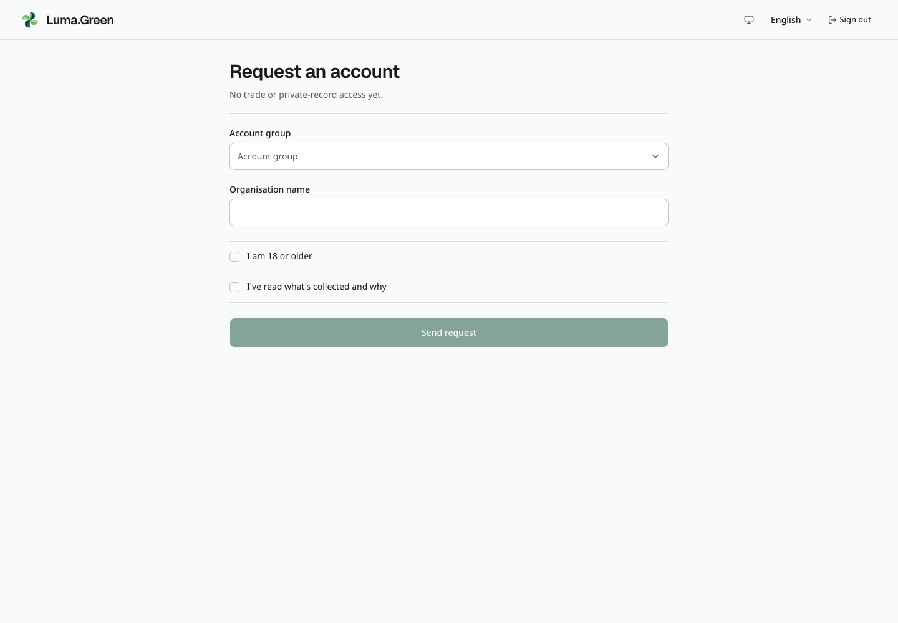

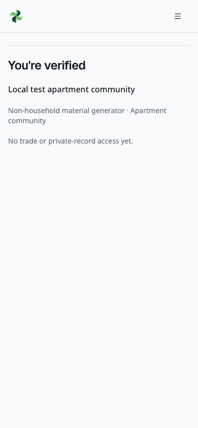

| User                                             | Entry point                           | What grants access                                                                     |
| ------------------------------------------------ | ------------------------------------- | -------------------------------------------------------------------------------------- |
| Visitor                                          | /                                     | No sign-in for public information                                                      |
| Household                                        | /sell; /login                         | A verified phone-only account, or a verified email account with its own phone verified |
| Applicant                                        | /join, then /login                    | Verified email and password, or phone code; application submission                     |
| Kabadiwala, preprocessor, recycler, manufacturer | /app                                  | Approved business and current workspace membership                                     |
| Invited team member                              | Invitation email; /account/workspaces | The invited verified email identity and an accepted invitation                         |
| Saathi                                           | /app                                  | Approved Saathi application and full sign-in                                           |
| Stakeholder applicant                            | /join/stakeholder                     | Full sign-in; approval confirms identity only                                          |
| Platform admin                                   | /admin/login                          | Configured admin email, password and authenticator                                     |

An application awaiting review does not give operational access. Each business sees its permitted records. A link to another business's page does not grant permission. A household's contact details become available to the assigned shop after it accepts the booking. Account security and the personal inbox remain available to signed-in households and applicants without business approval.

### Choose the correct test account

The restricted annex lists the disposable account email and password for each
alias below. This public guide lists purposes only. Never use the same password
for a real account. An account name is not a permission: check the selected
workspace and current role after sign-in.

| Test account alias                                 | What to open and check                                                                                                                     |
| -------------------------------------------------- | ------------------------------------------------------------------------------------------------------------------------------------------ |
| household                                          | Personal security and inbox. Verify the assigned unused test phone on this email account, or use the assigned phone-only booking identity. |
| household-coordinator                              | Personal security and inbox. Coordinator-wide access has not been granted; do not expect other households' bookings.                       |
| applicant                                          | Join form or own application status, security and inbox. No approved-business operations.                                                  |
| kabadiwala                                         | Assigned shop home, Requests, Prices, Stock, Sell, Buy, Trades and Lots and quality.                                                       |
| preprocessor                                       | Assigned preprocessing workspace, stock, buying, selling, trades, lots and permitted compliance records.                                   |
| recycler                                           | Assigned recycling workspace and its permitted material and evidence pages.                                                                |
| manufacturer                                       | Assigned manufacturing workspace, input buying and eligible byproduct selling.                                                             |
| fibre-maker, textile-maker, garment-maker          | Separate manufacturer test businesses using the current manufacturer screens. A subtype name does not prove a dedicated production module. |
| saathi                                             | Job board, own work and earnings records; personal security and inbox.                                                                     |
| apartment, office, hotel, resort, other-generator  | Non-household material-generator request and own status, security and inbox. Approval does not create a trading workspace.                 |
| city-official, csr-sponsor, lender, auditor, union | Own stakeholder request/status and account pages. No automatic private business report or finance access.                                  |
| apparel-brand, packaging-brand                     | Own brand-account request/status and account pages. No automatic EPR certificate or private supply-chain access.                           |
| team-admin                                         | The workspace administrator role granted through an accepted invitation. It is not a platform-admin account.                               |
| team-member                                        | The invited member's permitted operational actions in its assigned business.                                                               |
| team-viewer                                        | Read-only access to permitted records in its assigned business.                                                                            |
| invite-recipient                                   | Invitation acceptance and wrong-account/expired/replayed invitation cases assigned by the test lead.                                       |
| unrelated-owner                                    | Its own separate shop; denial when attempting another business's private records.                                                          |

These are 28 development identities. The platform-admin identity and phone
verification fixtures are controlled separately. The lead supplies their
procedure only when needed. The test roster does not create new production
users or promise that all specialist workspaces are implemented.

### Verify a mobile number on your email account

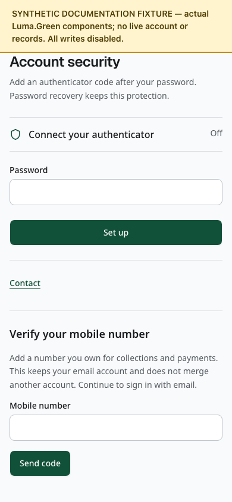

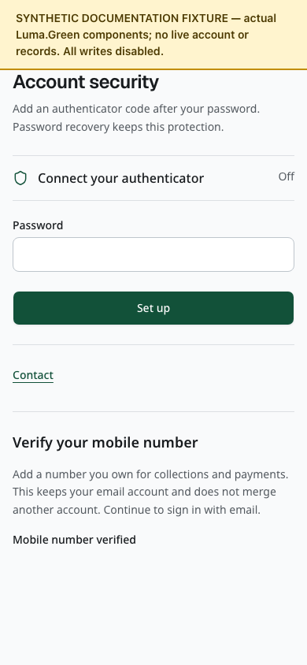

Use this when a collection or payment check requires phone ownership. It adds
one unused Indian mobile number to your current verified email account.

1. Sign in with your verified email and password. Complete your authenticator
   challenge if enabled. Open the account menu, then **Account security**.
2. Find **Verify your mobile number**. Enter your own number in **Mobile
   number**, then select **Send code**. If phone delivery is unavailable, stop;
   the test lead must supply the approved local procedure or configure MSG91.
3. Enter the **6-digit code** and select **Verify**. Wait for **Mobile number
   verified**. The success screen does not display the number's digits.
4. For a wrong number, select **Change number** before completion. For another
   code, wait for the resend countdown, then select **Send a new code**.
5. If asked to sign in again, use **Sign in again**, complete email/password and
   any authenticator challenge, then repeat the phone verification.
6. Continue to sign in by email. This step does not create a new session, remove
   your authenticator, replace an existing verified number or merge accounts.
   A number already owned by another account must be rejected.

Local tests use only the lead's assigned unused synthetic number and private
verification procedure. Do not enter another teammate's number or a guessed
code. Never put phone digits or codes in the shared guide or screenshots.

### Choose a workspace

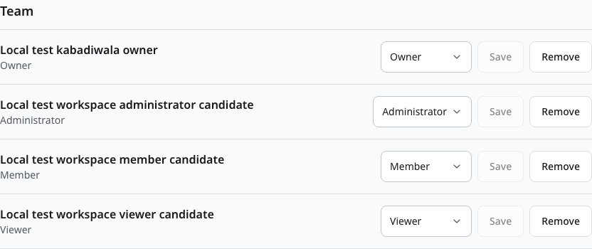

Open the account menu, then **Workspaces and team**, or use /account/workspaces. Select **Choose workspace** beside a business you can access. Check the business name and your role before opening its app. The selection applies to business reads and actions; it does not create membership or change the business type.

If access to the selected business is removed, the app asks you to choose another available workspace. It does not silently move an action to another business. If no workspace is available, follow your application status or ask an authorised team manager about access. A stakeholder approval alone does not create a business workspace.

### Understand team roles

These roles apply inside one business. A workspace **Administrator** is separate from the platform admin who reviews applications.

| Workspace role | Access                                                                                                                    |
| -------------- | ------------------------------------------------------------------------------------------------------------------------- |
| Owner          | Read and operate the business; manage all team roles and invitations; manage business API keys                            |
| Administrator  | Read and operate the business; invite, change or remove members and viewers; cannot manage owners or other administrators |
| Member         | Read and perform permitted business operations; cannot manage the team or API keys                                        |
| Viewer         | Read permitted business records; cannot perform business operations or manage access                                      |

Business type and workflow state still limit every role. Owner access does not enable an unavailable payment step. Only an owner can make an existing member an owner. The business must retain at least one owner; add another owner before removing or reducing the last owner's role.

### Invite a team member

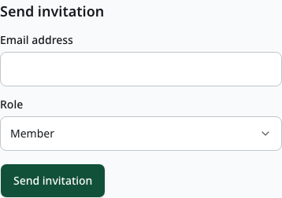

1. As an owner or authorised administrator, select the correct workspace.
2. In **Send invitation**, enter the person's email address and select an allowed role. Invitations do not grant the owner role.
3. Select **Send invitation** once. Check **Pending invitations**, the expiry date and delivery status.
4. The recipient opens the email link within seven days. They sign in with that exact verified email account, or create and verify it first.
5. The recipient checks the business name and role, then selects **Accept invitation**. The invitation works once and selects that workspace.

If **The invitation limit has been reached** appears, wait before sending another invitation. Do not press Send invitation repeatedly or create another account to avoid the limit. Keep the intended recipient and role unchanged, then make one attempt after the waiting period.

Email service acceptance is not proof of inbox delivery. If delivery is not confirmed, check the address and service before issuing a replacement. An expired or revoked invitation cannot be accepted. An invitation also stops working if its sender no longer has permission to grant its role.

If the recipient is signed in with a phone account or another email address, use **Switch account** on the invitation page. Sign in or register with the invited email address. Reopen the original email link if needed. This does not merge accounts or move existing bookings or applications. Keep the invitation link private.

If the invitation page shows **Something went wrong**, select **Try again**. Keep the page open while it retries and checks your signed-in email. If you closed or reloaded the page and the invitation is no longer available, reopen the original invitation email link. Do not send the link in a bug report.

### Change or remove access

Use the role control in **Team** and save the change. To remove a person, select **Remove**, check the confirmation and confirm once. Use **Revoke** in **Pending invitations** to cancel an unused invitation. Read the result before leaving the page.

Permission is checked on each protected request. Removing membership blocks future access to that workspace, including from an already open page. A lower role limits later actions. It does not delete the person's account or erase the business's records. Downloaded files cannot be recalled, so share them only through the approved business process.

### Before the owner opens the pilot

Connect the frontend to the intended Convex backend. Configure email delivery and complete the MSG91 account and DLT/template checks before live SMS use. Set actual prices and support contacts. Test each account and workspace role with isolated local users, then complete the required provider and deployment checks. The end of this guide contains the owner checklist.

---

## 03 / Email, phone sign-in and languages

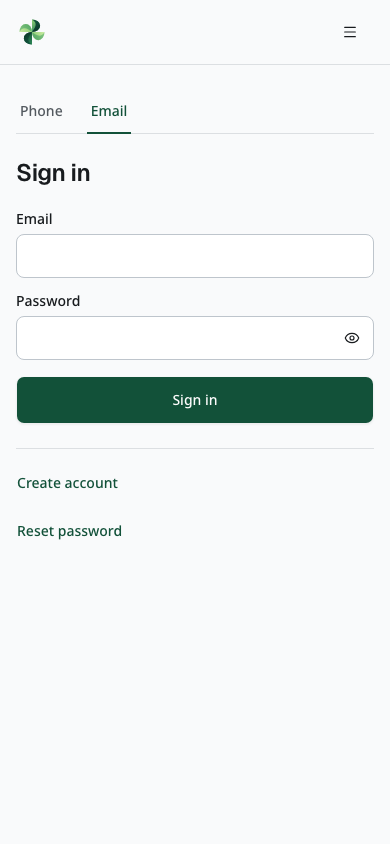

Open /login. If the language chooser appears, use Search or scroll the list. Select a language, check the current choice and select Continue. The next screen has **Phone** and **Email** tabs.

### Create and verify an email account

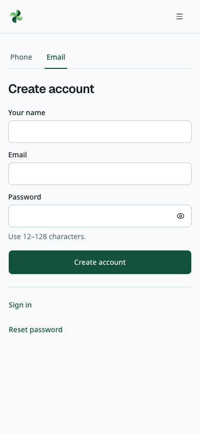

1. Select **Email**, then **Create account**.
2. Enter your name, email address and a password of 12–128 characters. Submit once.
3. Open the verification email within 15 minutes. On the verification page, select **Verify email**. Opening the link alone does not complete verification.
4. After success, return to /login and sign in with that email and password.
5. If an authenticator is enabled, complete its code or an unused recovery code. Wait for the session to finish loading before opening a private page.

An unverified email account cannot sign in. Use **Resend verification** after the unverified-email message if the link is missing or expired. Creating the same account again does not replace its password. Verification confirms the mailbox; it does not approve a business or grant workspace access.

Normal email verification, recovery and team invitations need configured Resend delivery. If delivery is unavailable, the page says so; existing verified email accounts can still sign in. A successful request does not prove inbox delivery. The current email messages are in English; their destination pages support the selected language.

### Reset an email password

1. In the **Email** tab, select **Reset password** and enter your email address.
2. If the account is eligible, open the received link within 15 minutes.
3. Enter and repeat a new password of 12–128 characters, then select **Set new password**.
4. After success, sign in again. Complete the authenticator or recovery-code check if enabled.

The reset link works once. A reset ends existing sessions and keeps the authenticator and recovery codes. Unknown, unverified and phone-only accounts receive a neutral response without a reset email. Use the separate admin recovery route in chapter 18 for the configured platform admin.

### Sign in with a phone code

1. Select **Phone** and enter your Indian mobile number. The form supplies +91.
2. When delivery is configured, request the code and enter the six digits from the message.
3. If an authenticator is enabled, complete its code or an unused recovery code.
4. Wait for the full session, then continue to your approved role or application status.

The language list uses each language's own name and its English name. Search
filters the list. Selecting a row sets the choice; Continue applies it and opens
the sign-in choices. You can use the language control in the header later.

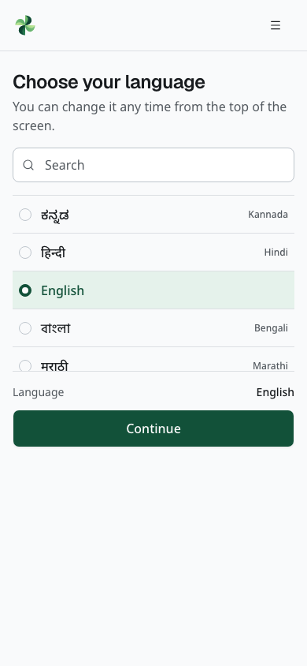

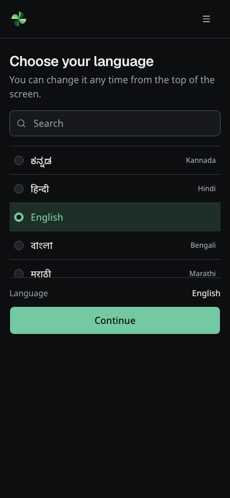

If code delivery is not configured, select Preview code screen after entering a valid mobile number. The next screen is labelled as a preview. You can inspect and enter the six code digits, but Verify and Resend are disabled. No SMS is sent, no account is created and no private page is opened. Use Change number to go back. The phone number stays in this browser tab, not in the address.

SMS codes expire after five minutes and allow five attempts. Wait 30 seconds before resending. Per-number limits also apply. Use the displayed retry control if delivery fails.

Phone-only sign-in is passwordless. Independently created email and phone accounts remain separate identities. A verified email user can attach one unused mobile number from Account security (chapter 02); this does not merge accounts or enable phone-code sign-in to that email account. There is no self-service account merge, email change or replacement of an existing verified number. Sign in with the account that owns the booking, application or membership. A phone code cannot enter an email or admin account.

See chapter 37 for authenticators, recovery codes and account settings. Normal sessions last up to 30 days. Sign in again after expiry, and sign out on shared devices. Language does not change your role. The isolated local test inbox is a developer test tool, not a sign-in method for cloud development, preview or production.

The 33 languages are English, Hindi, Bengali, Marathi, Telugu, Tamil, Gujarati, Kannada, Malayalam, Punjabi, Urdu, Arabic, Assamese, Odia, Nepali, Sinhala, Spanish, French, German, Italian, Portuguese, Dutch, Polish, Russian, Ukrainian, Turkish, Indonesian, Malay, Vietnamese, Thai, Japanese, Korean and Simplified Chinese. The language control shows the current language in its own script, for example English or العربية. On public pages and operational screens, phones and tablets keep it in the menu. Sign-in screens keep it in the header, as do wider desktop screens. Open the control to choose another language. On phones, the brand appears as its icon; the full name appears on wider screens. Arabic and Urdu use right-to-left layouts. The admin console is English-only. All translated catalogues have automated coverage checks; native-speaker review is still required before launch. Adding a language does not change the pilot region, the Indian number required for phone sign-in and booking, or the rupee currency.

---

## 04 / Household: book a collection

The collection flow shows four progress labels: Materials, Partner, Time and Review. A filled circle marks the current step. A check marks a completed step. Material rows show their selection with a check; enter the estimated weight after you select a row. The household flow stays at /sell. Its address uses a step query parameter; there are no separate /sell/estimate or /sell/book pages.

1. Select the materials you have. Enter estimated quantities.
2. If photo estimates are enabled, take or select a photo. Check each suggested material and weight. Correct them before continuing. Manual entry remains available.
3. Choose a nearby shop. Compare its material prices and whether it offers pickup or drop-off.
4. Choose pickup or drop-off and the offered time. Supply the location and address required by the form.
5. Review the material list, estimate, shop and time.
6. Use Confirm and book with the SMS code. If protection is on, also complete the authenticator or recovery-code check. Successful full verification submits the booking automatically. If already signed in, use the booking button once.
7. Save the tracking link shown after booking.

Booking requires a verified mobile number on the current account. Before booking with an email account, open Account security and verify your unused number as described in chapter 02, then return to /sell. Alternatively, use the assigned phone-only account. Switching to a separately created phone account does not transfer an email account’s records or memberships.

The estimate is not the final payment. The shop records the actual weight and the agreed material rate at collection. A photo estimate does not set a price and is not a certified measurement. It accepts one optional photo. Keep faces, documents and number plates out of the image. The photo goes to the configured AI provider for the estimate; Luma.Green does not save it.

The draft is kept in this browser tab during the flow. A closed tab or reset can remove the draft. A submitted booking is a backend record. Do not treat a draft as a confirmed booking.

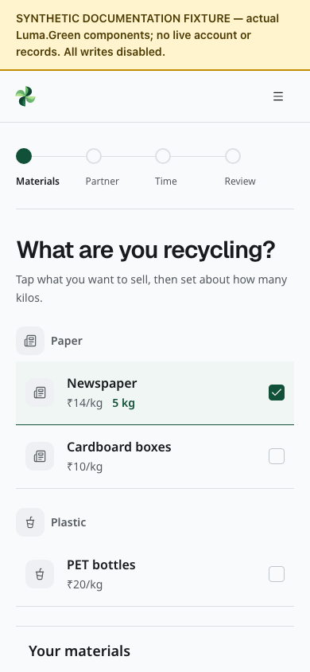

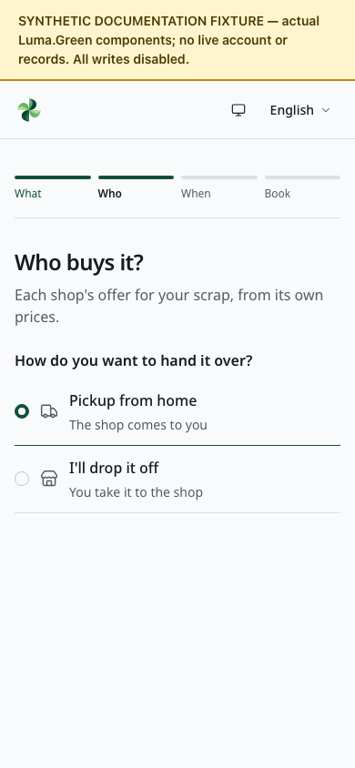

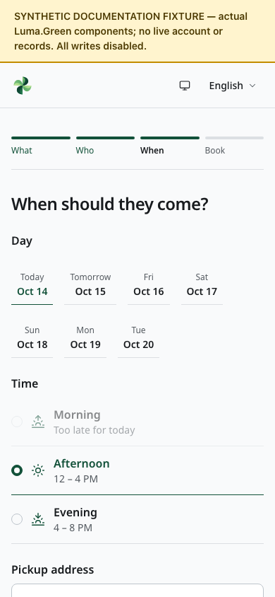

---

## 05 / Household: track, cancel and receive payment

Open the saved /t/[token] link to see the booking status. Treat this link as private; do not post it publicly.

1. Check whether the request is waiting, accepted, complete or closed.
2. When accepted, check the assigned shop and the recorded visit details.
3. Use the contact action when it is available. Contact the shop if the time or address needs clarification.
4. At collection, check each material and the scale reading with the collector.
5. Check the final total. Receive cash or confirm the UPI payment outside Luma.Green.
6. Review the receipt and keep the tracking link for your records.

Use Cancel only when the page offers it and while signed in as the original household. A tracking link alone does not permit cancellation. Cancellation is available only before the shop is on its way. If no shop accepts the request, the dispatch logic can expire or reassign it within its limits. A notification is optional; the tracking page is the record to check.

A completed receipt preserves its recorded weights and prices. A later price change does not rewrite it. If the record is wrong, contact support. Do not create a second booking solely to correct a completed receipt.

---

## 06 / Join as a business or Saathi

1. Open /join and read the role descriptions.
2. Choose Kabadiwala, Preprocessor, Recycler, Manufacturer or Saathi.
3. Sign in with the verified email or phone account that will own the application. Keep using that same account for its status and records.
4. Complete the role form. Use the location and contact details for the actual operation.
5. Upload the documents requested by that role.
6. Review the form and submit it for a person to check.
7. Open /join/status to follow the decision.

Forms use compact option rows. Radio controls choose one option; checkbox rows
allow more than one. Check the selected state before you continue.

Households do not need a business application. They can use a phone-only account, or verify their own unused phone on an email account, for /sell and personal account settings. Separately created accounts remain separate.

Kabadiwala forms ask about the shop, area, opening hours and collection options. Bulk businesses use /join/yard, /join/recycler or /join/manufacturer and then the documents step. Saathis use /join/saathi with an identity document and selfie.

The interface describes review as usually taking 12-24 hours. This is an operational target, not a guaranteed response time.

### Request another account type

On /join, choose **Request an account** for a non-household material generator, city official, CSR sponsor, lender, independent auditor, waste-picker union, apparel brand or packaging brand. Sign in with the verified email or phone account that will own the request. Select the account group, enter the organisation name and confirm the age and privacy statements. A material generator must also select a primary site: apartment community, office, hotel, resort or other premises. A manufacturer with a manufacturing facility uses the Manufacturer business application above.

The request page shows only your own pending, approved or rejected status. If it is rejected, read the review note there. An approved stakeholder account confirms identity only. It does not open trading, private records, evidence or a specialist workspace. Those permissions need a separate verified grant.

---

## 07 / Documents and application status

Upload clear, readable files. For bulk businesses, supply the consent documents or exemption information requested by the form and photographs of the equipment. Supply GST information when applicable. For Saathi identity documents, mask an Aadhaar number except its last four digits.

Certificate PDFs, ID files, selfies and machine images are capped at 10 MiB each. Machine MP4/MOV videos are capped at 20 MiB, with at most ten machine files. JPEG/PNG preparation reduces large uploads automatically. The form remains the final authority for accepted file types.

### Follow the status page

- Draft: finish and submit the application. A saved draft has not entered the review queue.
- Submitted: wait for the review. Check the page for a decision.
- Changes requested: read the admin's note, correct the listed items and submit again.
- Approved: continue to the operational app for your role.
- Rejected: read the reason and contact the owner if necessary. No self-service reopening control is provided.
- Suspended: operational access is unavailable. Contact the owner; the ordinary admin console has no suspension or reinstatement button.

If removing a file or discarding an application draft fails, the page shows an error. The file or draft remains visible so you can check its current state and try again.

Private files require a valid session and permission on every request. Do not share downloaded IDs or certificates. If a preview fails, sign in again if needed and use Try again. Large videos are not loaded until requested; video uploads are capped at 20 MB.

Files are not general attachments for customer conversations. Upload only what the application asks for. The mobile shell cannot open every private document path; use the authenticated browser or desktop flow when the app directs you there.

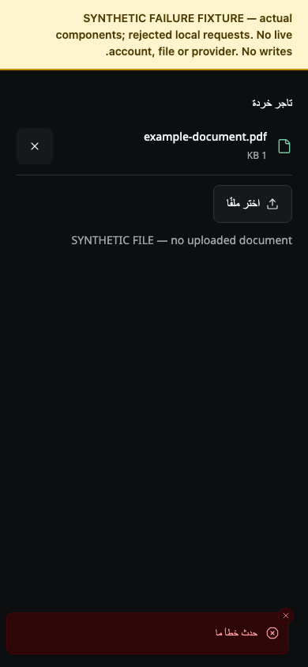

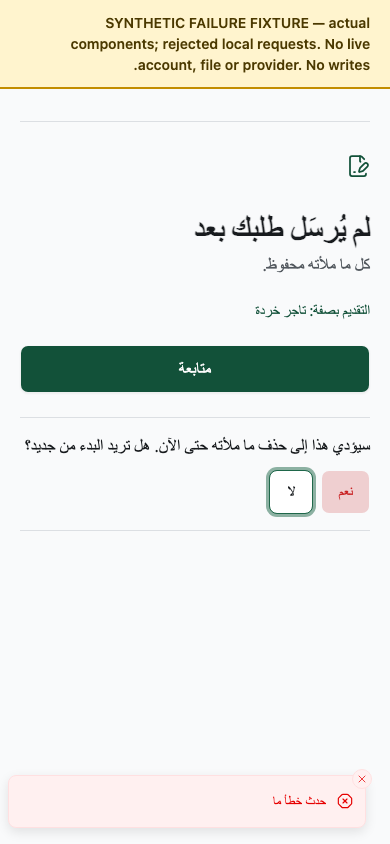

---

## 08 / Kabadiwala: start the working day

A kabadiwala runs a local collection shop. The approved shop uses /app to manage household requests, current stock, its rate card and onward trade.

1. Sign in with the account that has access to the approved shop. In Workspaces and team, check that the correct shop is selected and your role permits the required action.
2. Open Home. Read the request and stock summary.
3. Check the Auto-accept setting and pickup radius. Enable auto-accept only when the shop can handle suitable work; location data is required.
4. Open Requests to check new bookings and the Today list.
5. Check Prices before accepting new work. A shop rate cannot be below the platform minimum.
6. Check Stock before offering material to another business.

Use the bottom navigation on a phone or tablet. Two frequent destinations stay visible. Open More for the role's additional pages, language, appearance and sign-out. On wider desktop screens the same app shows side navigation. The available destinations follow the approved role; typing a route does not change permission.

Auto-accept can accept suitable bookings without a separate manual tap. Check the radius and location before enabling it. There is no separate Taking pickups availability switch. Changing auto-accept does not cancel bookings already accepted.

---

## 09 / Kabadiwala: accept and manage requests

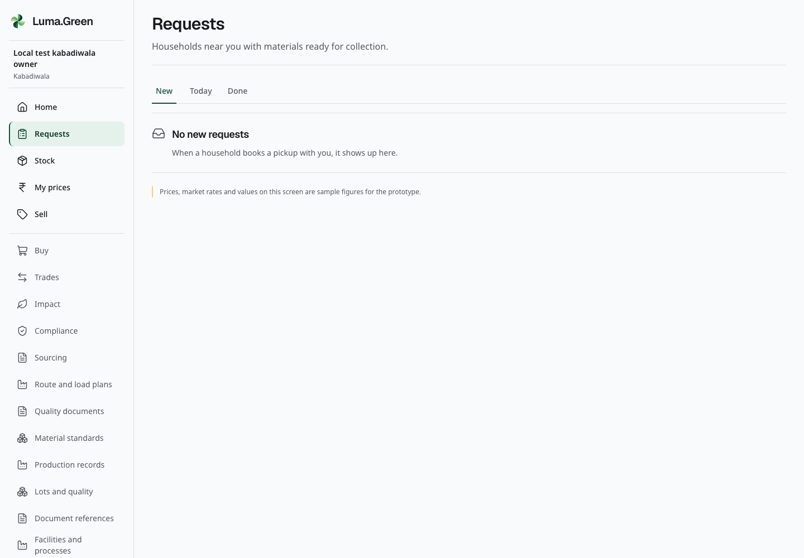

1. Open /app/requests.
2. Read each offered booking: area, estimated materials, time and collection mode.
3. Accept only if the shop can do the work. Use Decline when appropriate.
4. After acceptance, open the booking to see its permitted contact and address details.
5. Use the Today tab to find accepted work.
6. Open the accepted booking and use Start trip before travelling for a pickup. Open Weigh and pay when the material is ready.

Only the assigned shop can accept or act on the booking. A request that expired or moved to another shop cannot be accepted from an old page. Read the current error or status and refresh the record if needed.

If accepted work cannot be completed, contact the household and support. The shop page has no accepted-booking release or cancellation-with-reason control. Do not leave the household waiting or record a false completion.

Avoid repeated taps while a request is being submitted. An offline screen does not prove that an action failed; reconnect and inspect the booking before trying again.

---

## 10 / Kabadiwala: weigh and pay

1. Open the accepted booking at /app/requests/[id].
2. Weigh each material on the shop's scale. Enter the actual quantity for that material.
3. Check the price and line total. Remove or correct material that was not supplied.
4. Read the total with the household. Resolve a disagreement before recording completion.
5. Pay the household in cash or UPI outside the platform.
6. Choose the payment method and record the payment information requested by the form.
7. Confirm completion once. Check the receipt and updated stock.

Luma.Green records the result. It does not make the cash or UPI transfer. A button labelled as a payment step must not be treated as bank confirmation.

The backend stores money in whole paise and mass in whole grams. The screen formats those values for the selected language. Review the displayed units before entering a number. Weight and price fields accept digits used by supported scripts. Enter quantities without thousands separators. Use at most three decimal places for weighed kilograms and two for rupees. A decimal comma is accepted where the selected language uses it; an ASCII decimal point also works.

The final receipt is the record of that transaction. If a correction is needed after completion, contact the owner; do not silently alter another record to hide the difference.

---

## 11 / Kabadiwala: rate card and stock

### Change a shop price

1. Open /app/prices.
2. Find the material and read the minimum price.
3. Enter the shop's price per kilogram. Keep it at or above the minimum.
4. Save the change and read the confirmation.
5. Check the updated row before leaving the page.

A fallback price applies where the shop has no custom rate. If the admin raises a minimum above a shop price, the backend can lift the stored shop rate to that minimum. Old receipts keep their earlier price.

### Check stock

Open /app/stock to see recorded on-hand quantities and value. If any held material has no market price, the full value shows a dash with **No market price today**. Priced rows keep their own values. A dash is an unknown value; it does not mean the stock is worth zero. Empty stock has a zero value. Completed household pickups update stock. Accepted business orders reserve available stock. With live activation off, payment-dependent movement stays blocked; permitted dispatch and receipt update stock only through the verified lifecycle in chapter 12. Open the material chooser at /app/sell to see the quantity available to list. Reserved stock is not free stock; do not promise more than the available quantity.

To offer material onward, use /app/sell or the Sell action available to the role. To buy from a permitted supplier, use /app/market. The next chapter explains the common trade sequence.

### Plan a route and its combined load

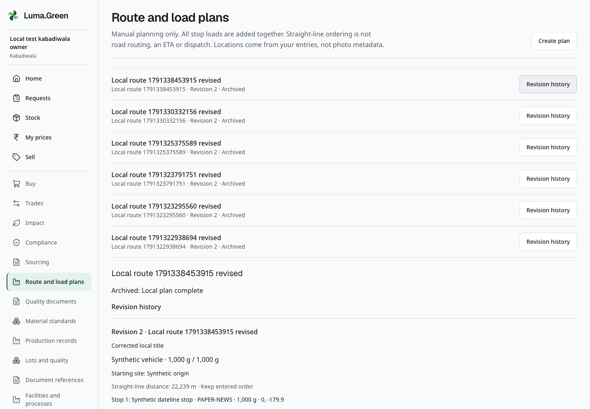

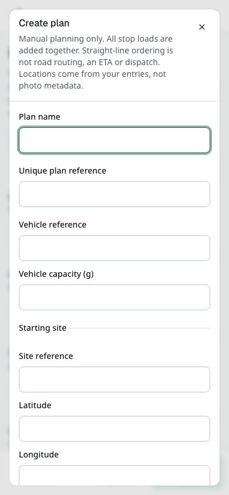

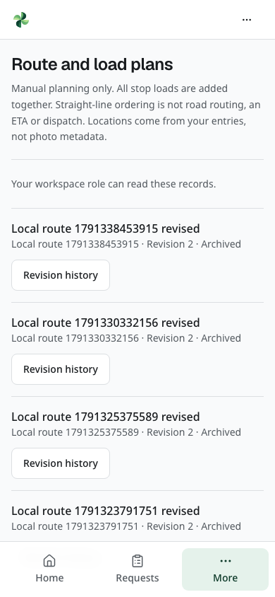

Use **More → Route and load plans** at /app/logistics. This is a manual plan. It does not book a pickup, start a trip, dispatch material or change stock. Enter site coordinates directly; Luma does not read GPS photo metadata. The displayed distance is a straight-line estimate between successive stops, with no return leg, road distance, travel time or navigation claim.

1. Sign in to the correct business workspace. Owners, admins and members can record a plan; viewers can read it.
2. Select **Create plan**. Enter a plan name, a unique plan reference and the vehicle reference.
3. Enter the vehicle capacity in whole grams. For example, 1 kg is 1,000 g. All stop loads are added together; the planner does not assume that the vehicle unloads between stops.
4. Under **Starting site**, enter a site reference, latitude and longitude. Latitude must be from −90 to 90; longitude from −180 to 180.
5. Enter the first stop, choose a currently active material handled by your workspace, and enter whole grams. Use **Add stop** for another site, up to 20 stops in total.
6. Select **Keep entered order**, or choose **Nearest next stop (straight line)** for a deterministic nearest-next straight-line order. Review the result yourself; this is not an optimal road route.
7. Enter a reason/reference and select **Save**. The combined grams must not exceed vehicle capacity. If validation fails, correct the retained fields and save again.
8. Select **Revision history** on the saved plan. Read the revision, capacity, stop sequence, material codes, coordinates and distance. Select **Save a new revision** to correct it. The earlier revision remains visible. If someone else changed the plan while your form was open, close it, read the new history and reopen the correction; do not repeatedly submit the old draft.
9. An owner or admin can select **Archive plan**, enter a reason and confirm. Archiving keeps the history and prevents later corrections. A member or viewer cannot archive a plan. An archive form opened before a later revision must be reopened after review.

Use a new unique reference for a different plan. Repeating an identical first submission does not create a second plan. A conflicting reuse of that reference is rejected. Reload to check the saved result before entering another plan after a connection error.

### Manufacturer: record your own byproduct stock

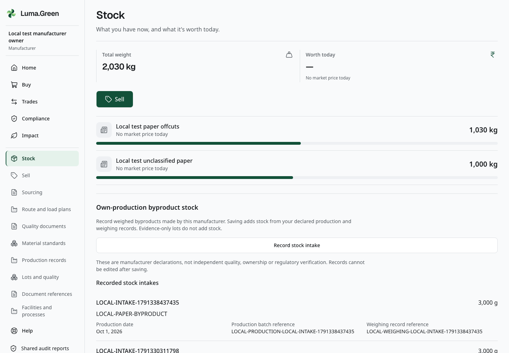

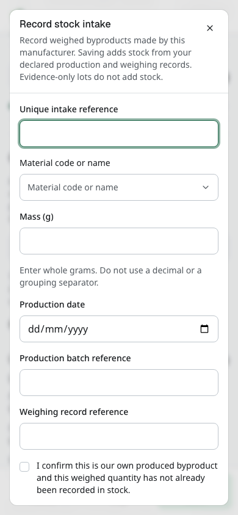

An approved manufacturer can open **Stock** at /app/stock and use **Own-production byproduct stock**. This action creates actual recorded inventory. Creating a traceability lot alone does not add inventory.

1. Check the active workspace. As an owner, administrator or member allowed to operate it, select **Record stock intake**.
2. Enter a **Unique intake reference** from your records. Use a different reference for each genuinely different intake; do not rename an earlier intake to record it twice.
3. Select the approved non-hazardous **Material**. If the list is empty, ask the platform administrator to review the material. A facility sector or process selection does not approve it.
4. Enter the weighed **Mass (g)** as whole grams, the **Production date**, **Production batch reference** and **Weighing record reference**.
5. Read the confirmation that the byproduct is your own production and this weighed quantity has not already been recorded. Select it only when it is true.
6. Select **Save** once. Read **Recorded stock intakes** and check the stock total. Use **Load more intakes** for earlier records. The saved intake cannot be edited.
7. To offer the stock, open **Sell** and follow chapter 12. Recording stock does not verify independent quality, ownership or legal approval, and it does not bypass the payment gate.

If a save response is uncertain, check the history before retrying. The same intake reference with identical details records only one intake. If the reference already has different details, inspect the original record before continuing; do not change the reference to hide that conflict. Viewers can read the history but cannot record stock. Only record synthetic test production in the local team walkthrough.

### Set up facilities and processes

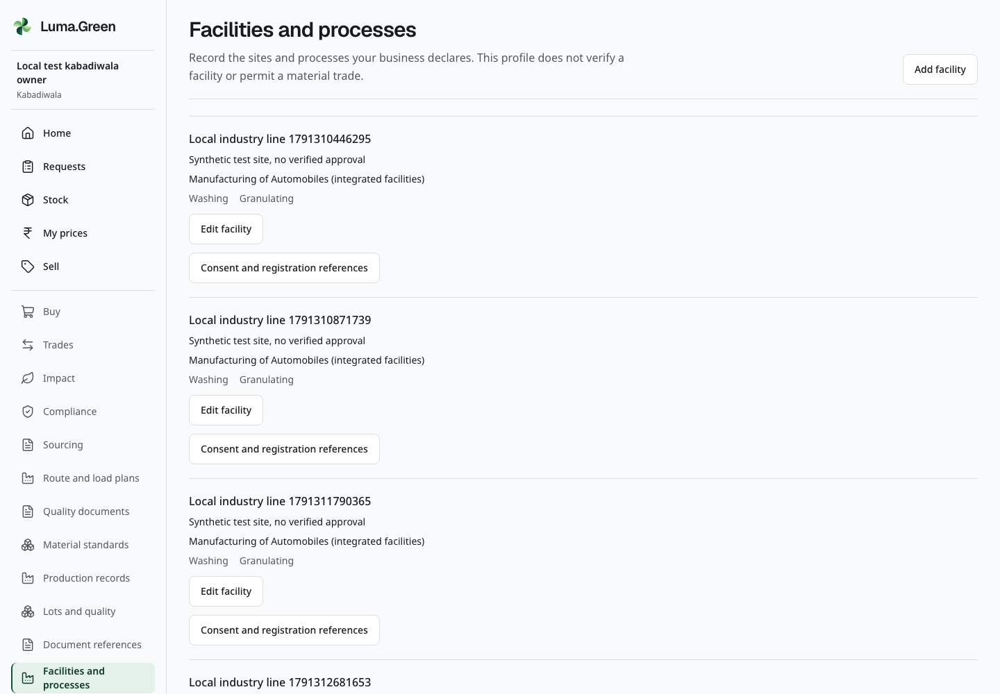

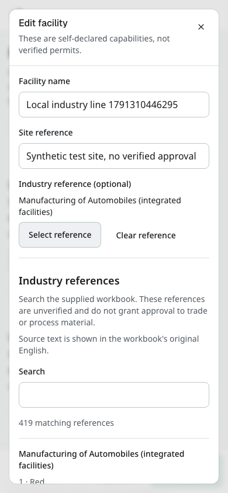

Open **More → Facilities and processes**, or /app/facility. Select the correct
workspace first. Its members can read the facility list. Only its owner or
administrator can add or edit a facility; operational members can still add
permitted registration evidence as explained below.

1. Select **Add facility**. Enter **Facility name** and **Site reference**.
   Use a real site reference for operations and the assigned synthetic location
   for local testing. This is an explicit entry, not photo GPS metadata.
2. To add context, select **Select reference** under **Industry reference
   (optional)**. Search the supplied sector text, select **View reference** to
   inspect its source, then **Select reference** on the correct entry. Use
   **Clear reference** if you selected the wrong one.
3. Under **Declared processes**, choose at least one process. A facility can
   declare several: sorting, baling, shredding, stripping, washing, granulating,
   compounding, recovery, manufacturing or residual handling.
4. Select **Save** once. Check the facility name, site, optional sector and
   process list after the dialog closes. Use **Edit facility** to update the
   declaration. A rejected save leaves an error; correct it before retrying.

These are self-declared capabilities. Saving a washing process or sector colour
does not verify machinery, permits, material handling, byproduct eligibility or
buyer approval. A facility label does not create a separate login or team role.

### Browse the supplied industry references

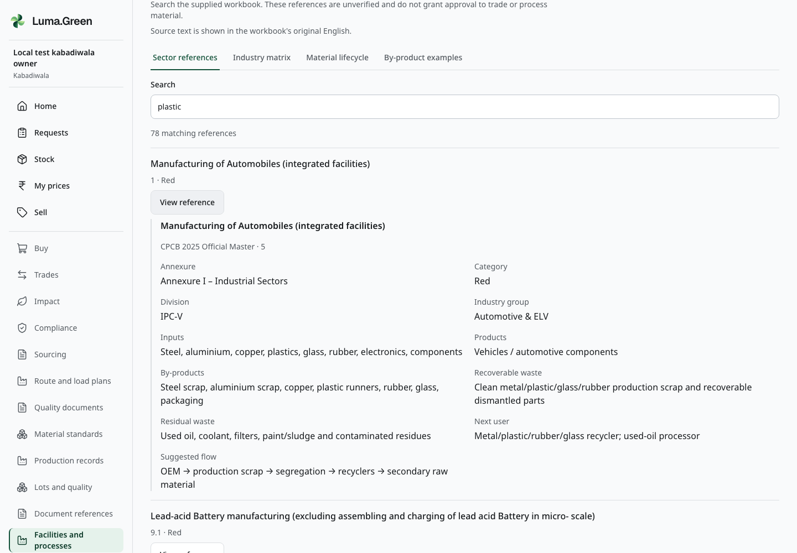

On the same page, scroll to **Industry references**. Choose **Sector references**,
**Industry matrix**, **Material lifecycle** or **By-product examples**. Enter a
term in **Search**, read the matching count and use **Previous** or **Next** for
other results. **No matching references** means the search has no results, not
that an industry is legally excluded.

Select **View reference** to expand an entry. Read its sheet name, source row
and labelled details. Source wording remains in the workbook's original English;
the surrounding controls follow your selected language. These are unverified
reference records. Some supplied text has extraction defects, and repeated
sector codes can describe different rows. Use the full entry, never a code or
colour alone, to identify context. A byproduct example or likely buyer is not
permission to list, transport or process that material.

### Record consent and registration references

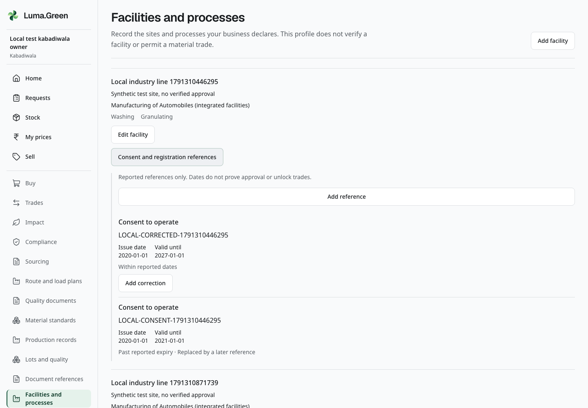

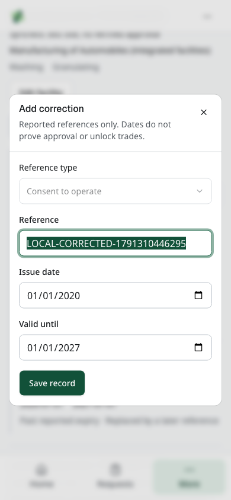

Within a facility, expand **Consent and registration references**. This list is
separate from the business-level **Document references** page in chapter 12.
Owners, administrators and operational members may add evidence; viewers read.

1. Select **Add reference**. Choose **Reference type**: Consent to operate,
   Consent to establish, EPR registration, Waste authorisation or Other reference.
2. Enter **Reference**, **Issue date** and **Valid until**. Use the date picker
   or the browser's date-entry format. The issue date must not follow expiry.
   Use only the assigned synthetic reference and dates in local training.
3. Select **Save**, then read the date status. **Within reported dates** means
   today falls within the entered period. **Past reported expiry** and **Before
   reported issue date** describe the other two cases. Date boundaries use the
   India calendar; the expiry date is included through that day.
4. To correct an entry, select **Add correction**. The reference type stays
   fixed. Change the reported reference or dates as needed and save once. The
   original remains and shows **Replaced by a later reference**.

A current date range is not a verified permit. These entries remain reported,
unverified evidence; no portal was contacted and no trading access was granted.
There is no document-upload control here. If the history limit notice appears,
do not treat the visible portion as a complete export.

### Record material lots

In a business workspace, open **Lots and quality** from the sidebar or the phone's **More** menu. The page lists incoming lots, lots held by this business and its previous hand-offs. Owners, administrators and members can record permitted actions. Viewers can read the records. Saathi and stakeholder accounts do not gain business access from this page.

Lot records describe physical material and measured processing. They are separate from stock, payment, legal ownership and certificates. Declaring or receiving a lot does not create saleable inventory or confirm a business trade. Use the stock and trade screens for those records.

1. Select **Declare a lot**. Enter the material code, material state and measured mass in whole grams. Select **Output stream** and **Handling classification** from the declared evidence, and add a source reference if available.
2. Save once. Open the lot and check its initial and remaining mass.
3. For an eligible held lot, select **Record transformation**. Enter the whole grams consumed from this primary input. For a blend, use **Add input lot** under **Other input lots**, choose another available lot held by this workspace, and enter its consumed grams. Repeat only as needed, up to 20 distinct input lots in total. Each lot must have enough available mass; another business's lot cannot be selected.
4. Enter contamination grams, process loss grams and each output's material, state, grams, output stream and handling class. You may select a **Facility** and one of its declared **Process** choices together; leave both unset if no facility is linked.
5. Check **Total input mass**. All input grams together must equal all outputs plus contamination plus process loss. For example, 800 g from the primary lot plus 200 g from another lot can produce four 250 g outputs when contamination and loss are zero. Fractional, unsafe, duplicate, unavailable or unbalanced inputs are rejected. Keep measured residual outputs separate from process loss.
6. Save once. Check the reduced balance on every input lot, the processing record in each source history and the new output lots. Your business can read its own output genealogy and process links. Output links are available only while it holds those lots.

A recipient of a transferred output or input remainder sees the authorised custody record, not the processing business's private parent, sibling or recipe history. Combining lots records physical evidence; it does not add inventory, pay a supplier or create a certificate.

Use the buyer's written specification to select a material state or grade. The form does not certify purity or invent acceptance limits. Enter actual measurements and references.

### Classify output streams and record residual disposition

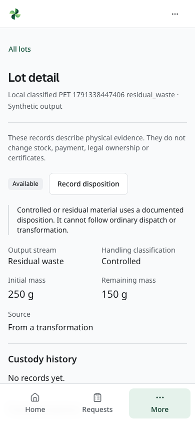

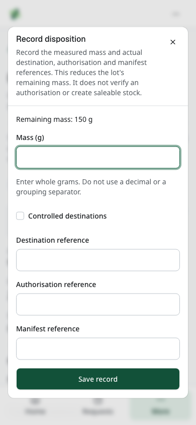

**Output stream** distinguishes Main product, Saleable by-product, Recoverable
waste, Residual waste and Not specified. **Handling classification** is separate:
Non-hazardous, Controlled or Not assessed. These labels record declarations;
they do not certify hazard status or make stock saleable. Process loss is not a
substitute for an actual residual output. Give measured residual material its
own output lot and count it once in the mass balance.

A controlled or residual lot shows **Record disposition** instead of ordinary
dispatch or transformation. This records a measured movement out of the lot's
remaining balance; it does not certify treatment or create saleable inventory.

1. Open the correct held lot and read its **Remaining mass**. Select **Record
   disposition** only for an actual authorised operation and recorded evidence;
   use the assigned simulation for local training.
2. Enter **Mass (g)**, **Destination reference**, **Authorisation reference**
   and **Manifest reference**. Confirm the measured grams do not exceed the
   remaining balance. Do not invent a real authorisation or manifest.
3. Select **Save** once. Read **Disposition history**, the recorded references
   and the reduced remaining mass. For the local exercise, 100 g recorded from
   a 250 g residual lot leaves 150 g. This is a training record, not a disposal
   service, government submission, certificate or payment.
4. A viewer cannot record disposition. If a save fails or another operation
   changed the balance, reload and reconcile the evidence before retrying. Do
   not repeat a successful action merely because the dialog closed.

### Record a hand-off

The hand-off action sends the entire remaining lot. Select the recipient's city and business type, search, and choose the correct active business. A directory listing does not prove processing capability or regulatory approval. Confirm those conditions through the business's normal approval process before moving material.

After dispatch, the intended recipient sees that hand-off and its mass. It does not see the source reference, earlier processing or inspections before receipt. The recipient measures the material and records the same number of grams to confirm receipt. A weight mismatch creates no receipt; resolve the difference before continuing.

After receipt, the receiving business holds the lot. The former holder can read its own hand-off history, but cannot open the lot's later private records. A page left open during this change can show an access message; use **All lots** to return to records you can still read. Lists show at most 100 records and display a limit notice when more exist.

### Record and correct quality results

Open a held lot and select **Record inspection**. Enter the written specification reference and version, sampling method, and measured parameters with their units and values. Choose **Accepted**, **Rejected** or **Conditional** explicitly. Add a buyer or evidence reference when relevant. The decision records the inspecting business's assessment; it is not approval from the named buyer or a certificate.

A saved inspection cannot be overwritten. To correct a result recorded by your business, select **Propose correction** and give a reason. The lot, buyer and specification stay fixed. A different owner in the same business must select **Approve correction** while that business still holds the lot. The original result remains visible. A viewer, the correction's author or a different business cannot approve it. A later holder can read earlier results but cannot correct another business's inspection.

---

### Attach a quality document and record the buyer's decision

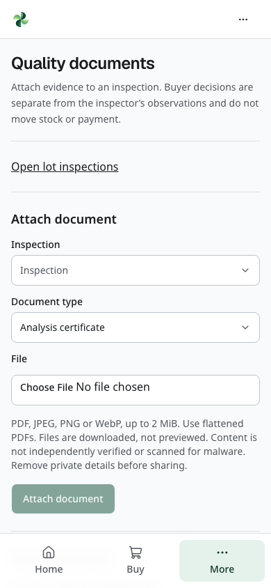

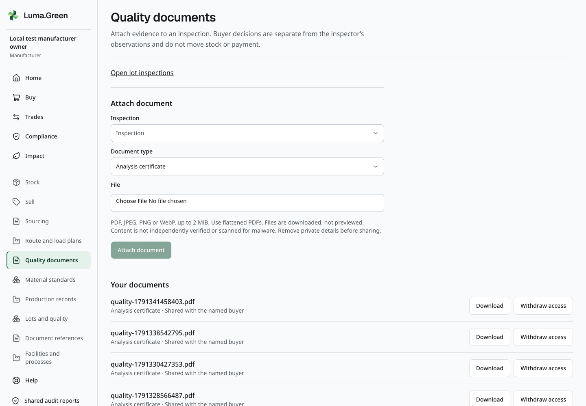

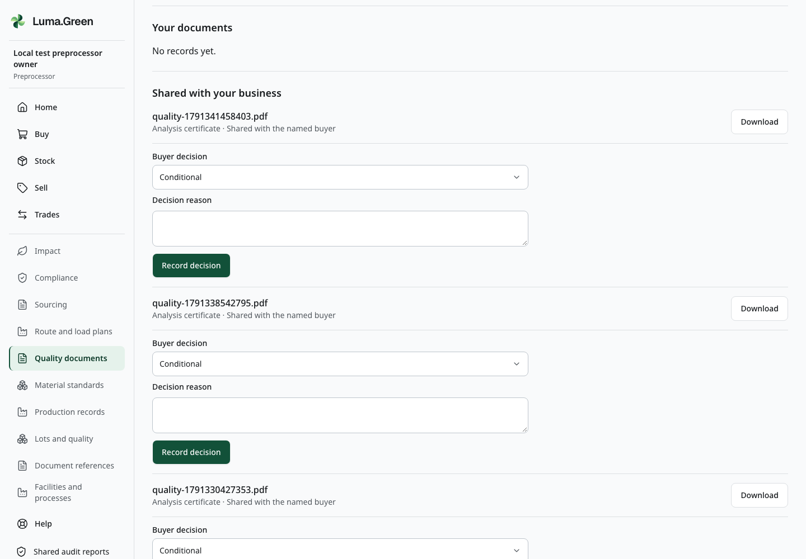

Use **More → Quality documents**, or /app/quality-documents. Select the correct
active business workspace first. This page attaches evidence to an existing
inspection. It does not replace a saved result or create stock or payment.

1. If the inspection is missing, select **Open lot inspections**. Open a held
   lot and record its inspection first. Return to **Quality documents**.
2. In **Inspection**, choose the specification reference and version. Select
   **Document type**: **Analysis certificate**, **Quality photo** or **Sample
   report**. The type is the uploader's description, not Luma's certification.
3. In **File**, choose one PDF, JPEG, PNG or WebP file up to **2 MiB**. Use a
   flattened PDF. Encrypted or active PDFs are rejected. Files are downloaded,
   not previewed. File checks are not an independent review or a malware scan.
   Remove personal details before upload and sharing.
4. If the inspection names a buyer, decide whether to check **Share this
   document with [business name]**. Leave it unchecked for business-only access.
   Select **Attach document** once. Read the new entry under **Your documents**
   and its **Business only** or **Shared with the named buyer** label. At most
   20 documents can be attached to one inspection, including withdrawn records.
5. A buyer opens the same page in its own workspace and finds **Shared with
   your business**. Select **Download** to read the evidence. Under that file,
   choose **Buyer decision**: **Accepted**, **Rejected** or **Conditional**.
   Enter **Decision reason**, then select **Record decision**. Check **Buyer
   decision history**. The inspecting business can also read this history.
6. To change a buyer decision, record a new decision with its reason. Earlier
   decisions remain. A buyer decision is separate from the inspector's result;
   it cannot confirm a gateway payment or complete a material hand-off.
7. An owner can select **Withdraw access** for a document. **Access withdrawn**
   confirms that future downloads are blocked, including downloads through a
   shared report. It does not erase the audit record or recall earlier copies.

Viewers can read permitted files and decisions but cannot upload, withdraw or
record a decision. Each section shows up to 100 recent records. A failed action
keeps safe form input: check the file, workspace access and connection before
retrying. Do not share passwords, identity documents or real customer details in
local training files.

### Share a fixed audit report with one approved recipient

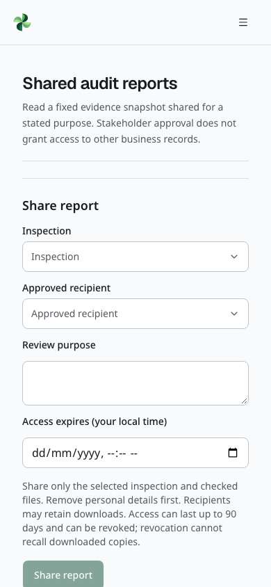

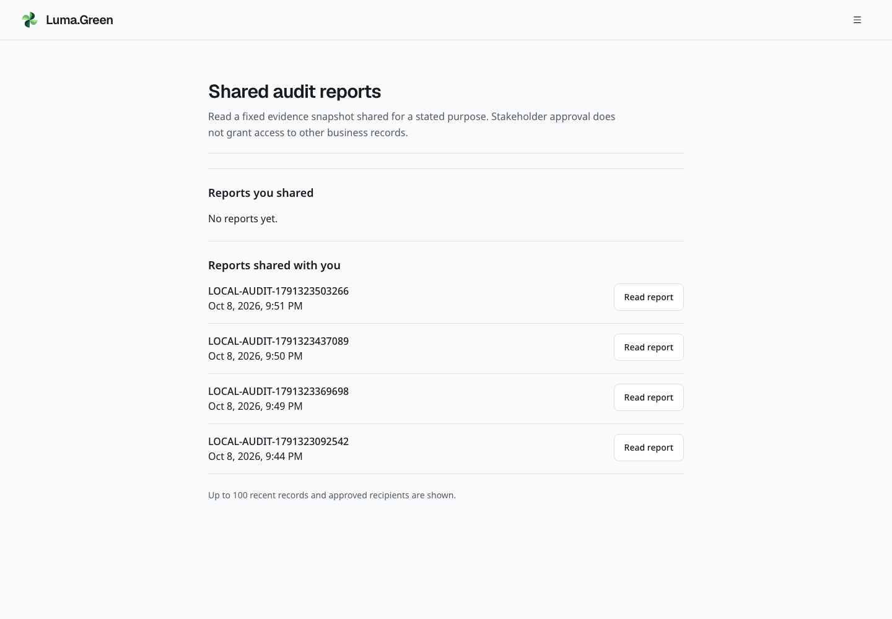

Open the account menu and select **Shared audit reports**, or /account/reports.
A business owner sees **Share report**. A stakeholder account sees only reports
that an owner has granted to that exact approved account. Being an auditor,
brand or city official does not grant access to the whole platform.

1. As owner, choose **Inspection** and **Approved recipient**. Check the
   recipient's organisation name before proceeding. Pending corrections
   and inspections replaced by an approved correction cannot be shared. Obtain
   the required separate approval before sharing a corrected result.
2. Enter **Review purpose**. Set **Access expires (your local time)** to a
   future time no more than 90 days away. Check only the files needed for that
   purpose. Select **Share report** once.
3. Under **Reports you shared**, select **Read report**. Check the fixed
   material, mass, specification, sampling method, results and inspecting
   business's decision. **Buyer decision history** contains the decisions
   recorded at the moment of sharing; it does not infer buyer approval.
4. The recipient signs in and opens **Reports shared with you**. Select
   **Read report**, then **Download** for an included file. Every download
   checks the current session and grant. Private lot ancestry, recipes,
   sibling lots and customer contact fields are not added to the snapshot.
5. As owner, select **Revoke access** to end the grant early. The recipient
   then sees **Access expired, withdrawn or unavailable.** Expiry, withdrawn
   files, lost recipient approval or a suspended source business also prevent
   future access. Copies already downloaded cannot be recalled.

A report is a fixed declaration, not an independent certificate or portal
submission. Later inspections or buyer decisions do not rewrite it. Share a new
report when a new snapshot is needed. The list shows up to 100 recent records
and approved recipients. The connected local suite covers file access, buyer
decisions and report withdrawal. The team must still run its manual acceptance;
no local result proves government verification.

### Find a reviewed material definition

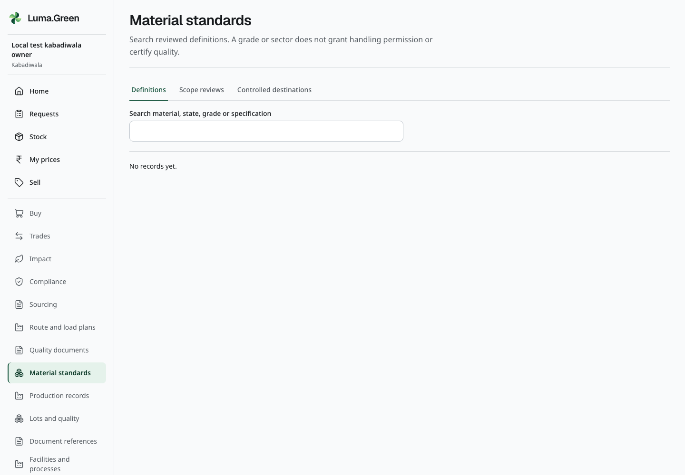

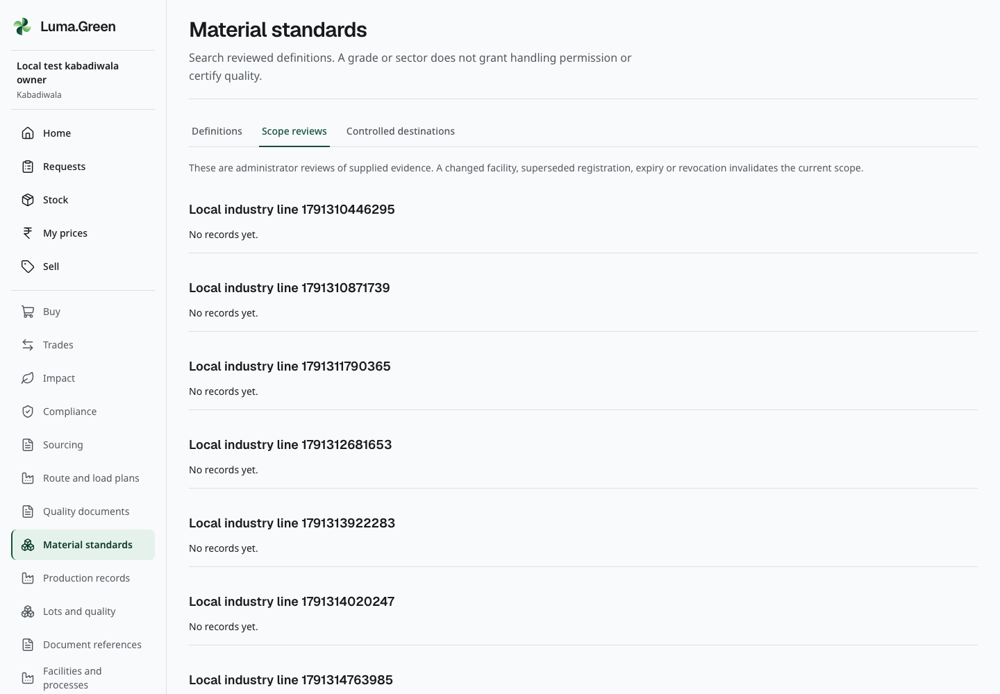

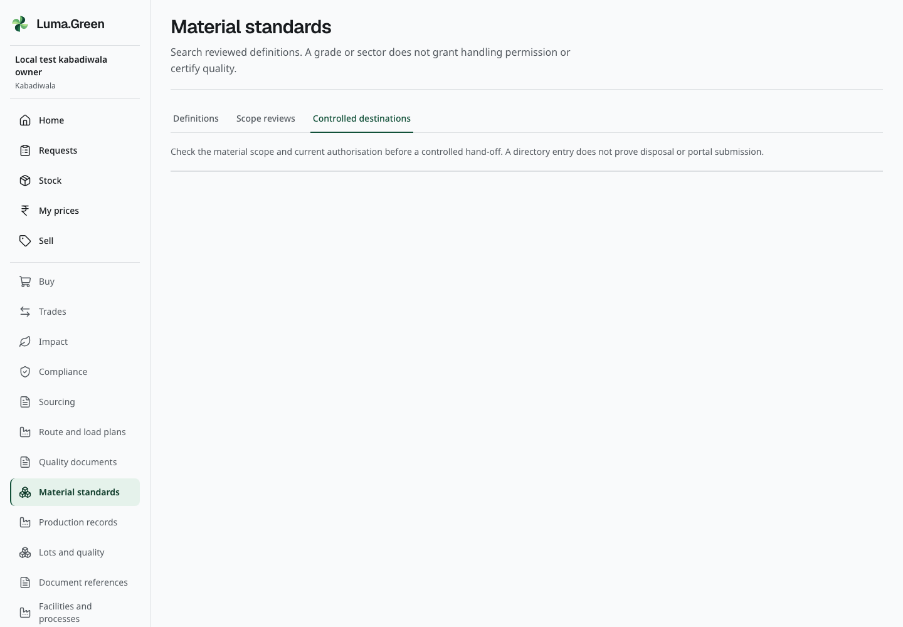

Open **Material standards** in a business workspace. The **Definitions** tab lets
all business roles search active material codes, grades, processing states and
written specifications. Enter a word from the specification or material code.
Open the result and compare its version and source reference with the buyer's
contract. A definition is a reference standard; it does not certify your lot.
Draft and retired definitions are not in this search. A limit notice means the
list is incomplete; narrow the search before you use the result.

Use **Scope reviews** to read the admin's review of your own facility,
registration reference, material and process scope. **Current** requires the
review and source registration to remain within their dates and the facility to
remain unchanged. A later facility change or replaced registration can make the
review stale. Ask the admin to review the new evidence. The page does not verify
a government portal or grant a new trading permission.

Use **Controlled destinations** to inspect the reviewed receiver, site, material
scope, authorisation reference and expiry. For a controlled lot's **Record
disposition** form, select the **Controlled destinations** checkbox, then select a receiver.
The form fills the recorded destination and authorisation references. Enter the
actual measured grams and manifest reference. The server checks that the selected
receiver is still active, unexpired and in scope when you save. A recorded
reference without this selection remains a reported reference, not registry
verification. Neither path proves that the receiver completed treatment.

### Record a recipe and a production declaration

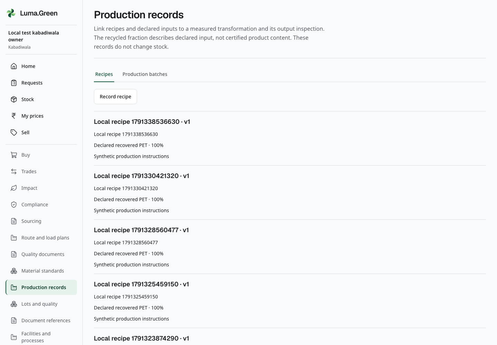

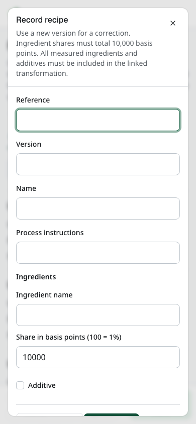

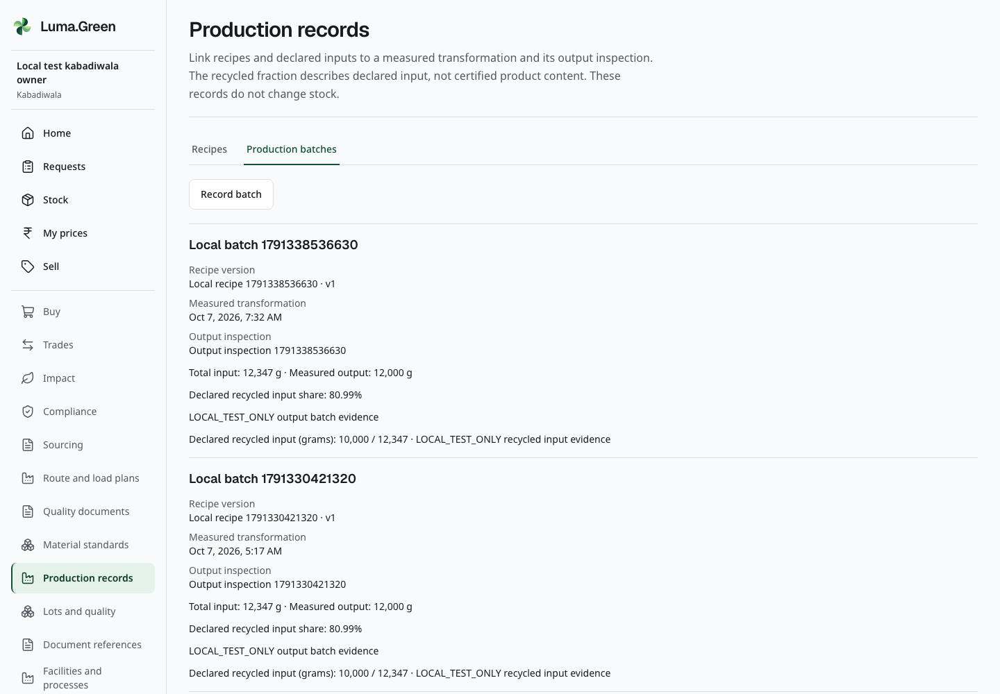

Open **Production records**. Owners, workspace administrators and operational
members can record declarations; viewers can read them. These records add
production evidence. They do not add stock, accept a sale, collect money or
certify recycled content.

1. In **Recipes**, select **Record recipe**. Enter a reference, version, name and
   written instructions. Add each ingredient and its share in basis points:
   10,000 basis points means 100%; 500 means 5%. Mark an ingredient as an additive
   where that declaration is correct. All shares must add to exactly 10,000.
2. Save once and read the ingredients and version in the list. A saved recipe is
   immutable. Use a new version for a revised recipe; do not change a past record.
3. In **Lots and quality**, record the measured transformation and an inspection
   of its output first. Return to **Production records → Production batches** and select
   **Record batch**.
4. Enter the batch reference. Select the recipe, transformation and output
   inspection. For every consumed input, enter the declared recycled grams and
   the supporting evidence reference. Recycled grams cannot exceed that input's
   consumed grams. Identify additives where applicable.
5. Enter the batch evidence reference and save once. Read total input, output,
   recycled-input percentage and each evidence reference. The percentage uses
   exact recorded input grams and is rounded down to a whole basis point. It is
   a declared input ratio, not a certified output-content claim.
6. If saving fails, keep the draft and check the references and current workspace
   access. A transformation can have one immutable production declaration. Do
   not create another transformation merely to correct a clerical error; report
   the error to the admin and retain the original evidence.

## 12 / Business trade: buyer and seller

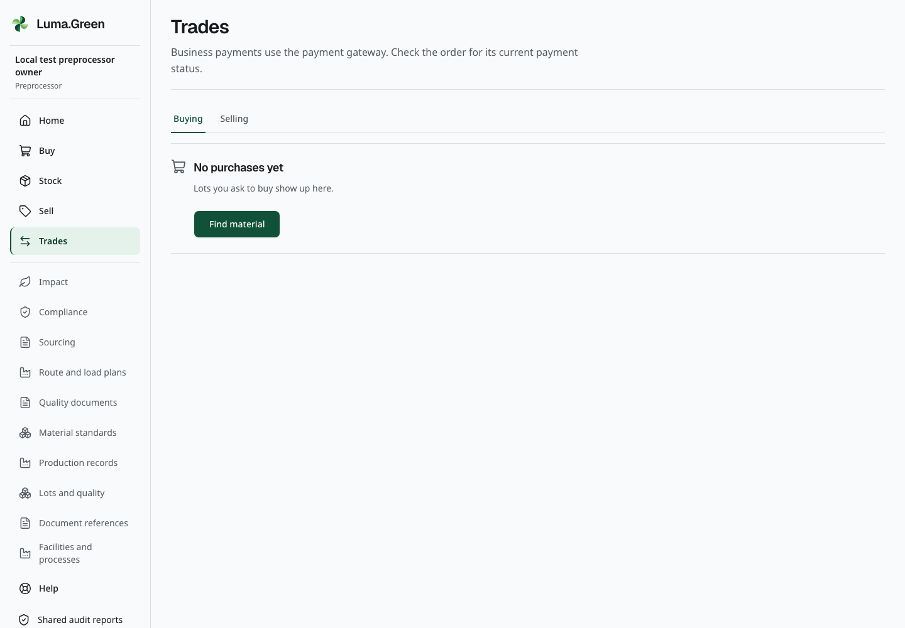

1. Seller: open /app/sell, select material, available quantity and asking price, add an optional note, then create the listing.
2. Buyer: open Buy, choose a listing from an allowed supplier and inspect its material, available quantity and price.
3. Buyer: enter the requested quantity, review the offer and create the order.
4. Seller: open Trades, inspect the new order and accept or reject it as offered by the current state.
5. Both parties: read **Payment and delivery** on the accepted order. In the default no-provider setup, payment-dependent actions stay blocked. After approved live activation and verified collection, the permitted seller can record dispatch and the buyer can confirm full receipt. Follow the conditional steps below; an accepted order alone does not permit movement.
6. For an older prototype record, check the unverified label. It does not confirm a payment, shipment or delivery.

For an active listing you no longer want to offer, select Withdraw and confirm. Read the resulting listing state.

Request, accept or decline are available before payment. Accepted stock remains reserved until a permitted cancellation or verified dispatch changes the commitment. Older prototype states remain readable as history; they do not authorize a new movement. Use the current interface instead of an old screenshot to decide which action is available.

A price, quantity and total must fit the exact integer range. If a price is rejected, reduce the price or quantity and check the total before sending again. A failed request keeps the form open. Existing records with an invalid total remain visible with an error instead of an estimated amount.

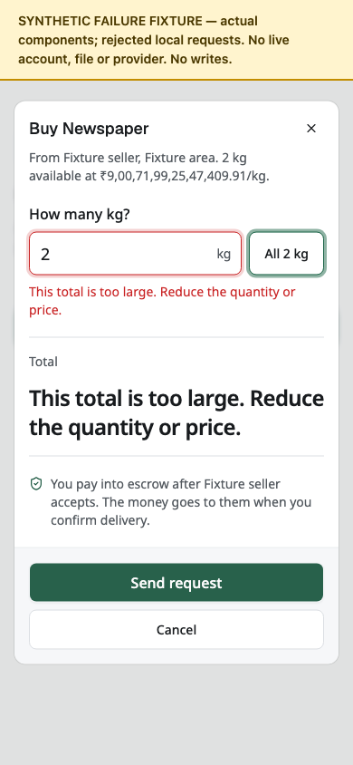

### Add a material grade and written specification to an offer

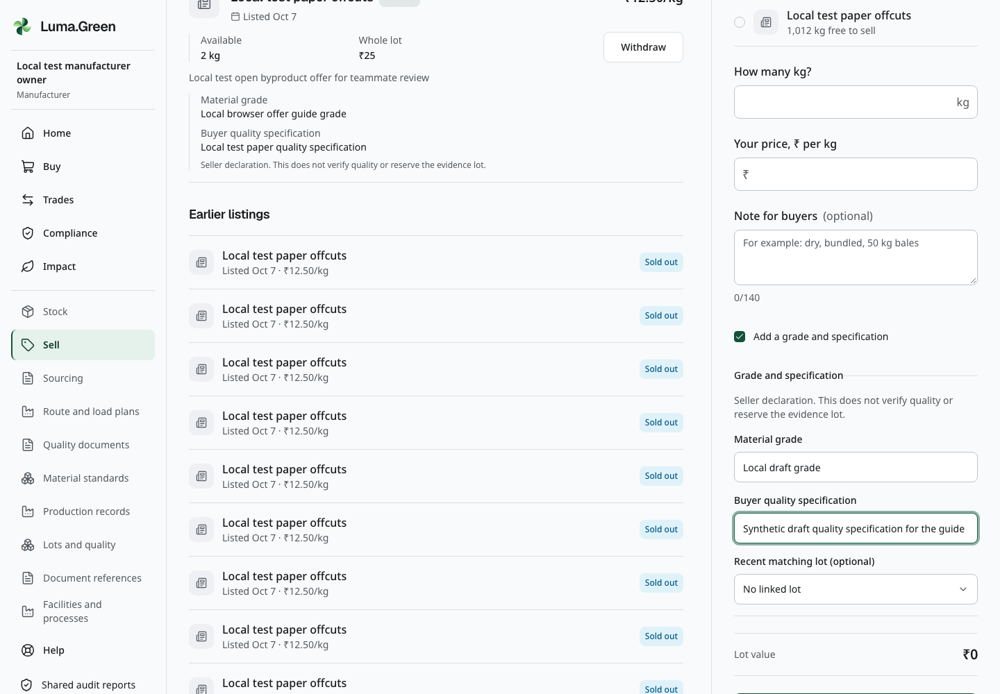

On **Sell**, select the eligible material and enter quantity and price. If the
offer needs detail, enable **Add a grade and specification**. Enter **Material
grade** and **Buyer quality specification** from the agreed written requirement.
Both fields are required when the section is enabled. Do not invent a purity,
moisture or contamination limit from a material name.

In **Recent matching lot (optional)**, keep **No linked lot** or choose an
eligible lot currently held by your business for that material. A linked lot
must explicitly be **Non-hazardous** and classified as **Main product**,
**Saleable by-product** or **Recoverable waste**. Not assessed, Not specified,
Controlled and Residual waste cannot supply this link. Save with
**Put on sale**. The offer shows the grade, specification and, when linked, its
**Recorded lot state**, with the seller-declaration notice. The buyer reviews
this information before requesting the material. The request keeps the recorded
specification instead of silently changing when other evidence changes.

A linked lot is supporting evidence. It does not reserve that physical lot,
validate quality, reveal its private history to the buyer or create inventory.
Stock reservation and the gateway hold remain separate. If the lot's ownership,
material or handling status no longer meets the server rules, refresh and choose
valid evidence; do not use an unrelated lot to bypass the check.

### Store document references for your business

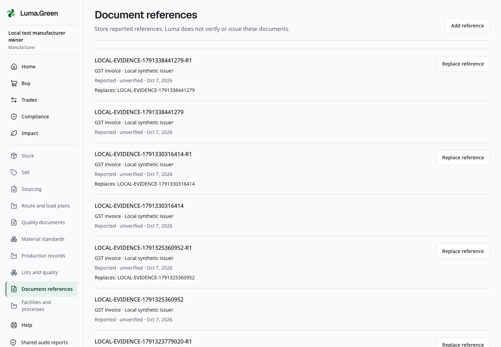

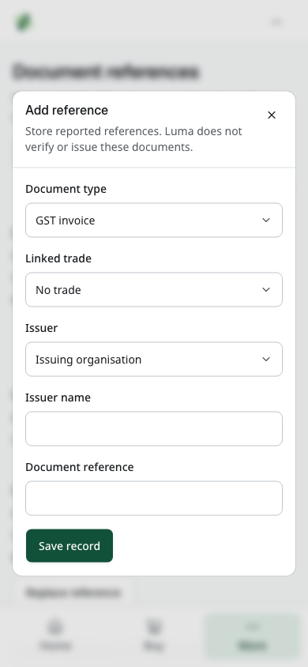

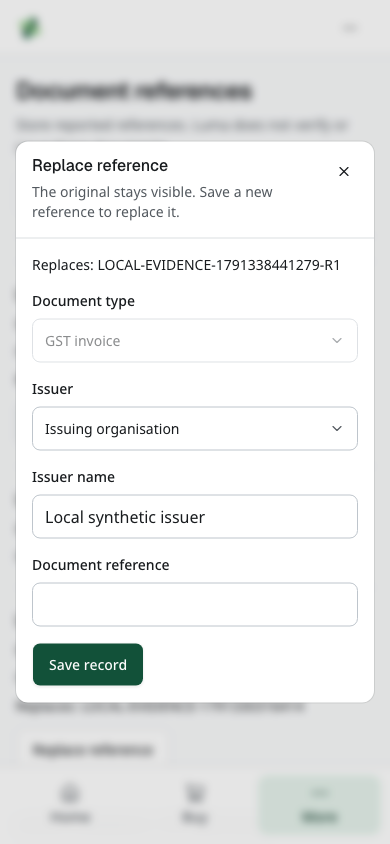

Use **More → Document references**, or /app/evidence. This page records what
an organisation reports. Every entry stays **Reported · unverified**. Luma
neither issues the document nor confirms it with a government portal.

1. Check your selected workspace. Select **Add reference**. A viewer can read
   history but cannot add or replace a reference.
2. Choose **Document type**: GST invoice, E-way bill, CPCB EPR certificate or
   Pollution control consent. These are distinct records; a trade receipt is
   not a GST invoice and an EPR reference is not a platform-created token.
3. In **Linked trade**, keep **No trade** for a business-level reference, or
   choose a trade that belongs to this workspace. The list does not offer
   another organisation's private trade.
4. Choose **Issuer**. For **Issuing authority** or **Issuing organisation**,
   enter **Issuer name**. With a linked trade, you can choose its **Seller**
   or **Buyer** instead. Enter the exact **Document reference** and save once.
5. Read the saved entry and its unverified status. Use **Show more** to load
   older history. **Linked trade** opens Trades; it does not open a tax portal.
6. To correct a reference, select **Replace reference**. Enter the replacement
   reference and save. The original stays visible and the new entry identifies
   what it replaces. Its document type and trade link stay attached to the same
   record chain. Do not try to erase the original or reuse another organisation's
   reference to claim compliance.

There is no file-upload, issue-date editor or portal verification on this page.
For local training, use only the lead's clearly synthetic reference, such as
`LOCAL-REVIEW-REF-01`; do not copy a real tax or certificate identifier into the
shared test log. Recording or replacing a reference cannot change payment,
stock, certificate issuance or legal verification status.

### Payment and delivery

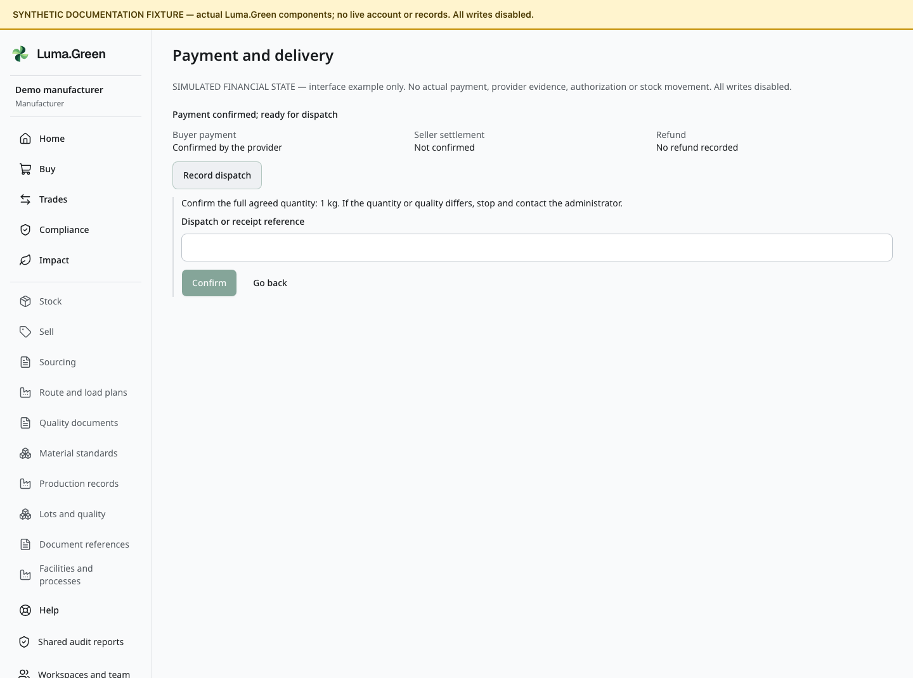

Cashfree Payment Gateway with Easy Split is selected. The current source has
checkout, payment/delivery status and administrator review controls. Local
production-build acceptance passed; real provider acceptance and live activation
are still pending. The default local
walkthrough uses no live keys. It must not make a real payment or present
synthetic confirmation as provider evidence. B2B payments have no off-platform
settlement option.

1. Open **Trades**, choose Buying or Selling and read the correct order. Under
   **Payment and delivery**, read **Buyer payment**, **Seller settlement** and
   **Refund** separately. Buyer payment does not prove that the seller received
   a settlement. Older prototype records can show an unverified legacy state.
2. If live setup is approved and the server permits this buyer, select **Pay
   through the gateway**, then **Open secure checkout**. Pay only the agreed
   order total. A verified Indian phone and the correct buyer workspace are
   required. Closing checkout or seeing a browser success callback does not
   confirm payment; wait for the provider-derived status and reload the order.
3. The seller records a real dispatch only when **Record dispatch** is offered.
   Check the full agreed quantity, enter **Dispatch or receipt reference** and
   select **Confirm** once. The seller's on-hand stock decreases by the exact
   agreed grams. Repeating the same saved operation cannot deduct it again.
4. After actual receipt, the buyer selects **Confirm receipt**, checks the whole
   agreed quantity, enters the reference and confirms. The buyer's stock gains
   those grams once. If quantity or quality differs, stop and contact the
   administrator. Do not confirm a false receipt to move the order forward.
5. For an unpaid accepted order, use **Request cancellation**, enter the reason
   and confirm. Read the result after reload. **Cancellation is being checked**
   is not **Order cancelled**. Without a live provider order, cancellation can
   release the accepted commitment without changing on-hand stock. With a live
   order, the server must first prove it is terminal and unpaid; elapsed time
   or a closed browser is insufficient.
6. If the order needs review, keep its reference and contact the administrator.
   Viewers can read but cannot pay, dispatch, receive or cancel. If an update
   fails, the reference stays in the form. Check the current order state before
   retrying; an action can disappear when another user changes the order.

A verified email user can verify one unused Indian phone in Account security
(chapter 02). This retains the same email identity and does not merge accounts.
Phone verification alone cannot enable live payment. New checkout and dispatch
need active live configuration and approved policy. Existing dispatched receipt,
refund and reconciliation follow frozen order terms when new checkout is paused.

### Sandbox checkout and local training

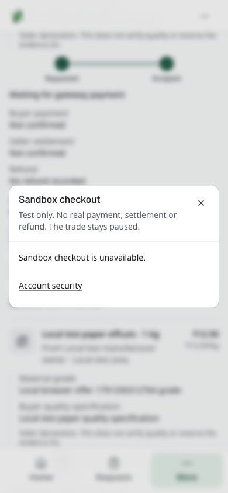

An eligible order can show **Sandbox checkout**. Read **Test only. No real
payment, settlement or refund. The trade stays paused.** Without setup, the
dialog says **Sandbox checkout is unavailable** and links to **Account security**.
The link does not prove provider setup. In the no-key local run, stop here and
check that no provider SDK loads.

Only an explicit permitted **Open sandbox** click loads checkout. Read the
server status: **Waiting for server confirmation**, **Sandbox collection
confirmed**, or **Server review required**. Sandbox evidence never authorizes
live stock movement, delivery, refund or settlement. A synthetic documentation
figure is an interface example only, not evidence that this payment happened.

### Refunds and seller settlement

Ask the administrator to review a payment problem. The administrator can request
the full remaining refundable amount using the order's approved terms; partial
refund entry is not supported here. A request is not a completed refund.
Provider-confirmed refunds leave the order on hold. They do not automatically
cancel the trade, release or restore stock, or prove that material was returned.
Physical resolution needs review. Seller settlement requires separate,
order-specific provider evidence; a general payout notice is insufficient.

Before live use, the owner must complete provider/KYC/Easy Split approval,
commercial policy, real sandbox/webhook/refund/settlement acceptance and release
checks. Policy values come from the approved business agreement. The connected local browser suite has passed. Final release checks and real
provider acceptance remain open; adding keys alone is insufficient.

/app/trades/[id]/invoice is a printable trade receipt. It is not a GST tax invoice. It does not replace the supplier's required tax or transport documents.

---

### Sourcing and supply plans

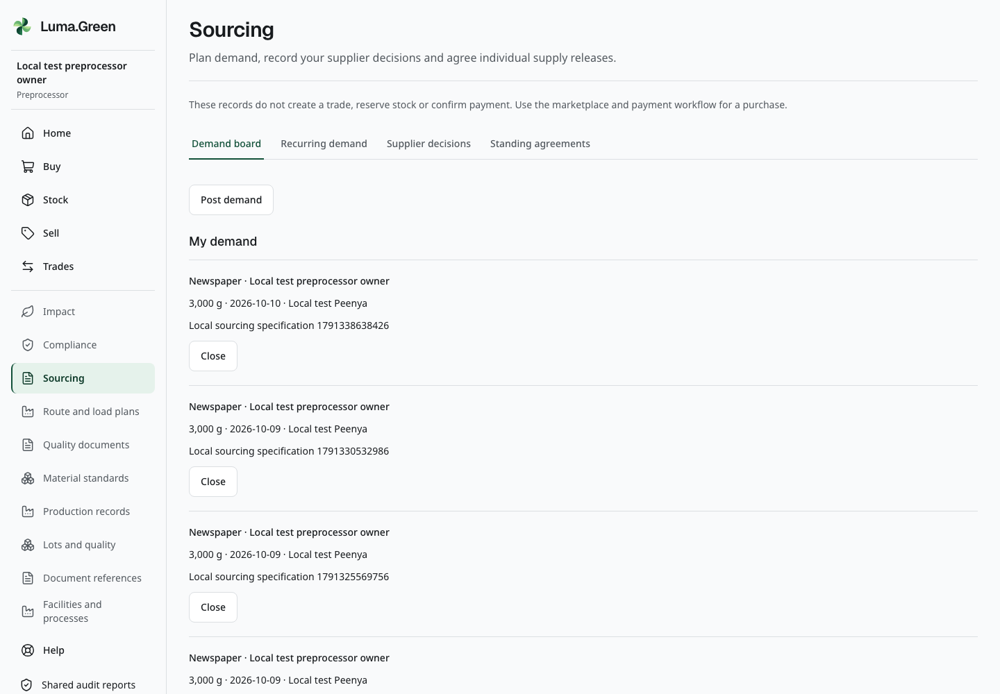

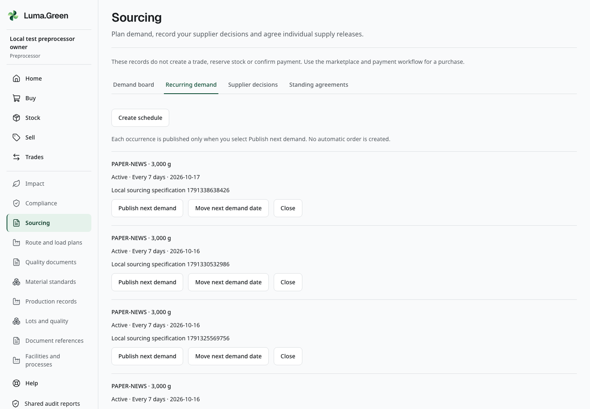

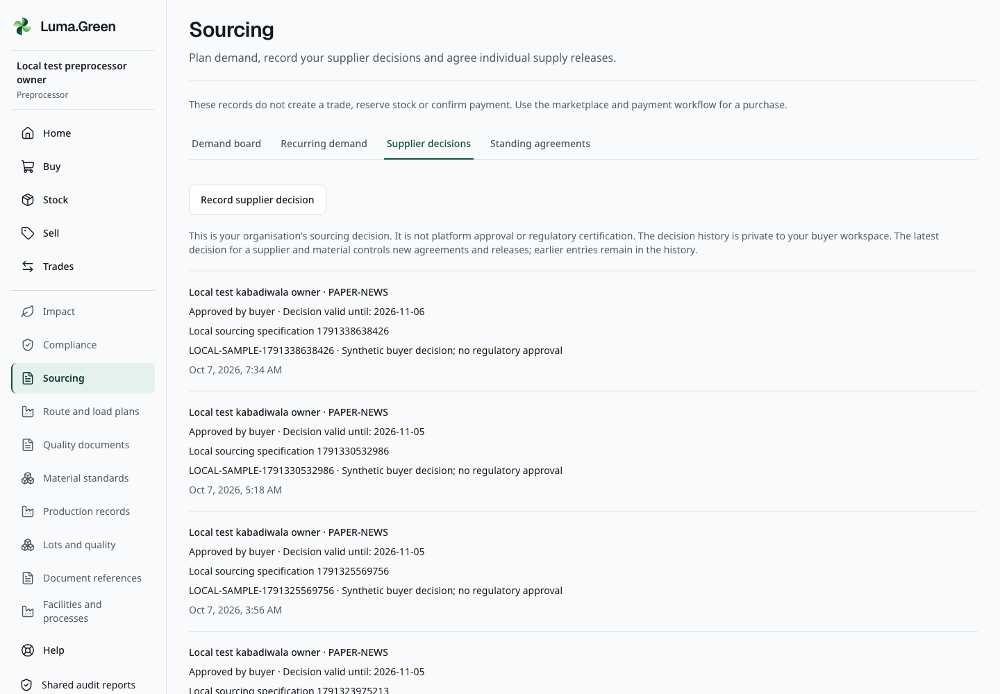

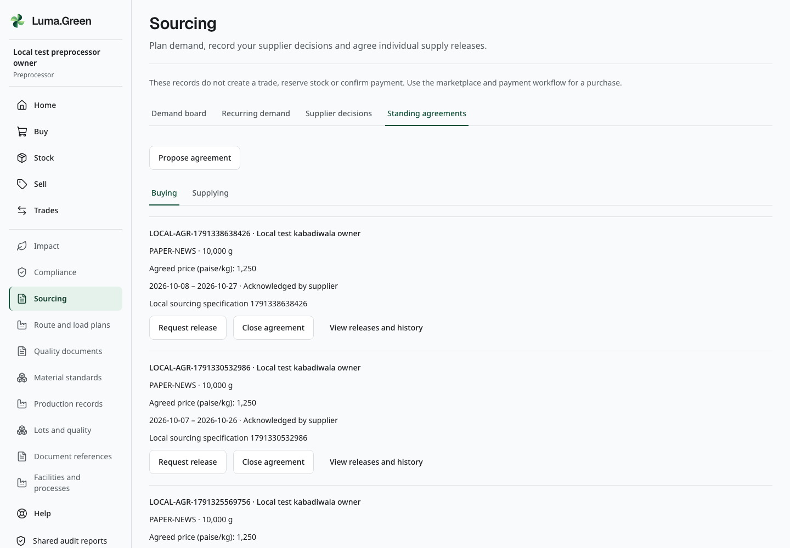

Open **More → Sourcing** in your business workspace. This screen plans supply.
Its records do not create a trade, reserve stock or confirm payment. Owners,
administrators and members can write records; viewers can read them.

1. Select **Demand board → Post demand**. Choose a material, enter a whole number
   of grams, the delivery area, a written specification and the needed-by date.
   Select **Save record**. **My demand** contains your requests; **Demand from
   buyers** contains eligible requests that your business can supply. Use **Close**
   when your request is no longer needed.
2. Select **Recurring demand → Create schedule** for a repeated requirement.
   Choose **Every 7 days** or **Every 30 days**. The schedule does not post by itself.
   Select **Publish next demand** for each occurrence. Check **Next demand date**
   after publication. If the date has passed, use **Move next demand date** to set
   a later current date, then publish explicitly. Previous publications remain.
3. Select **Supplier decisions → Record supplier decision**. Choose the material
   and supplier; enter the exact written specification, sample or inspection
   reference, decision, validity date and reason. This is your private business
   decision, not platform or regulatory approval. The latest decision for that
   supplier and material controls new agreements and releases. Record a new
   decision to correct it; earlier entries remain in history.
4. Select **Standing agreements → Buying → Propose agreement**. Use a supplier
   with a current approved decision for the same specification. Enter a unique
   reference, whole grams, integer paise per kilogram and the agreement dates.
   The proposal waits for the supplier. It does not reserve stock.
5. The supplier opens **Standing agreements → Supplying**, selects
   **Acknowledge** or **Decline**, and records a response reference. These actions
   record the supplier's intent separately from the buyer's decision.
6. After acknowledgement, the buyer selects **View releases and history → Request
   release**. Enter the release reference, whole grams and needed-by date. Total
   requested and acknowledged releases cannot exceed the agreed quantity. The
   supplier must acknowledge each release separately. A late acknowledgement can
   be recorded while the agreement and supplier decision remain current; its
   original needed-by date is retained. It does not prove delivery on that date.
7. Use **View releases and history** to review the recorded actions. Use
   **Close agreement** to prevent new releases while retaining earlier records.
   Complete an actual purchase through the marketplace and payment workflow.

If a form reports an error, keep the draft and check the dates, current material
eligibility and workspace permissions. Use **Load more** for paginated history.
A limit notice means only a bounded selection is shown; it is not a complete
supplier directory. This workflow is included in the passed connected local suite.
The team must still run its manual acceptance against the recorded release.

## 13 / Preprocessor: buy, sort and sell onward

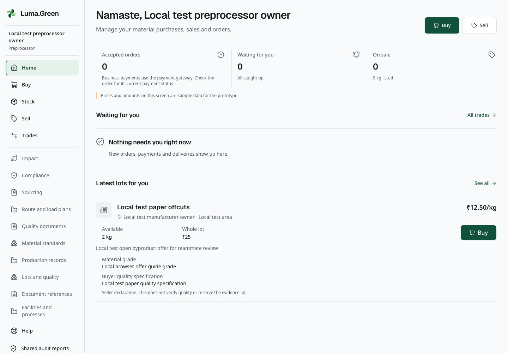

A preprocessor buys, sorts and supplies recyclable material. Kabadiwala-to-preprocessor and preprocessor-to-recycler trades are common examples. The actual offers and buyers follow each approved business’s material scope. These screens use the shared stock and trade records.

1. Open /app/market to inspect offers that match your approved material scope.
2. Check material, quantity and supplier before placing an order.
3. Follow the trade sequence in chapter 12.
4. Inspect /app/stock for recorded quantities and reservations. In the default no-provider setup, payment-dependent dispatch and receipt remain blocked; chapter 12 explains the approved live flow.
5. Use /app/sell to offer eligible available material to approved buyers that handle it.
6. Use /app/trades to follow orders that need a decision or are waiting for the gateway.

Physical sorting, grading and baling happen outside the app. Use **Lots and quality** to record measured inputs, outputs, contamination and process loss through **Record transformation**, as described in chapter 11. Record inspection results against the written specification. These records do not change stock, transfer legal ownership or certify the material. Do not describe an activity as recorded unless its saved record exists.

Keep the documentary evidence required by the business. An older prototype payment record does not establish collection or settlement. Review the relevant Standards information before making a certification claim.

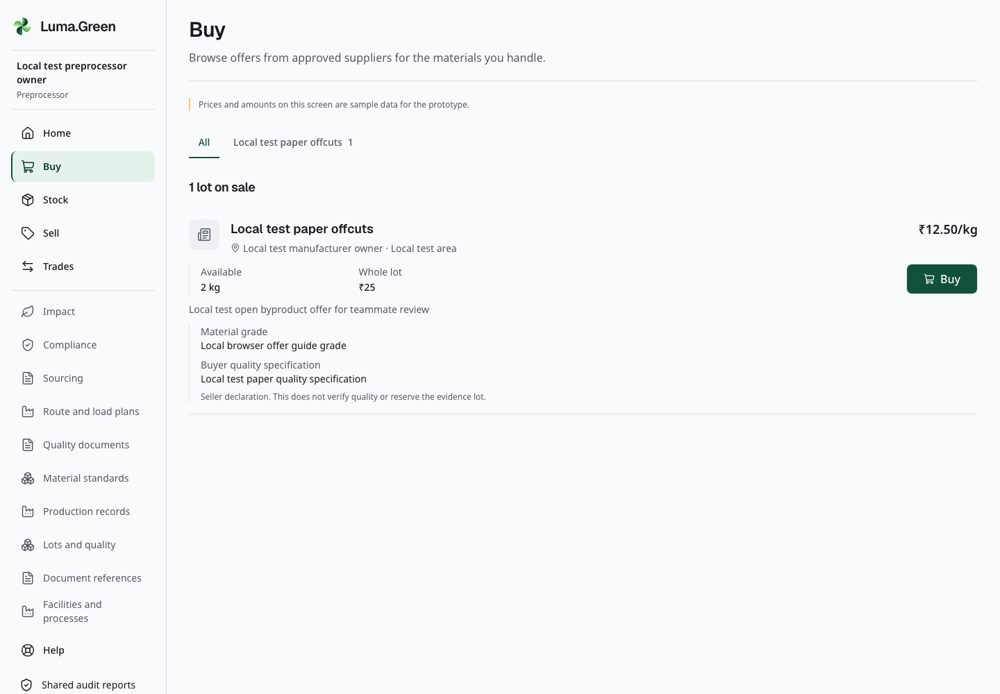

---

## 14 / Recycler: supply recovered material

1. Open Home to see the role's summary.
2. Use Buy to inspect offers from approved suppliers within your material scope. Preprocessors are one common source.
3. Use Trades to request, accept or reject orders as permitted. Without an activated gateway, accepted orders wait and dispatch and receipt stay blocked. Follow chapter 12 after approved live activation.
4. Use Stock to inspect collected materials and recycled-material groups.
5. Use Sell to offer eligible output to approved buyers that handle the material.
6. Open /app/compliance and /app/impact where the role menu provides them.

Use **Lots and quality** and **Record transformation** to record measured processing inputs and outputs. Chapter 11 explains the mass balance, hand-off and inspection steps. Saving a transformation does not convert stock or create saleable inventory; check stock and trade records separately.

Compliance shows a renewal warning when a consent has fewer than 90 days left. The renewal review date is 90 days before expiry; it is not a promise of an SMS reminder. Renew with the issuing board and contact support to update the certificate.

Compliance totals depend on the recorded transactions. They are supporting information. Check the date range, categories and underlying receipts before using them in an external report. No automated regulatory filing is performed.

---

## 15 / Manufacturer: buy, sell byproducts and review compliance

1. Open Buy to inspect approved suppliers and offers that match your material scope.
2. Check material, grade, quantity and price before placing an order.
3. Follow the trade state. In the default no-provider setup, accepted orders wait for the gateway. After approved live activation and verified collection, the seller can record dispatch and the buyer can confirm full receipt as described in chapter 12.
4. Inspect any available trade receipt as a record only; an older receipt is not proof of payment or delivery.
5. Open /app/compliance to inspect the recorded recycled-material and EPR information.
6. Check the displayed financial year and the transactions behind the total.

Manufacturers can buy from approved suppliers within their material scope and offer approved non-hazardous recyclable byproducts. The buyer can be any approved business that handles that material. This does not give blanket permission to trade hazardous or unclassified waste. Available materials and buyers come from the server's current eligibility rules. Local acceptance and provider completion are separate checks.

### Offer a manufacturer byproduct

1. Select the manufacturer's workspace and open **Stock**. Check that the assigned byproduct has available stock. A lot evidence record alone does not supply stock.
2. Select **Sell**, or open /app/sell. Select an eligible material from the available stock choices. Enter the quantity in kilograms, price per kilogram and an optional note. Check the units and total.
3. Select **Put on sale** once. Check that the listing appears. A viewer can read permitted records but cannot create or withdraw a listing.
4. The approved buyer opens **Buy** at /app/market. A kabadiwala finds this destination in **More** on a phone. The buyer checks the material and seller, enters the quantity and requests the order. Do not infer delivery distance or transport coverage from eligibility alone.
5. The seller opens **Trades**, then **Selling**, and accepts the assigned request. The buyer opens **Buying** to check the same order. The kabadiwala trade page opens on Selling by default; select Buying for its purchase.
6. Both parties check the accepted status and gateway message. No manual paid flag, reference upload or cash option can complete this B2B order. A reservation is not a stock deduction or payment.
7. To stop offering an active listing, use **Withdraw** and check the resulting state. This does not silently cancel an already accepted order.

For the isolated training case, use **Local test paper offcuts**, 1 kg at ₹12.50 per kg. The requested total is ₹12.50, or 1250 paise. **Local test unclassified paper** is the negative test control and must not become an eligible manufacturer sale. These values and labels are synthetic test data, not live price recommendations.

The platform supplies records, not a certification. It does not automatically file EPR returns, issue carbon credits or approve the business's environmental claims. In the default no-provider setup, business payment-dependent actions are blocked as described in chapter 12.

Do not treat the trade receipt as a GST invoice. Obtain the actual supplier invoice and other required documents through the business's normal process.

---

## 16 / Saathi: local work and earnings records

A Saathi is an approved worker who can take pickup, sorting or shift work offered by the platform's job flow.

1. Sign in with the same email or phone account that owns the approved Saathi application.
2. Open /app to view the job board.
3. Read the job's location, work, time and offered amount.
4. Accept only work you can attend.
5. Select Mark done on the current job when the work is complete, then confirm completion.
6. Open /app/impact to inspect the earnings record shown for the role.

Finish marks the job done and records that action. It does not call a payout provider. Confirm actual payment through the agreed payment method outside the platform.

The Saathi home is /app. There is no /app/saathi page. If an application is not approved, follow /join/status instead of trying to open another role's route.

---

## 17 / Admin: create access once

The system has one configured platform admin. Business team invitations do not grant console access; there is no platform-admin invitation screen. Normal email signup and phone sign-in never grant admin access.

1. Owner: confirm the intended frontend and Convex deployment.
2. Configure the backend authentication settings and the allowed ADMIN_EMAIL. Set a separate random ADMIN_SETUP_TOKEN of 32–512 characters on Convex. Keep it private and give it only to the person who will create the admin account.
3. Open /admin/setup.
4. Enter the full name, Indian mobile number, date of birth and only the last four Aadhaar digits.
5. Enter the configured email address and the private Setup token. Set and confirm a password of 12-128 characters.
6. Select Create the admin account.
7. Scan the authenticator QR code or enter its key in an authenticator app.
8. Enter the current six-digit code and turn on the authenticator.
9. Save the one-time backup codes securely. Confirm that they are stored, then go to the console.
10. Remove ADMIN_SETUP_TOKEN from the Convex environment. Sign out and test a normal password and authenticator sign-in.

Do not include a real setup token, password, authenticator key, QR code, backup code or identity file in a screenshot or this guide. New account creation requires the configured email and setup token. It does not prove mailbox ownership through a verification email. If an unexpected account already exists, stop and use an owner-led recovery procedure.

If setup cannot connect, read the safe error message and try again after the connection returns. The control becomes available again. If the account already exists after an uncertain result, use admin sign-in and return to setup to complete it. Do not create another identity.

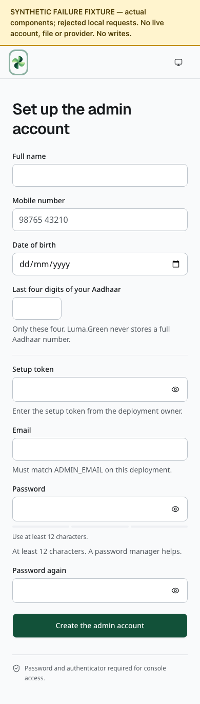

---

## 18 / Admin: sign in and recover access

1. Open /admin/login on the intended deployment.
2. Enter Email and Password. Select Continue.
3. Enter the current authenticator code. Six digits can submit automatically.
4. If the authenticator is unavailable, select Use a backup code. Enter one unused code and select Sign in.
5. Use Start again to return to password entry.
6. Select Sign out when finished, particularly on a shared device.

If a password, authenticator or backup-code request fails, the form shows an error and allows another attempt. A failed sign-out keeps the current page open. It does not confirm that your session ended; retry before you leave a shared device. Phone codes cannot grant an admin session.

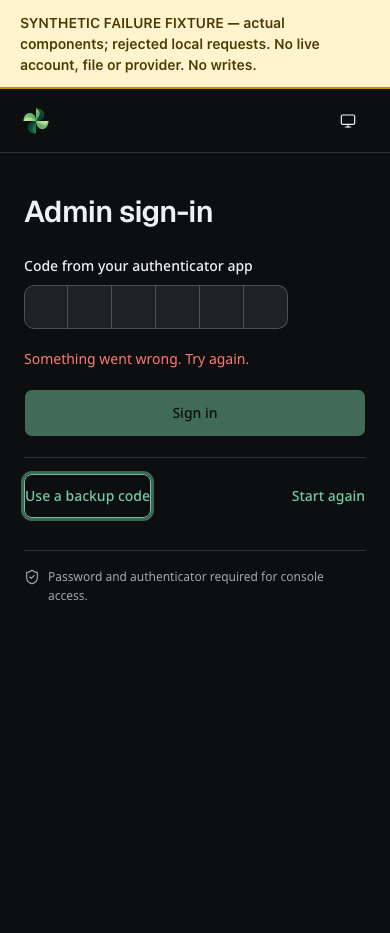

Admin sessions last at most 12 hours. Activity does not extend that limit. The console is English-only and has no locale prefix.

If setup was interrupted, reopen /admin/setup and complete the remaining profile or authenticator step. If signed in with a normal email or phone account, sign out before starting admin setup.

### Reset a lost admin password

1. On Admin sign-in, select Forgot password, or open /admin/forgot-password.
2. Enter the configured admin email and select Send reset link. Recovery needs the owner to configure the verified Resend sender. If configuration or delivery is unavailable, follow the displayed error.
3. Open the received link within 15 minutes. Use a unique password of 12–128 characters and enter it again. The visibility control helps check entry; the length hint is not a guarantee of password strength.
4. Select Update password once. After success, sign in with the new password and your authenticator or an unused recovery code.

A link works once. Missing, expired or previously used links cannot reset the account. Request a new link when needed. A successful reset ends existing sessions and invalidates earlier pending sign-in proofs and reset links. It keeps the authenticator and recovery codes. Unknown or non-admin addresses receive a neutral response and no email.

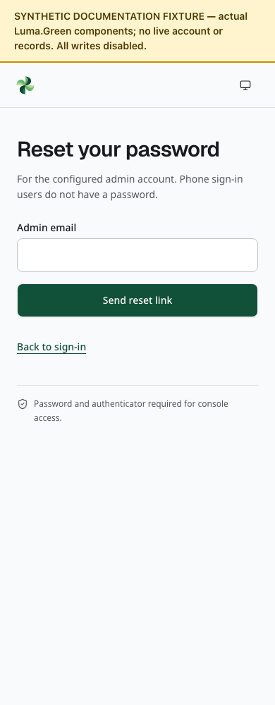

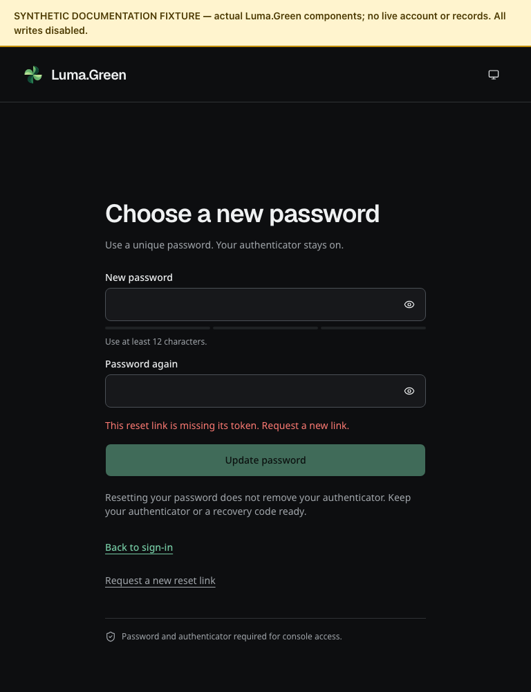

If neither an authenticator nor an unused recovery code is available, arrange owner-led recovery. A password reset does not bypass the second factor. Business team invitations do not grant platform-admin access. Changing ADMIN_EMAIL is not a safe way to invite another operator.

---

## 19 / Admin: daily overview

Open /admin. Check Waiting for review, Overdue and Open support requests. Use the console navigation to open Verification, Prices, Pilot numbers or Support.

1. Process the oldest submitted applications first.
2. Treat 18 hours as due soon and 24 hours as overdue.
3. Check applications returned for changes in With the applicant.
4. Review support requests and the current reference prices.
5. Review current booking outcome totals and the count sent to another shop. Investigate individual cases through the operator workflow or an authorised backend review.

The **Recent accounts** list shows **Profile created**, the date of first profile creation. It is not a complete login audit or proof of a verified phone number. An email account can have no phone number. The summary counts and queue reads are bounded for the pilot. They are not unlimited exports.

The console does not include a maintenance switch, platform-admin invitation, suspension/reinstatement action, SMS resend tool or a report export button. Business team invitations are managed separately in Workspaces and team. Older plans that mention those actions are not instructions for this version.

---

## 20 / Admin: review an application

1. Open /admin/verification. Select Review on a submitted application.
2. Check the applicant, role, available contact details, language, submission time and version.
3. Inspect the form, files and any changes from a previous submission.
   If a source site or material origin is declared, complete the extra source
   check against the applicant's evidence. These are declarations, not
   verified material grades or permits.
4. Complete the role checklist below.
5. Choose Approve, Ask for changes or Reject.
6. Read the confirmation and enter a note if required.
7. Confirm once, check success, then return to the queue.

| Role                               | Manual checks                                                                                                                                         |
| ---------------------------------- | ----------------------------------------------------------------------------------------------------------------------------------------------------- |
| Kabadiwala                         | Check map location and available contact evidence; GSTIN, if supplied, must be active and match the business                                          |
| Preprocessor/recycler/manufacturer | Check active matching GSTIN if supplied; valid consent matching business, address and activity, or checked exemption; working-unit photos; call owner |
| Saathi                             | Readable ID; matching name; masked Aadhaar if used; selfie match; call applicant                                                                      |

Approve becomes available after every checklist item is ticked. Checklist ticks are temporary page notes; they are not stored as an evidence checklist. Decisions are recorded in the audit trail. Change and rejection notes must contain 5-1,000 trimmed characters.

Already decided applications show status. There is no reopening or suspend button. Approved kabadiwalas start with fallback prices.

### Review stakeholder account requests

The bottom of /admin/verification has a separate stakeholder queue. For each request, check the claimed organisation, account group, primary site if present, available applicant contact details, identity and affiliation. Enter a review note of 10-1,000 characters. Tick the identity-and-affiliation check before approval, then choose Approve account or Reject request. A rejection does not require the checkbox. The decision is recorded in the audit trail. Approval confirms the reviewed identity and affiliation only. It does not create a trading organisation or give access to private records, certificates, credit trading or a specialist workspace. Those permissions are not supplied by this approval screen.

---

## 21 / Admin: reference prices

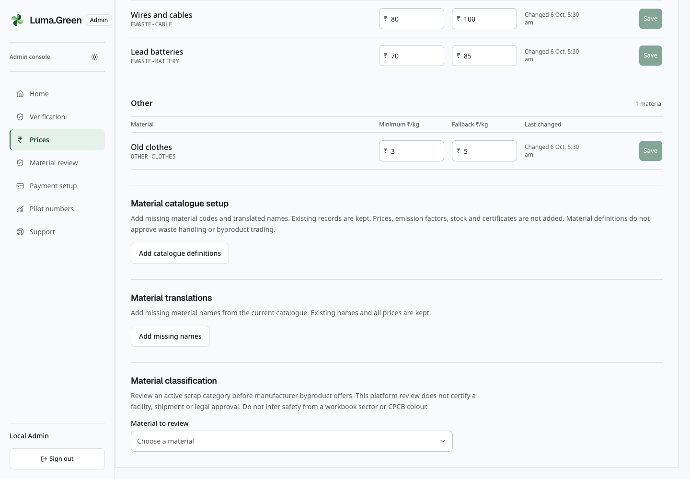

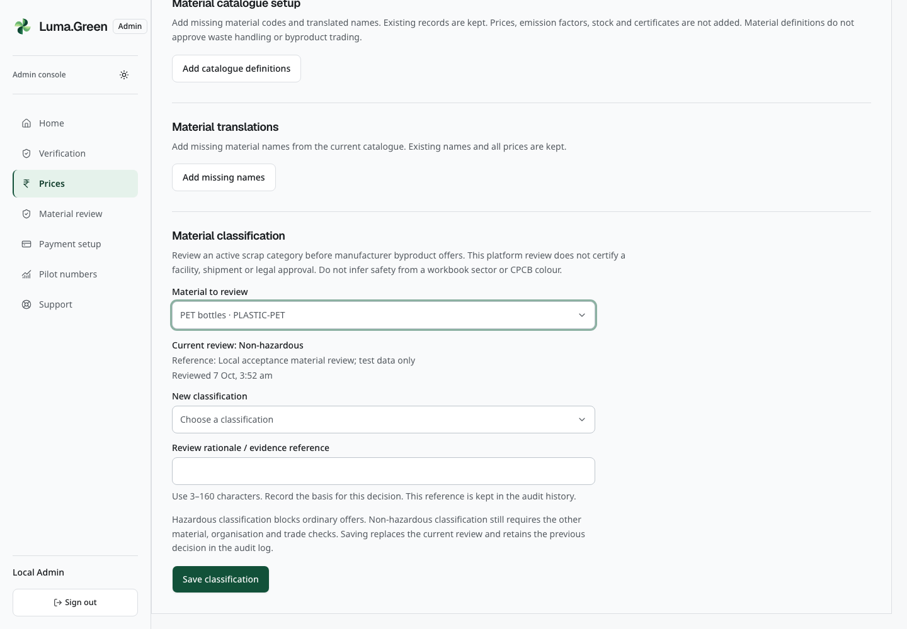

### Set up an empty material catalogue

After the owner completes the first-admin setup, open /admin/prices. If no
materials exist, use **Add catalogue definitions** under **Material catalogue
setup**. Wait for the result. The action adds missing canonical material codes,
translated names, families and stages. It preserves existing definitions and
can be used again without duplicating them.

This action adds no sample prices, price history, stock, orders, emission
factors or certificates. It does not approve a waste-handling activity or a
manufacturer byproduct. Review and enter the actual minimum and fallback prices
in the material rows before allowing a household estimate or shop rate to rely
on them. Never run a prototype reset or demo import to prepare production.

New definitions have an unknown emission factor. Where a recorded material
needs that factor, Impact shows the CO₂e estimate as unavailable, not zero.
Measured kilograms remain visible. Existing reviewed factors and earlier
records are preserved. No credit is issued by catalogue setup or Impact.

### Review a manufacturer byproduct material

As the platform admin, complete password and authenticator sign-in, then open /admin/prices and scroll to **Material classification**.

1. Select **Material to review** and read its current review, reference and date.
2. Check the actual material evidence. Under **New classification**, choose **Non-hazardous** or **Hazardous** explicitly. Do not copy a workbook sector colour as a safety decision.
3. Enter **Review rationale / evidence reference** using 3–160 characters. Keep the underlying evidence in its approved location; this text is a reference, not an upload.
4. Select **Save classification** once, then read the updated current review. The change is audited.

Hazardous classification blocks ordinary manufacturer byproduct offers. Non-hazardous classification alone does not approve a facility, shipment or legal activity, and does not bypass active-business, material-family, stock, buyer or gateway checks. Teammates must use only the assigned synthetic review case locally; ordinary team accounts cannot make this admin change.

Open /admin/prices. The screen is fixed to Bengaluru and identifies its values as prototype sample prices. The owner must validate launch prices.

1. Find the material row.
2. Enter Minimum and Fallback in rupees per kilogram.
3. Check that both are positive and the minimum does not exceed the fallback.
4. Use at most two decimal places; the maximum is 10,000 rupees per kilogram.
5. Select that row's Save. Read the confirmation and any count of shop rates raised.
6. Use Undo only to discard unsaved edits.

Raising a minimum can raise stored shop rates below it. This operation has pilot query bounds; it is not an unlimited bulk rewrite. Fallback prices apply where a shop has not supplied its own rate and to the first household estimate. Old receipts keep their original values.

If the material catalogue is empty, ask the platform operator to load the approved catalogue before setting prices. **Add missing names** fills missing catalogue names from the bundled translations. It preserves existing names and prices; it does not load an empty catalogue or provide an online translation service. There is no city selector or price-history export control.

---

### Review material, facility and destination evidence

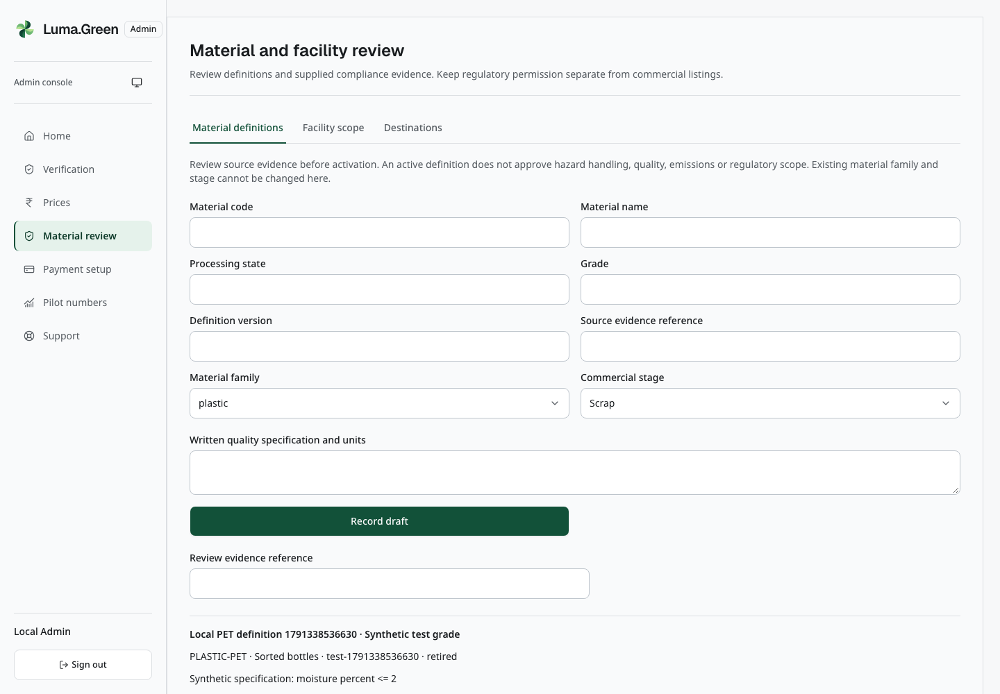

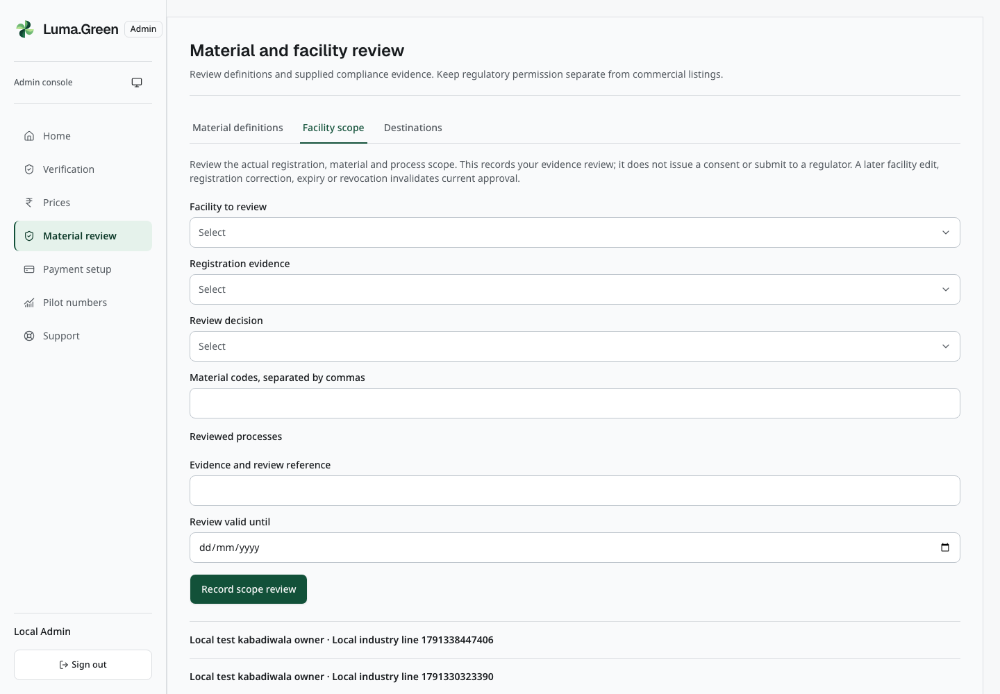

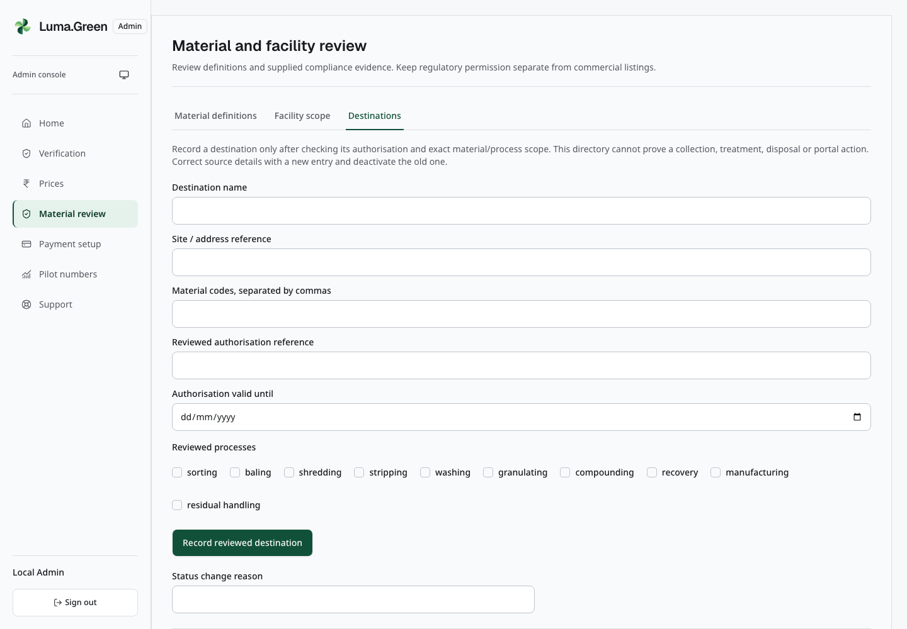

Open **Material review** in the admin navigation. This page is for the platform
admin, not a workspace administrator.

- **Material definitions:** complete the material code, name, processing state, grade,
  version, family, commercial stage, source reference and written specification.
  Select **Record draft**. Check the saved values, enter **Review evidence
  reference**, then activate the intended row. Retirement removes that definition
  from business search; it does not change an earlier lot or material receipt.
- **Facility scope:** select a declared facility and its current registration.
  Select only materials and processes covered by its evidence. Enter the review
  decision, evidence reference and validity date. The date cannot extend beyond
  the registration for an approved review. Save and read the resulting history.
  This records the admin's evidence review, not a government approval.
- **Destinations:** record the receiving site, covered materials and
  processes, authorisation reference and validity date. Deactivate a receiver
  with a reason if its approval is withdrawn. New linked dispositions must then
  fail; earlier evidence remains unchanged.

Use assigned synthetic evidence during local training. Never approve a real
facility solely because its name or workbook category appears on this page.

## 22 / Admin: pilot numbers

Open /admin/pilot. Choose Today, 7 days, 30 days or the fixed 13-20 October 2026 report preset. That preset is not the current 10 October launch target. Read the displayed date range in India time.

1. Check whether Partial report is shown. Choose a shorter period if it is.
2. Review booking count, reassignment count and average acceptance time.
3. Review collected kilograms and recorded payments.
4. Compare estimated and weighed kilograms for completed bookings with receipts.
5. Review booking outcomes and application decisions.

### Read the charts

The Booking outcomes chart compares the six current booking states. Read the
counts beside the chart for exact values. A zero count has no visible bar.
The Estimate and weighed material chart compares the two weights for each
material code. The table below gives the same values in kilograms.

Hover a bar to read its tooltip. The written counts and table are also available
without a mouse. The charts use records from the selected report period. They do
not create a price history or show a trend over time. If a report has no bookings
or material rows, the related chart is not shown.

### What these numbers mean

Bookings are selected by date booked. Applications are selected by their latest submission date. Outcomes are the current record state, not a historical snapshot at the selected end date. The report reads at most 1,000 bookings and 1,000 applications; the backend accepts a maximum 31-day range.

Recorded payment is not proof of a provider transfer. Demo rows are included if present in the deployment. Drafts and previous review rounds are not complete application-funnel counts. The report does not measure photo-to-booking conversion, form abandonment or original AI accuracy. A basket weight can have been edited manually.

There is no CSV or PDF export control on this page. This user guide does not add one.

---

## 23 / Admin: support and private files

### Support inbox

1. Open /admin/support.
2. Select Open, Answered or All.
3. Read the requester, topic, role, message and time.
4. Use Call to open the device's telephone handler, then handle the conversation outside the app.
5. Select Mark answered after the matter is handled. Check the Answered tab.

The inbox includes help and solar enquiries and reads the newest 200 records. Mark answered changes the status only. It does not send an email or SMS. There is no reply composer, internal note, assignment, reopen or delete control.

### Private files

Business quality files and owner-granted audit reports use the separate controls
in chapter 11. Admin support access does not grant a stakeholder access to them.

Use the application's image/PDF preview. Select Load the video before a video is fetched. Open or Download only when necessary. A valid session and permission are required on each file request. If the session has ended, sign in again. For a network error, use Try again.

Store downloaded identity documents only in an approved secure location. Do not add them to Git, this guide, a public support thread or a screenshot set. Temporary browser preview caching is not a document archive.

---

## 24 / Help, contact and training

1. Open /help and search for the task or problem.
2. Filter by topic or choose your role.
3. Open a guide and follow its steps.
4. Use /help/contact if the guide does not solve the problem.
5. Enter the requested contact information and a clear message. Submit once and read the result.

The illustrated topic links open the complete preparation, weighing/payment and business-verification guides. They keep the selected language. Use them when you know the task but not which role directory to open.

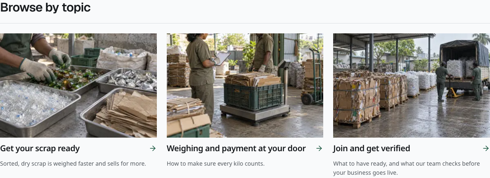

Training completion is stored in this browser's local storage. It is not a certificate and does not automatically follow the account to another device. Clearing browser data can remove the mark.

The current Call and WhatsApp number is a placeholder: +91 80 0000 0000. It is not an active support number. The owner must replace it before launch. When connected, the contact form creates a support request; it does not prove that a person has replied or that an SMS/email was delivered.

The contact form limits repeated messages from the same number within one hour. If the limit message appears, keep your draft and try again in an hour.

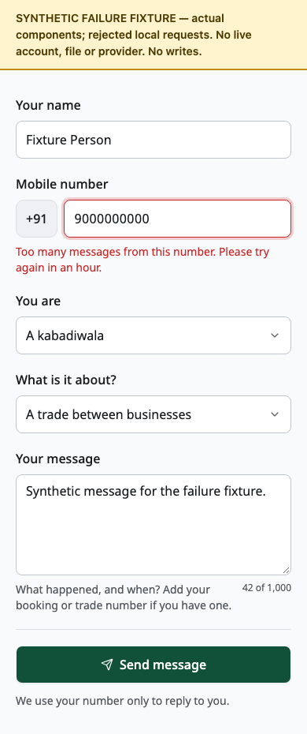

---

## 25 / Standards, impact and rooftop solar

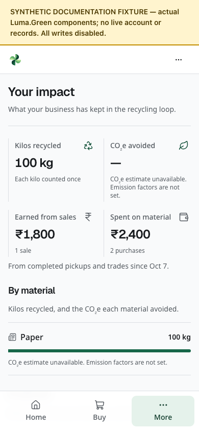

Use /standards for information about the material chain and industry schemes. Check the relevant official scheme before making an external claim. A platform record does not itself certify a business or issue a credit.

Use /app/impact for the summary available to your role. Keep recorded collection quantities, estimated impact and verified carbon credits separate. Carbon-credit issuance, trading and retirement are later product work.

Use /solar to explore the rooftop-solar information and estimator. The input reads local digits and decimal separators, such as 3000,50 in French or ٣٠٠٠٫٥٠ in Arabic. Check the displayed estimate after editing; malformed numbers show a field error. Treat estimates as planning inputs, not an installation quote or guaranteed return. Send an enquiry through the form if enabled. It enters the support workflow; no installer booking, finance approval or electricity connection is completed by that form.

The grading, weighing and custody sections now include relevant work scenes beside their rules. The images do not certify the work or show measured platform activity. The platform does not replace business compliance advice, physical inspection, product testing or a supplier's official documents.

---

## 26 / Mobile and desktop apps

The repository contains an Expo/React Native shell for Android and iOS and an Electron shell for macOS and Windows. They use the same hosted operational UI and backend. Signed, installable releases and store acceptance are still release tasks.

### When an approved release is available

1. Install the signed app from the owner's approved distribution channel.
2. Open the app and sign in to the correct service.
3. Grant camera or location access only when needed for the current task. If location is denied, use the form's available manual choice.
4. On desktop, choose an existing photo; direct camera capture is not enabled.
5. Follow a browser handoff for admin pages or private documents when requested. The external browser can require a separate sign-in.
6. If disconnected, restore the connection and inspect the current record before repeating an action.

Hosted website changes can update the shared UI. Compatible signed JavaScript updates and desktop updates have separate release paths. Mobile shell updates can apply at a later cold start; an immediate restart requires a choice. Desktop updates can install on normal quit or through the offered restart action. Select Later while a form is in progress. New native capabilities can still require a binary or store update; permanent freedom from updates is not promised.

Account notifications and device permission are explained in chapter 38. Android/iOS push requires EAS, APNs/FCM setup and controlled signed-device tests. Desktop notifications require the application process to remain open. Apple Developer, Google Play and Expo/EAS accounts are not yet set up.

There is no offline write queue, background location service or independent native ledger. A mobile JavaScript export is not an APK or IPA installer.

### Local desktop demonstration

The separate Luma.Green Demo app is available as an unsigned Apple Silicon Mac
build and a Windows x64 folder. Windows execution still needs a Windows test.
Start the built website on the same computer with `pnpm exec next start --port
3004`, then open the demo app. Copy the entire Windows folder, not only its EXE.
The app loads localhost:3004; it does not contain an offline copy of the website.

Rebuild with `pnpm --filter @luma/desktop demo:pack:mac` or
`pnpm --filter @luma/desktop demo:pack:win`. Demo cookies are separate from the
production app. Updates are disabled in the demo profile. It does not bypass
sign-in or make a disconnected backend work. Show public pages first; use only
an approved test backend and test account for protected workflows.

### Android and iOS demonstration

Run `pnpm --filter @luma/mobile demo:ios --check` or
`pnpm --filter @luma/mobile demo:android --check` to check the local web origin.
Omit `--check` to start Metro for an installed development build. iOS simulator
uses localhost; Android emulator uses 10.0.2.2 to reach the computer.

A real device needs a tested HTTPS origin, the matching development build and
native tools or an approved EAS build. Set EXPO_PUBLIC_APP_ORIGIN before building
and launching; then use `pnpm --filter @luma/mobile demo:device`. The app cannot
assume that any Expo Go installation contains its native modules. Full Xcode is
required for local iOS builds; Android needs the supported JDK and Android SDK.

This machine exported both JavaScript bundles and tested the launcher. It did
not produce an APK or IPA, and no phone or simulator acceptance was completed.
See apps/mobile/README.md and docs/operations/app-releases.md for build, signing
and device checks.

---

## 27 / Troubleshooting

| What you see                     | What to do                                                                                                                                                                         |
| -------------------------------- | ---------------------------------------------------------------------------------------------------------------------------------------------------------------------------------- |
| Code-entry preview               | You can inspect the phone and code screens. The owner must connect auth/SMS before verification works.                                                                             |
| Admin console is not switched on | Check the frontend/backend setup; no admin action can fix a missing connection from this screen.                                                                                   |
| SMS code is late                 | Check the number and resend timer. Avoid repeated sends. Check provider acceptance and handset delivery separately.                                                                |
| Code expired or attempts used    | Follow the screen to request a new code after the permitted delay.                                                                                                                 |
| Protected page redirects         | Sign in again; check the selected workspace, current membership and business approval.                                                                                             |
| Temporary sign-in service error  | Wait briefly, then select Try again. This reloads the current page; the error alone does not mean you were signed out.                                                             |
| Inbox is unavailable             | Check the connection and sign-in state. Reload after service returns; do not treat an unavailable inbox as empty.                                                                  |
| Application requests changes     | Read the note, correct the specified fields and resubmit.                                                                                                                          |
| Booking cannot be accepted       | It may have expired or been reassigned. Read the current status.                                                                                                                   |
| File will not open               | Confirm session and permission; use Try again, or the browser/desktop path.                                                                                                        |
| Price cannot be saved            | Check units, decimal places and the minimum/fallback rule.                                                                                                                         |
| Pilot report is partial          | Select a shorter date range. Do not use a truncated total as complete.                                                                                                             |
| Business order waits for gateway | Check the gateway setup and order state in chapter 12. Without approved activation, checkout and later steps stay blocked. A kabadiwala pays a household directly outside the app. |
| Email verification is missing    | Check the address and delivery status; use Resend verification after the unverified-email message.                                                                                 |
| Invitation is unavailable        | Use the invited verified email account. Check expiry and ask the sender to replace a revoked or expired invitation.                                                                |
| App shows an update              | Finish or save your work, then use the offered restart action.                                                                                                                     |

For an uncertain submit, reconnect and inspect the record first. Do not repeatedly create a booking, trade or payment record. Provide the route, visible status, time and non-sensitive record identifier when reporting a fault. Never send passwords or recovery codes.

---

## 28 / Owner launch and account checklist

This is an owner/developer checklist, not a list of admin console buttons. The exact environment names and release commands live in the repository runbooks.

### Complete setup in this order

1. **Use the existing hosting address.** The existing Vercel production address
   is [lumagreen.vercel.app](https://lumagreen.vercel.app). The `luma.green`
   custom domain is not configured in Vercel at this checkpoint. Do not send
   teammates to that custom domain until ownership, DNS, HTTPS and redirects
   have been verified. The production address is separate from the local test
   environment and is not proof that the latest release is deployed.
2. **Let the engineer finish the built-in configuration and release.** Reuse
   the existing GitHub, Convex and Vercel projects. Configure a production
   `BETTER_AUTH_SECRET`, the exact HTTPS `SITE_URL`, the matching frontend site
   and Convex URLs, and the intended `ADMIN_EMAIL`. Deploy the reviewed backend
   before its frontend. Keep all local test-mode and private inbox settings out
   of hosted deployments. Better Auth needs no separate account signup.
3. **Create the first admin account once.** The engineer supplies a private
   temporary `ADMIN_SETUP_TOKEN`. Follow chapter 17 at /admin/setup using the
   configured admin identity. Finish the authenticator check and store recovery
   codes privately. Remove the setup token after success. Then test admin
   sign-in, sign-out and a denied signed-out console read.
4. **Connect normal account email.** Create or open the owner's Resend account.
   Add an owned sending domain or subdomain, install the exact DNS records Resend
   supplies, and wait for verification. Choose the sender. Store
   `RESEND_API_KEY` and `AUTH_FROM_EMAIL` in Convex, with the separate
   `ADMIN_RESET_FROM_EMAIL` for admin recovery. Test a real controlled mailbox
   for verification, password reset and invitation delivery. Complete each link
   and test expiry and reuse; an accepted send is not inbox delivery.
5. **Connect phone verification.** Create or open the MSG91 account. Complete
   the required India DLT entity, header and content-template process and map
   the approved values into MSG91. Configure `MSG91_AUTH_KEY` and
   `MSG91_OTP_TEMPLATE_ID` in Convex. Use a controlled handset to test receipt,
   expiry, wrong-code rejection and resend limits. Optional status SMS needs
   its own approved Flow templates; OTP setup does not enable those messages.
6. **Finish the business-payment gates.** Ask Cashfree to approve Luma's
   recycling-material marketplace use case and enable Payment Gateway with
   Easy Split. Complete merchant and seller/vendor KYC. Keep sandbox and live
   credentials separate. The implemented payment, refund and seller-settlement
   controls require final integrated checks and real provider acceptance before
   live checkout can open. The owner must confirm who bears gateway, refund and
   chargeback fees. Adding a live key does not resolve these acceptance or policy gates. B2B orders
   stay blocked at the documented payment boundary until they pass.
7. **Add real operating details.** Confirm support contacts, operating hours,
   approved business access and actual material rates. Keep the disposable
   development accounts and synthetic training materials out of production.
   Each teammate uses their own verified production identity and invitation.
8. **Run one manual release check.** Use chapter 40 and the detailed manual
   against the exact released candidate. Record account delivery, workspace
   permissions and each enabled provider separately. Enable optional analytics,
   AI, push or native releases only after their own setup and acceptance checks.

### Admin payment setup: record the correct vendor reference

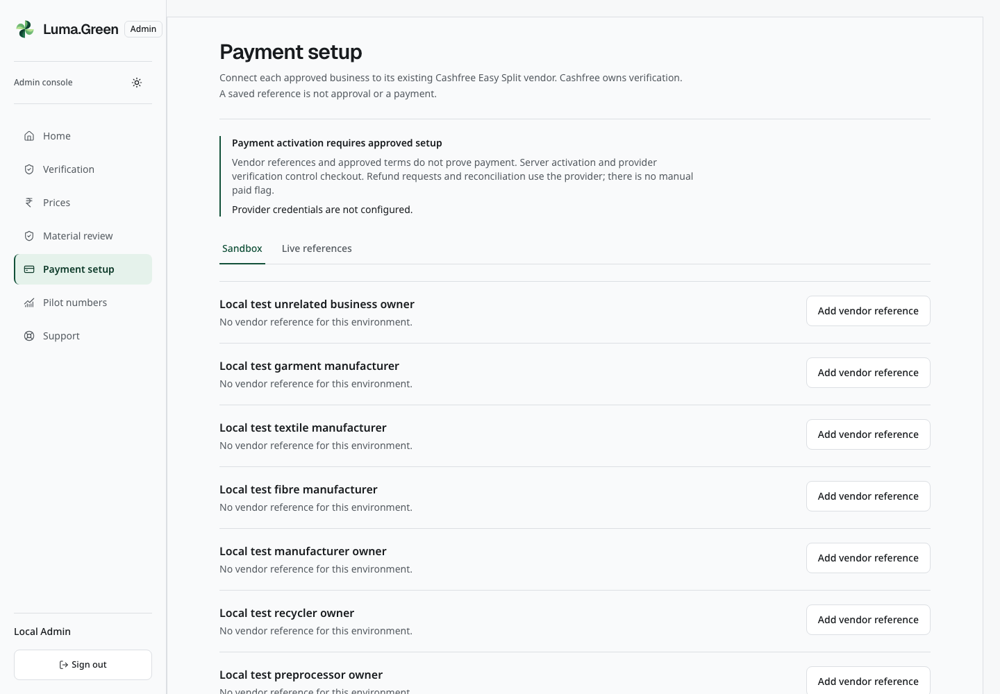

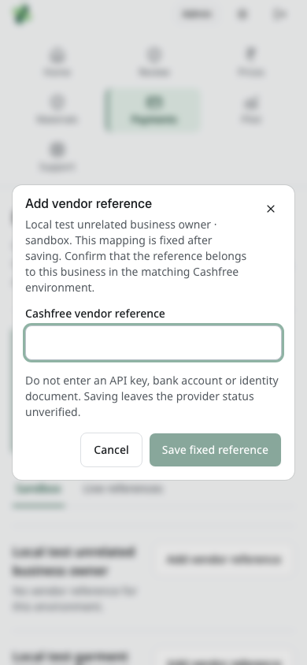

This page is for the configured administrator. It prepares a Cashfree vendor
mapping; it does not open checkout or release money.

1. Sign in at /admin/login and complete the authenticator check. Select
   **Payment setup** in the console navigation, or open /admin/payments.
2. Read **Payment activation requires approved setup**. The configuration message tells you
   whether the backend has matching provider credentials. Do not enter keys here.
3. Choose **Sandbox** for a test vendor or **Live references** for a verified
   live vendor. These environments have separate mappings.
4. Find the approved business. Use **Load more businesses** if needed. Select
   **Add vendor reference** and check the business name and environment in the
   dialog. A suspended business cannot receive a new mapping.
5. Copy the vendor reference from the matching Cashfree account. Confirm its
   ownership before selecting **Save fixed reference**. The reference accepts
   letters, numbers and underscores, up to 100 characters. The mapping is fixed;
   a different reference cannot overwrite it. Use **Cancel** if uncertain.
6. A saved reference starts unverified. When matching backend credentials are
   configured, select **Check with Cashfree** to request its current provider
   status. A missing configuration keeps the check unavailable. This lookup
   cannot collect money, mark an order paid, refund it or confirm settlement.
7. Record the result in the restricted setup log. If the reference is wrong,
   stop and contact the engineer; do not reuse another business's reference.
   Do not copy vendor identifiers, keys or banking details into the shared guide.

For the two-teammate local walkthrough, open the blank dialog and select
**Cancel**. Do not invent a vendor, save a mapping or call the provider.

### Admin payment terms and financial review

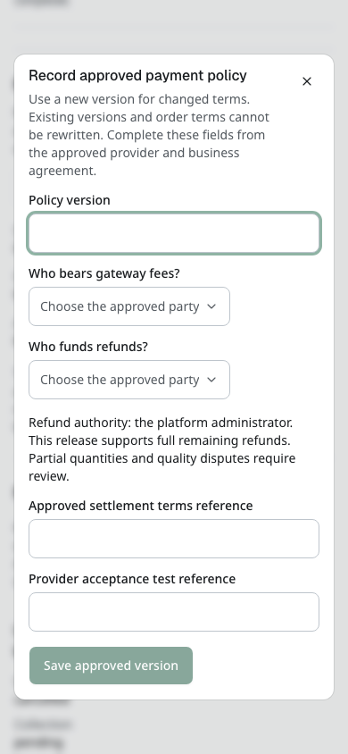

1. On Payment setup, scroll to **Payment terms and activation**. Read Server
   activation, Selected version and Approved policy. Off or Not configured is
   expected before the owner approves and enables live setup.
2. Select **Record approved policy**. Enter a new **Policy version**, choose
   **Who bears gateway fees?** and **Who funds refunds?**, then enter the
   **Approved settlement terms reference** and **Provider acceptance test
   reference**. Use actual approved values from the agreement owner. Do not
   invent a payer, funder or approval reference for a production setup.
3. Select **Save approved version** only for an approved policy. Exact retries
   retain the original; changed terms need a new version. Saving this form does
   not enable server activation, add a fee or rewrite existing order terms.
   During the beginner no-key tour, inspect the blank form and close it.
4. In **Payment, refund and settlement review**, find the correct seller/buyer
   record. **Recheck provider evidence** requests current evidence; it is not a
   manual paid switch. Read each updated state after the request finishes.
5. If a refund is approved and available, select **Request remaining refund**.
   Read the full amount, enter **Refund reference** and **Approved refund
   reason**, then select **Confirm refund request**. This contacts the provider
   in a configured environment; do not use it during a no-provider training run.
6. Keep pending, reviewed and confirmed outcomes distinct. A success notice for
   the request does not prove refunded money. A confirmed refund keeps the trade
   held and does not restore stock. If a request fails, keep the retained
   reference and recheck evidence before retrying. Do not issue another refund
   under a new reference to work around an uncertain result.

The exact settings and owner actions are maintained in
[Account and deployment checklist](../operations/launch-checklist.md) and
[Service inventory](../operations/services.md). Enter secrets in the service's
protected settings, never in this Google Doc, a screenshot or the test log.

| Service or task              | Required setup                                                                                                                                                                                    |
| ---------------------------- | ------------------------------------------------------------------------------------------------------------------------------------------------------------------------------------------------- |
| Hosting and domain           | Intended HTTPS origin; frontend deployment; NEXT_PUBLIC_SITE_URL                                                                                                                                  |
| Convex                       | Correct deployment and URLs; deployment-specific keys; schema/functions deployed before dependent UI                                                                                              |
| Authentication               | SITE_URL, BETTER_AUTH_SECRET and ADMIN_EMAIL; private ADMIN_SETUP_TOKEN for first setup, then remove it                                                                                           |
| Phone SMS                    | MSG91 account, DLT/template approval and OTP limits; configured OTP values                                                                                                                        |
| Account and invitation email | Resend is required for normal email verification, recovery and invitations; verified AUTH_FROM_EMAIL, RESEND_API_KEY and HTTPS SITE_URL; test inbox delivery                                      |
| Admin email recovery         | Separate ADMIN_RESET_FROM_EMAIL and the configured existing admin identity; verify single-use reset without removing TOTP                                                                         |
| Business payments            | Default-off Cashfree lifecycle; approved policy and explicit activation, recycling-marketplace/Easy Split and KYC approval, final code checks, actual collection/refund/settlement proof required |
| Device notifications         | VAPID keys for browsers; Expo/EAS and APNs/FCM for mobile; signed desktop/device acceptance. Inbox persistence and alert delivery are separate checks                                             |
| Optional status SMS          | Separate approved Flow templates and outbox configuration; verify handset delivery                                                                                                                |
| Analytics/errors             | Optional PostHog, GA4 and Sentry projects; telemetry switch, service keys and provider settings                                                                                                   |
| Search ownership             | Optional Google Search Console and Bing ownership tokens; deployed sitemap submission                                                                                                             |
| Optional AI                  | OpenRouter credentials or authenticated HTTPS model gateway; quotas and evaluated model                                                                                                           |
| Android/iOS                  | Expo/EAS project, Apple/Google developer accounts, signing credentials and physical-device checks                                                                                                 |
| macOS/Windows                | Stable signing identities, notarization where required and signed update feeds                                                                                                                    |
| Support and prices           | Real contact details; verified pilot prices; staffed review/support process                                                                                                                       |
| Operations                   | Measured backups and restore drill, provider cost limits and incident procedure                                                                                                                   |

Better Auth runs within the existing Convex component; it needs no separate hosted-auth account. Review and test the complete integration before any backend or frontend release. This source update records local behavior, not a new cloud deployment. Use the current delivery handoff for the release baseline and the 10 October launch plan for remaining work.

Use docs/testing/launch-2026-10-10.md and docs/operations/services.md for the launch plan and provider account inventory. The operations runbooks launch-checklist.md, app-releases.md, push-notifications.md, low-cost-operation.md and sms-notifications.md give the release steps. Keep secrets and disposable test passwords outside Git and the shared guide.

Local verification requires AUTH_LOCAL_TEST_MODE=true, loopback SITE_URL and the system loopback CONVEX_SITE_URL, plus the protected local inbox configuration. It is for the isolated local backend only. Cloud development, preview and production must not use test codes or the retired AUTH_DEV_MODE flag. MSG91 live OTP remains disabled until account and DLT/template evidence is accepted.

A branch push is not deployment. A build is not provider approval. A provider accepting a message is not proof that a handset received it. Test each boundary before opening the pilot.

---

## 29 / Route reference

| Area                     | Routes                                                                                                                                 |
| ------------------------ | -------------------------------------------------------------------------------------------------------------------------------------- |
| Public                   | /, /how-it-works, /participants, /prices, /contact                                                                                     |
| Household                | /sell; /t/[token]                                                                                                                      |
| Sign-in                  | /login; /login/verify; /login/email/verify; /login/email/reset; /login/email/complete                                                  |
| Account settings         | /account/security; /account/notifications; /account/workspaces; /account/workspaces/invite                                             |
| Onboarding               | /join; /join/kabadiwala; /join/yard; /join/recycler; /join/manufacturer; /join/saathi; /join/stakeholder                               |
| Onboarding documents     | /join/[business]/documents; /join/status                                                                                               |
| Role home and requests   | /app; /app/requests; /app/requests/[id]                                                                                                |
| Stock and prices         | /app/stock; /app/prices                                                                                                                |
| Facilities and processes | /app/facility; /app/material-standards; /app/production                                                                                |
| Lots and quality         | /app/lots; /app/lots/[id]                                                                                                              |
| Business trade           | /app/market; /app/sell; /app/trades; /app/trades/[id]/invoice                                                                          |
| Document references      | /app/evidence; /app/quality-documents                                                                                                  |
| Sourcing and transport   | /app/sourcing; /app/logistics                                                                                                          |
| API connections          | /app/integrations; /api/v1/openapi.json                                                                                                |
| Reporting                | /app/impact; /app/compliance; /account/reports                                                                                         |
| Help                     | /help; /help/[role]; /help/[role]/[guide]; /help/contact                                                                               |
| Reference/enquiry        | /standards; /solar                                                                                                                     |
| Admin access             | /admin/setup; /admin/login; /admin/forgot-password; /admin/reset-password                                                              |
| Admin work               | /admin; /admin/verification; /admin/verification/[id]; /admin/prices; /admin/payments; /admin/operations; /admin/pilot; /admin/support |

Replace bracketed parts with the real record, role or guide value. They are not literal links. User-facing routes support locale prefixes such as /kn, /hi and /ar. English normally uses no prefix. Admin routes never use a locale prefix. Unknown routes show a not-found page.

App routes have no organisation slug. In particular, do not use /app/[org]/stock, /app/saathi, /sell/estimate or /sell/book from older plans.

---

## 30 / Glossary and working rules

| Term                    | Meaning in this platform                                                                        |
| ----------------------- | ----------------------------------------------------------------------------------------------- |
| Kabadiwala              | A local collection shop that buys from households                                               |
| Preprocessor            | A business that sorts and prepares bulk recyclable material                                     |
| Saathi                  | An approved worker who takes local jobs                                                         |
| Minimum                 | Lowest permitted shop price for a material                                                      |
| Fallback                | Reference price where a shop has no custom rate                                                 |
| Estimate                | A starting quantity/value that must be checked                                                  |
| Receipt                 | Recorded material, weight, price and transaction details                                        |
| Reserved stock          | Quantity committed to an active trade                                                           |
| EPR                     | Extended Producer Responsibility; platform records can support reporting                        |
| Gateway                 | Cashfree is selected; live B2B payments require approved provider setup and explicit activation |
| Workspace               | One business and the records allowed by its current membership                                  |
| Workspace administrator | A business team role; it does not grant platform-admin access                                   |
| TOTP                    | Time-based code from an authenticator app                                                       |
| Partial report          | A bounded report that did not include every matching record                                     |

Check the material, unit, quantity and price before you confirm an action. Keep real payment confirmation separate from a recorded payment state. Use the correct account and deployment. Preserve private files and recovery codes. Resolve errors through a correcting operation that keeps the audit history.

---

## 31 / Screenshot reference: prices and solar

Open /prices before comparing a shop offer. A connected demo deployment can show seeded sample prices with a visible sample-data notice. These values demonstrate the interface; they are not verified market quotes. Choose a material to inspect its price detail and any available history. Check the city, date, unit and sample-data notice. An unconfigured or empty backend shows placeholder rows and a status message. Placeholders move only while a request is loading; reduced-motion settings stop that motion. The interface does not create replacement prices when a request fails. This board is not independent market-price advice.

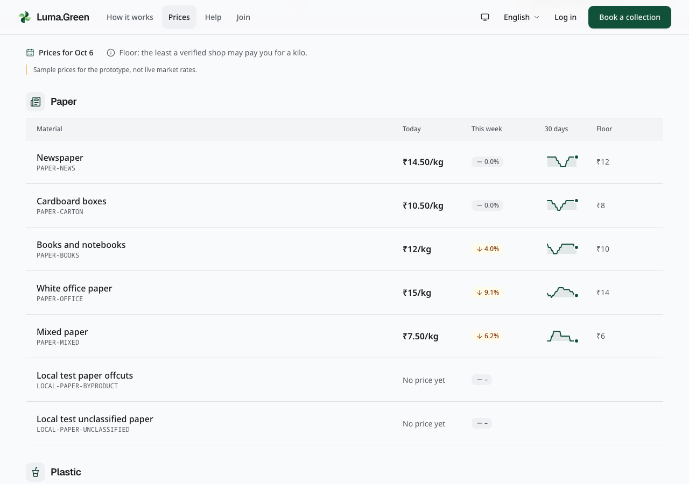

The isolated test catalogue can also contain **Local test paper offcuts**
(`LOCAL-PAPER-BYPRODUCT`) and **Local test unclassified paper**
(`LOCAL-PAPER-UNCLASSIFIED`). These are synthetic byproduct acceptance records.
The unclassified material is a negative test control. Neither label is a market
quote, approved trading classification or production catalogue recommendation.

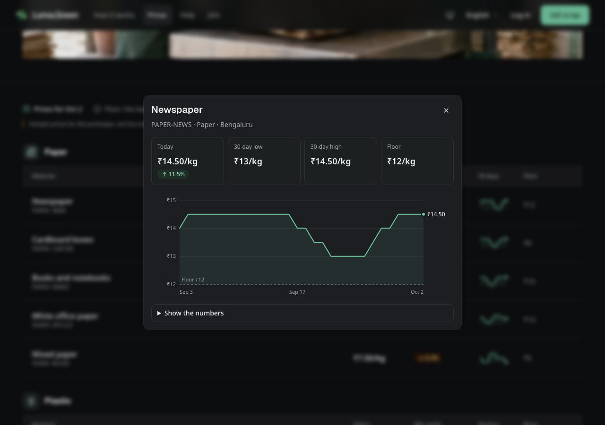

The historical demo capture contains 26 materials. The 3 October capture shows 29 available daily samples in its rolling 30-day window; no new sample was added for that capture. These figures do not describe the empty, paused cloud deployments after the 6 October reset. Select a row to open its history. Use the arrow keys on the chart to read another date. Select Show the numbers to open the daily values below it. Close the dialog to return to the board. These sample values must be validated or replaced before operational use.

The weighing guide below the board explains the final amount: zero the scale, weigh each material separately, agree the amount and check the receipt. A reference price does not replace measured weight. Use Open guide to read the full household weighing instructions.

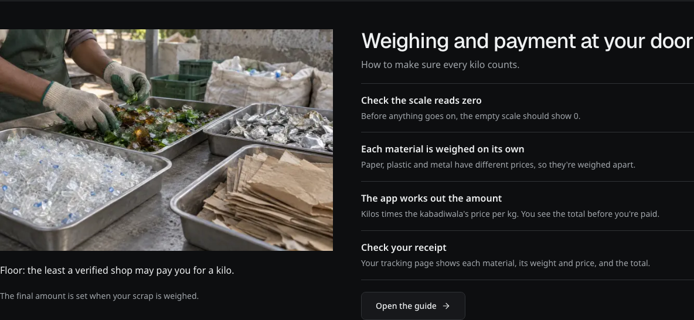

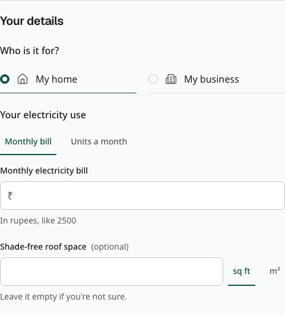

---

## 32 / Screenshot reference: language and contact

Use the language control to change language. On public pages and operational screens, phones and tablets keep it in the menu. Sign-in screens keep it in the header. The same workflows remain available; text direction and number formatting follow the locale. The admin console stays English-only.

---

## 33 / Screenshot reference: chain and review queue

The retained queue image is an earlier component example and does not show the new stakeholder queue. It does not establish that a real application has been reviewed or approved. Follow chapter 20 for the decision process.

---

## 34 / Optional analytics and error reports

When the owner enables analytics, public information pages show Optional analytics. Select Allow analytics to enable PostHog and Google Analytics page-visit measurements, or Keep analytics off to continue without them. Both choices keep the platform available. Use Analytics settings to change the choice later. A successful change from allow to off reloads the page to remove loaded analytics scripts.

The choice stays on this browser/device. A blocked storage message means the choice could not be saved and analytics stay off in the current visit. Retry when storage is available. A different device or cleared browser storage needs a new choice.

---

## 35 / Analytics privacy, errors and owner setup

Only the home, how-it-works, participants, prices, standards, solar and help landing pages are measured. Sign-in, booking, tracking, onboarding forms, the business app and admin pages are excluded. Events omit query strings, tracking tokens, customer records, form text and full referrers. Session replay, autocapture and user profiles are off. These limited page counts do not replace the admin pilot report.

### Error reports and owner settings

Sentry error reports are separate from optional visit analytics. When the owner configures Sentry, it receives error types and scrubbed code locations. Reports remove error messages, request details, user data and breadcrumbs. Performance tracing and replay are off. If the application shows its general failure screen, use the retry control. Retry refreshes the failed page data; it does not submit the failed operation again automatically. A failure in error reporting does not disable this control.

The general failure screen uses the same appearance and translated retry control. Its safe retry and accessibility behavior are covered by tests. This guide does not include a forced-failure browser capture.

The owner supplies the telemetry switch and each service key in the web deployment, then rebuilds it. GA4 Enhanced Measurement must be switched off in the property settings. Do not install a second tag through Google Tag Manager. Use docs/operations/observability.md for exact settings, tests, and spend controls. Empty keys keep services disabled. Browser/Next.js Sentry setup does not capture Convex backend or native-shell errors.

Google Search Console and Bing verification tags are optional ownership checks. Configure their tokens, deploy, verify ownership and submit sitemap.xml. These tags do not collect visit analytics and do not prove search indexing. See docs/operations/seo.md. Existing language alternates, canonical URLs and private-page noindex rules remain in place.

---

## 36 / Appearance and role pages

Story pages such as How it works, Participants and Standards use broad material or work scenes. Task pages such as Prices, Solar, Contact and help use shorter images beside the introduction, so search, prices or form controls appear earlier. On a phone, the content and image fit the narrow screen. The artwork does not show a live customer, business or platform record.

How it works now includes a practical preparation section for paper, bottles, metal and e-waste. Join adds the checks used for business review and the explanation of why document files are needed. These links open complete help guides; they do not submit an application or approve a business.

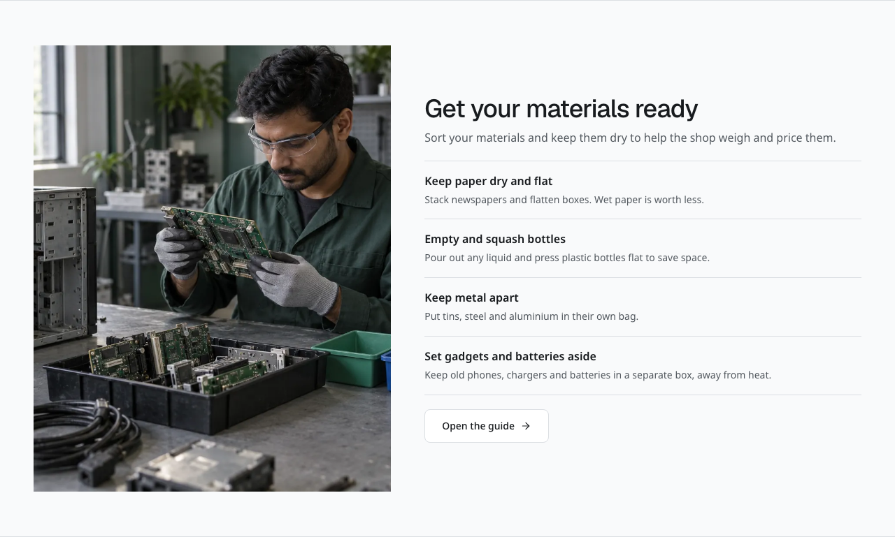

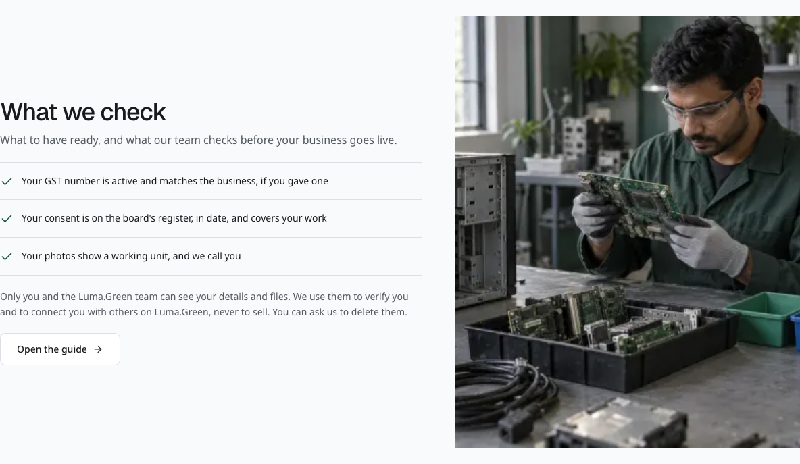

The interface uses neutral light surfaces and charcoal dark surfaces. Green marks
the main action and selected states. Public pages have wider spacing; workspaces
keep records and controls closer together. Buttons, form fields and panels use
consistent shapes across roles. Tabs use their text labels and an underline to show the selected view. On a narrow screen, tabs can move onto another row. Read the text label before selecting an icon.

Geist supplies the large display headings. Noto supplies body text and the script
fallbacks for all 33 languages. The language control changes text, direction
and number formatting; it does not change access or stored records.

Use Appearance in the desktop header, phone or tablet menu, or workspace controls
to select Light, Dark or System. System follows the device setting. Your selection stays in this browser
when browser storage is available. It does not change another person's account
or device. Admin and public pages use the same local preference.

The wide desktop header keeps its links and controls on one row. The phone menu button stays disabled until the page controls are ready. On phones and
tablets, the header shows the logo and menu control. Open the menu for navigation,
appearance, language, sign-in and Book a collection. The menu scrolls on short screens.
Press Escape to close it and return keyboard focus to the menu control.

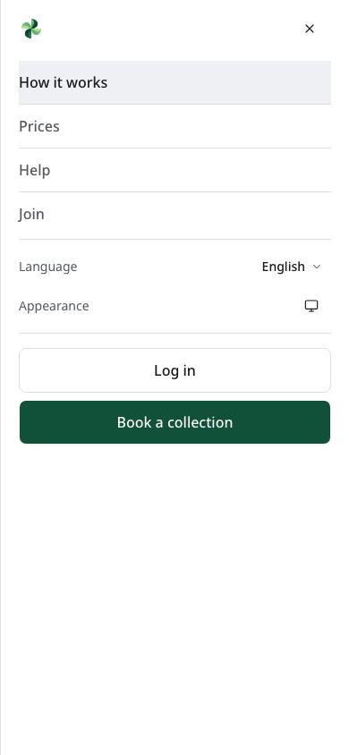

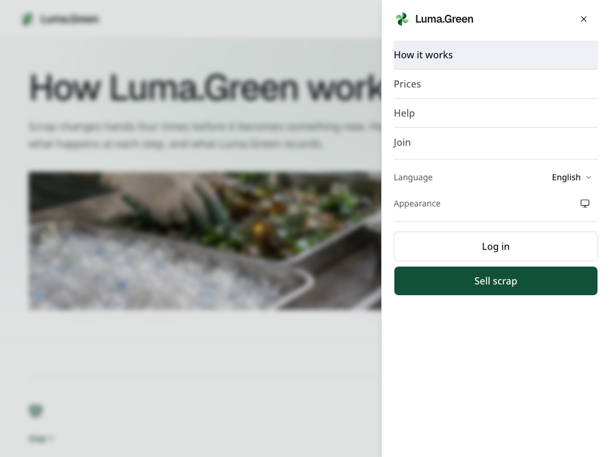

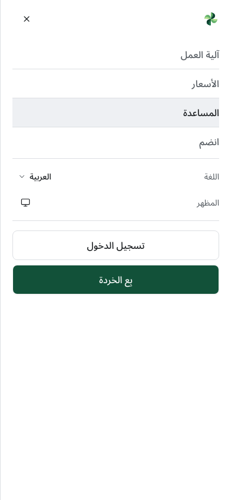

The logo mark turns once when you hover over it or use the keyboard to focus its
link. The name stays still. Reduced motion in your device settings disables the turn.

The Participants and role-help pages explain each role with work scenes and
written guidance. There are no phone or laptop mockups. The generated photos
provide context; they are not evidence of actual staff, facilities, customers,
safety certification or operational results. Tables and transaction records
remain the source for operational activity.

On a role-help page, use the links at the top to jump to guides, questions or
training. Decorative images do not sign you in or create a record. Reduced
motion settings stop the decorative scroll effects.

---

## 37 / Optional account security

Normal email and phone accounts can add an optional authenticator. Phone-only users remain passwordless and cannot use email password recovery to add a password. Email users keep password sign-in and must supply their current password for authenticator setup, code replacement or disabling protection. The platform admin always requires a password and an authenticator.

### Turn on an authenticator

1. Complete email/password or phone-code sign-in for the account you want to protect. Open the menu, then Account security.
2. Check that the authenticator status is Off. For an email account, enter its current password. Select Set up.
3. If the page asks you to sign in again, use that action and complete sign-in. Security changes require a recent sign-in within five minutes. With protection already enabled, that sign-in must also pass the second check.
4. On your own device, scan the setup QR code with an authenticator app, or enter the setup key there.
5. Enter the current six-digit code to confirm setup.
6. Save the recovery codes in your private password manager or another secure place. Confirm that you saved them before leaving the page.
7. Check that the status is On. Sign out and complete one controlled sign-in to check your authenticator.

Never share or include a setup QR code, key or recovery code in a screenshot, chat, support request or team document. The screenshots below show only the status screen. They do not prove enrollment or sign-in.

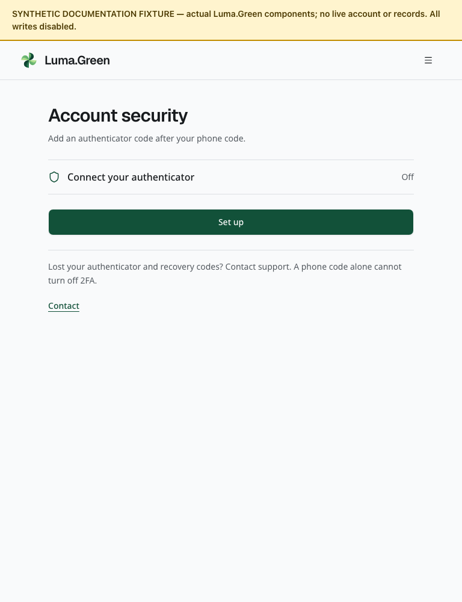

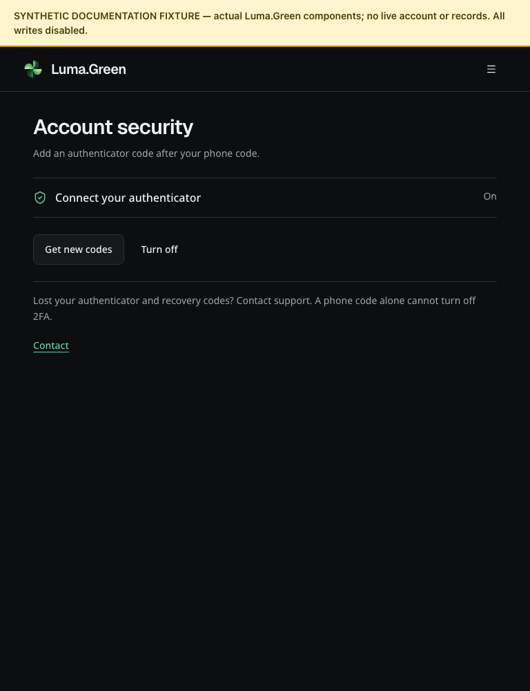

### Sign in when protection is on

After your email/password or SMS code check, enter the current code from your authenticator. If the app is unavailable, select Use a recovery code and enter one unused recovery code. A recovery code works once. If the challenge expires, start sign-in again. Repeated invalid attempts can cause a temporary limit. Keep the device clock accurate for time-based codes.

The same second check appears during a household booking. The booking must wait until both sign-in steps finish. Closing a challenge does not confirm a booking.

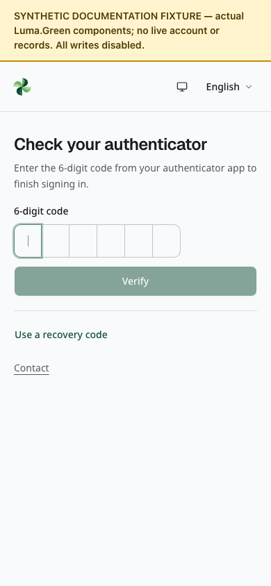

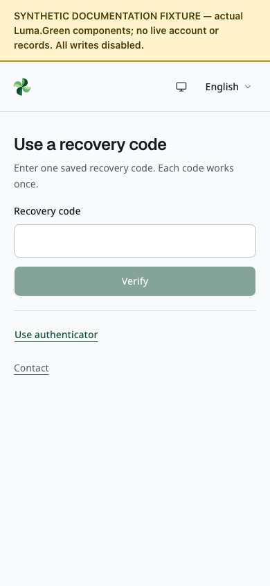

### Replace codes or turn protection off

Open Account security after a recent full sign-in. For an email account, supply the current password when requested. Select Get new codes to replace the set. Read the confirmation: replacement invalidates the previous set. Store the new set securely. To turn off the optional authenticator, use its separate confirmation action. This option does not apply to the required admin authenticator.

If both the authenticator and all unused recovery codes are lost, contact the platform owner. There is no instant support bypass or self-service phone-number change. Never treat a screenshot or possession of an old tracking link as proof of account ownership.

---

## 38 / Inbox and device notifications

Open the account menu and select Notifications. Approved businesses also have account links in their workspace menu, including Workspaces and team. Changing the selected business does not switch the signed-in identity. The inbox belongs to the signed-in user. The device setting applies only to the current installation.

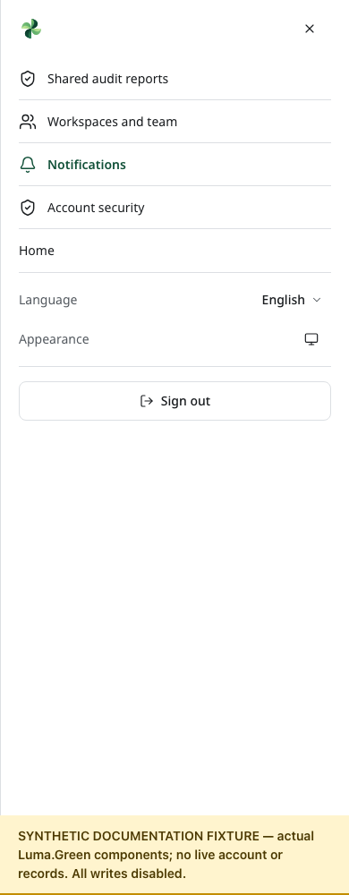

### Read an update

1. Open Notifications after sign-in.
2. Read Your updates. Pickup and application events appear with their date and time.
3. Select Mark read for one unread row. Read all changes at most 100 unread entries per press; use it again if unread entries remain.
4. Use Show more for older updates. The first read loads 20 rows.
5. If an action fails, check the error and retry after the connection returns. A failed action must not be treated as a saved read state.

An empty inbox means that no update is available in the loaded account view. A loading placeholder can mean that the sign-in connection is still being established or that the read has not finished. An unavailable or failed inbox is not an empty inbox. Check the connection and sign-in state, then reload after service returns. These states do not mean that a notification reached a device.

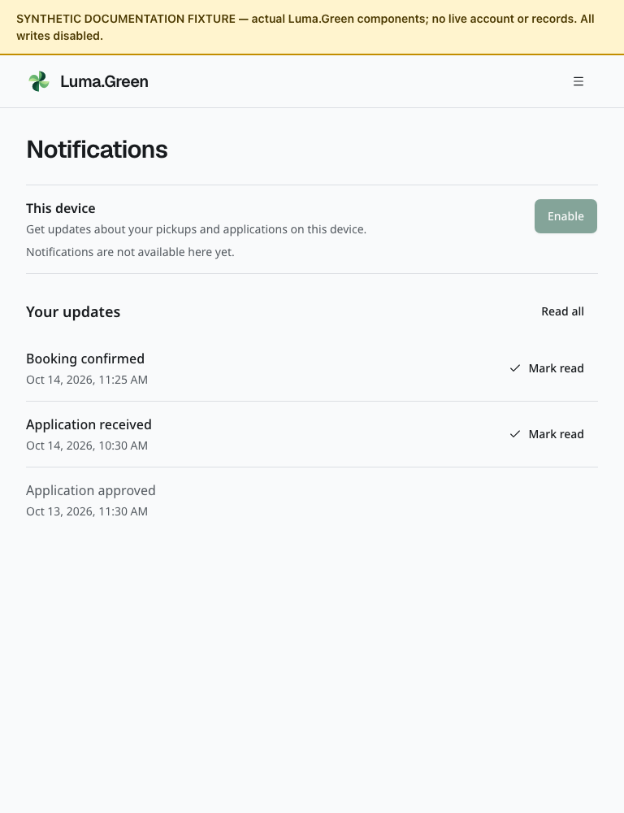

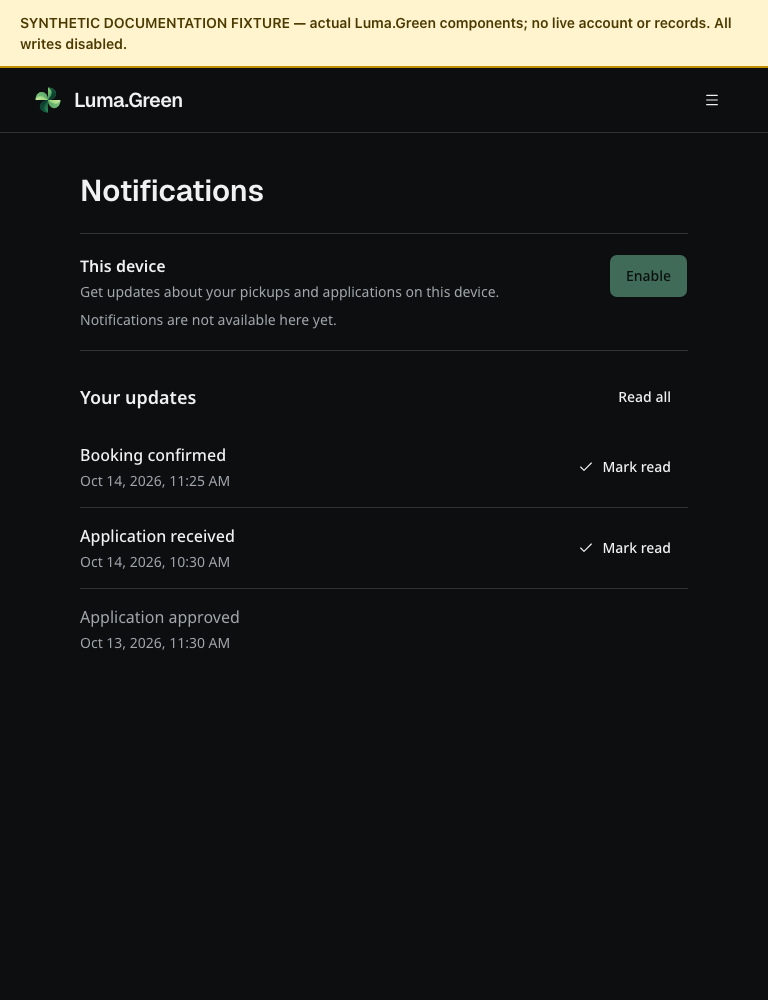

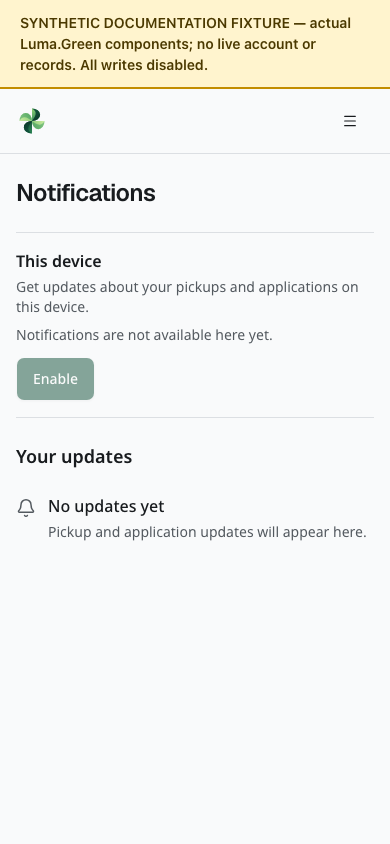

### Enable alerts on this device

1. Read the status under This device. If delivery is unavailable, the connected inbox can still work.
2. Select Enable when the device and service support it. In the mobile app, read the app explanation, then choose whether to permit notifications in the operating-system prompt.
3. If permission is denied, the app remains usable. If the operating system blocks another prompt, change its notification setting before trying again.
4. When enabled, alerts use general Luma.Green text. Private pickup and application details remain in the signed-in application.
5. Open an alert to reach the inbox in the active language. If the session has ended, sign in before reading private updates.
6. Select Turn off to stop alerts for this installation. Inbox history stays available. Sign-out revokes this installation's registration before clearing the session. The notification control stays disabled while sign-out is pending. If sign-out reports an error, retry; do not assume that access or delivery has already ended.

Each explicit mobile alert tap opens the inbox, including a second tap after you visited another page. A notification does not grant account access. There is no action in the user interface to send an arbitrary notification to another person.

The server checks that the linked sign-in session is still active before starting each delivery. A notification already in transit can still arrive.

If device cleanup fails, its pending state remains after a reload. Retry sign-out
on that device; a reload alone does not prove that cleanup or sign-out finished.
If the matching backend has not been released yet, notification controls show
an unavailable state. Other pages and their unsaved forms remain usable.

Browser push needs HTTPS, browser support and backend VAPID settings. Mobile push needs an EAS project, APNs/FCM credentials and a suitable signed build. Desktop alerts work only while the Electron process is running. There is no claim of delivery after the desktop app quits.

Apple Developer, Google Play and Expo/EAS accounts are not yet set up. Use the release runbook before attempting a real device test. A local fixture, permission test, JavaScript export or provider acceptance receipt is not proof that a physical device received the alert.

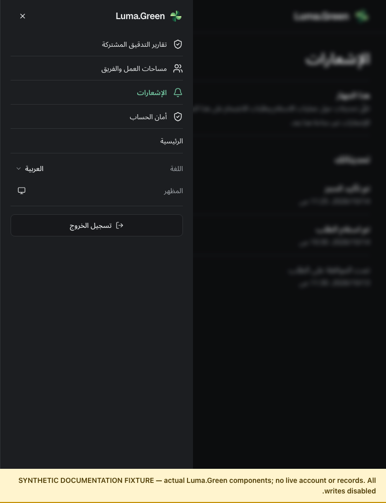

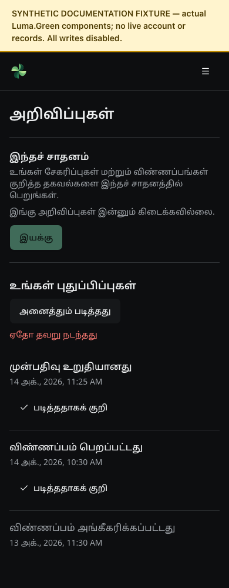

---

## 39 / Connect your business systems

An approved business can give its ERP, stock or reporting system read access to
Luma.Green. This applies to kabadiwalas, preprocessors, recyclers and manufacturers. The
first API version reads the business profile, material catalogue, recorded stock
and trade records. It can also supply optional industry news when the platform
operator has enabled the news provider. It cannot change stock, place orders,
transfer money or certify carbon credits.

### Create an API key

1. Sign in with an owner membership and select the correct business workspace. Open Compliance, then API access.
2. Enter a short key name that identifies the receiving system.
3. Select its read permissions. Select only the records the system needs.
4. Choose 1, 7, 30 or 90 days before expiry. The default is 30 days.
5. Select Create key. Copy the key into the receiving system's protected secret
   settings before you close the result. The full key is shown only once.
6. Give your integration operator the website address followed by /api/v1.
   Use OpenAPI specification for the exact request and response contract.
7. Test a request for a permission you selected. To confirm the business first,
   select Business details (`organization:read`) and test the organization request.

Workspace administrators, members, viewers and Saathis cannot manage keys. Each business can have up to five active,
unexpired keys. A key belongs to one business and one deployment. Development
and production credentials are separate. The API does not use a language prefix.

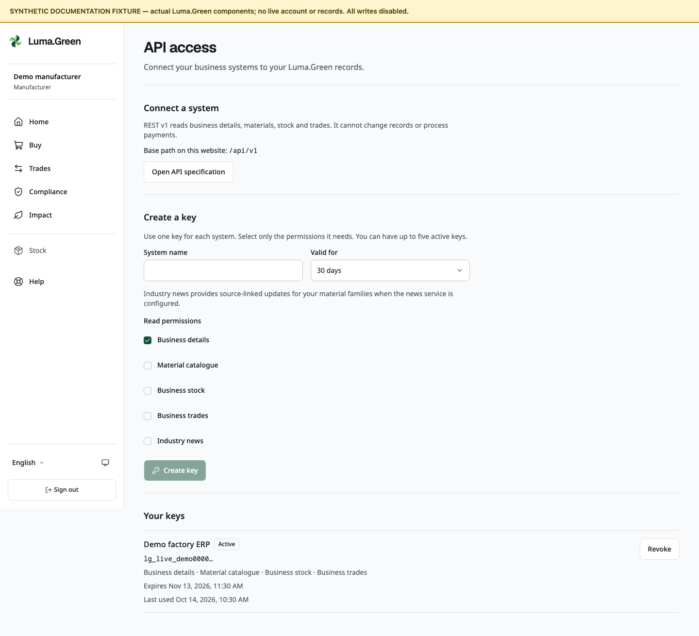

### Protect and replace a key

Keep the key in the server's secret store. Do not put it in a spreadsheet cell,
browser code, source repository, URL or support message. Give each system a
separate key. The screen shows the key name, safe prefix, permissions, expiry and
last-used date and time. It does not reveal the full secret again.

To replace a key, create another key, install it in the receiving system, test a
request, then revoke the old key. Revoke an unused key first if all five slots are
occupied. To stop access, select Revoke beside the key and confirm the action.
If the key is lost, revoke it and create a replacement. Removing or reducing its issuer's
owner membership, or suspending the business, also stops the connection.

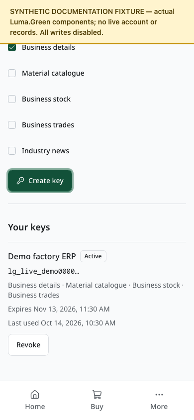

### Read the data correctly

The API uses integer grams for mass and integer paise for money. Keep Luma.Green
material codes beside your system's item codes. Material labels can be translated;
they are not stable identifiers. A factory can import its recorded purchases and
compare its stock with the ERP. A recycler can import its recorded sales.

Read all pages when importing inventory, materials or trades. List pages contain
up to 100 records; the default is 50. Trades have separate buyer and seller lists.
Records can change between requests, so a set of pages is not a guaranteed change
feed. Stage a full import and reconcile it before changing local records. An
incomplete scan does not prove that a record was removed.

A key permits 60 accepted requests per minute; the business total is 180 across
its keys. On a rate-limit response, wait for the stated retry period. An expired
or revoked key needs replacement. A denied permission needs an owner to issue a
key with the required scope. Never send the key when reporting an error; send the
request ID, route, time and response status.

The API reports the gateway-required payment boundary. Business orders advance
through payment-dependent steps only when the live configuration, frozen policy,
provider evidence and current permissions permit them. With activation off,
these steps remain blocked. Older prototype records remain unverified. Sandbox evidence does not confirm a live trade. A trade record
is not proof of bank payment, seller settlement or a GST tax invoice. API access does not approve specialised or hazardous
waste handling. Material-specific evidence and workflows remain separate work.

### Optional industry news

The news permission reads English headlines selected from the business's recorded
material families. Each item includes its publisher, date and original article
link. Show those details when displaying a headline and open the publisher's link
for the article. The platform does not provide full article text or a news feed
screen in this release.

The platform operator must configure an approved NewsAPI plan and a daily quota.
News stays unavailable when it is disabled, the quota is used, or the provider
fails. The API does not substitute invented headlines. Provider access and a
successful live request must be checked separately from local tests.

### Language and appearance

The API access controls follow your selected app language and appearance.
Technical paths and key prefixes remain left-to-right. The examples below show
Arabic and Tamil with the same synthetic records.

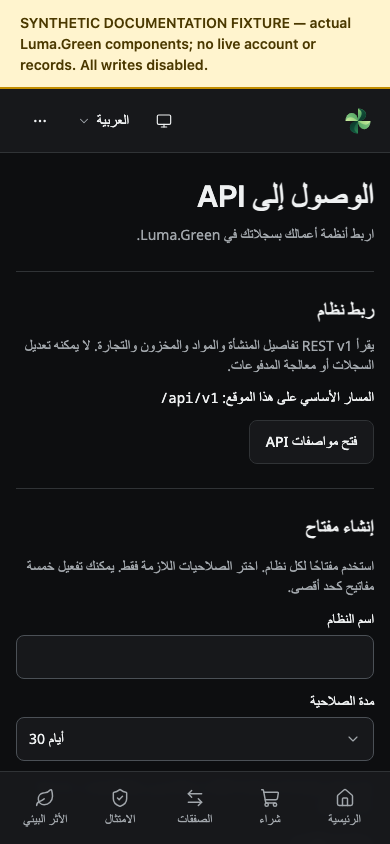

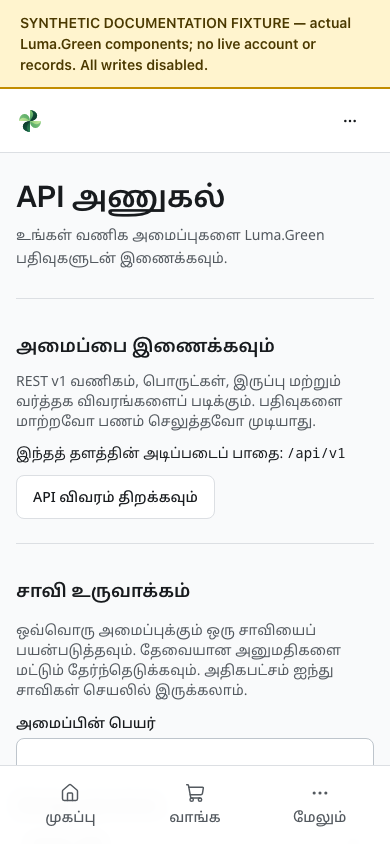

For developer examples, field definitions, setup and the planned webhook, write,
MCP and GraphQL stages, read docs/architecture/industry-api.md. The current release
is REST and read-only. Treat future stages as plans.

---

## 40 / Evidence and maintenance

### Two teammates can run this check together

The owner supplies the candidate address, release identifier, approved test dataset and restricted credentials annex. Use only that environment. The annex contains disposable development accounts; those accounts must not become shared production logins. Each teammate uses a separate browser profile. Label them **Tester A** and **Tester B**. Closing a tab alone does not sign out.

Tester A runs household, kabadiwala and workspace-owner actions. Tester B runs preprocessor, recycler, manufacturer, Saathi and viewer actions. Switch accounts through **Sign out**, then sign in with the next assigned account. Keep platform-admin work with the owner or a specifically authorised tester. Do not pass the admin password or authenticator codes between teammates.

Use the sequence below for the first guided pass. The detailed regression cases are in docs/testing/team-end-to-end-manual.md. Record an actual result for each row; this list is a procedure, not a record that a test passed.

| Step | Person and screen                       | Action                                                                                                                                                                                         | Expected result                                                                                                                                      |
| ---- | --------------------------------------- | ---------------------------------------------------------------------------------------------------------------------------------------------------------------------------------------------- | ---------------------------------------------------------------------------------------------------------------------------------------------------- |
| 1    | Both, public pages                      | Open Home, Prices, How it works, Participants, Standards, Help and Contact. Open one help guide, then return.                                                                                  | Titles and navigation work. Sample prices are labelled. No private account data appears. Do not send a support request during this reading pass.     |
| 2    | Both, /login                            | Use Email with the assigned existing test account. Open Account security and Notifications. Reload each once.                                                                                  | The same account remains signed in. The inbox shows updates, an empty state or a clear service error; it does not silently treat an error as empty.  |
| 3    | A, Workspaces and team                  | Select the assigned shop. Read the business name and role. B signs in as the shop's viewer in a separate profile.                                                                              | Both see the assigned business. The viewer has read-only access and cannot change members, stock, lots or settings.                                  |
| 4    | A, /sell; B observes                    | Use the assigned phone test account for booking. Follow Materials, Partner, Time and Review. Use only the local verification method supplied by the test lead. Save the private tracking link. | One booking appears. Email verification alone does not satisfy phone verification. No real SMS or payment is required for the isolated local case.   |
| 5    | A, shop Requests; B, household tracking | A switches to the shop account, opens New and accepts the assigned booking. Open Today and the booking. Use Start trip for a pickup, then Weigh and pay.                                       | The status changes on both screens. Contact details appear only after acceptance. A drop-off does not need Start trip.                               |
| 6    | A, weighing; B, receipt                 | Use the exact material, grams and rate assigned in the manual. Record a simulated household cash/UPI payment only in this approved test dataset. Check the receipt and stock.                  | One exact receipt and one stock increase. Reloading or reopening the completed record does not pay or add stock again. No money was sent by Luma.    |
| 7    | A, shop Sell; B, preprocessor Buy       | A lists the assigned available material. B requests the agreed quantity. A opens Trades and accepts it.                                                                                        | Both parties see the same material, quantity, price and accepted status. Payment-required controls remain blocked while the gateway is unavailable.  |
| 8    | A and B, Lots and quality               | Follow the measured PET exercise below. A records a lot and transformation, then dispatches the selected output to B's business. B records receipt.                                            | Mass balances agree. Custody moves only on valid receipt. Lot evidence does not create stock, a paid trade or a certificate.                         |
| 9    | A, team owner; B, invite recipient      | When the test lead assigns the invitation case, invite the exact test email with Viewer access. B opens the private local invitation and accepts. A removes that membership after the check.   | The invited verified email works once. A wrong email cannot accept. Removal stops subsequent private reads and writes. Do not remove the last owner. |
| 10   | Both, remaining assigned roles          | Sign in as each assigned participant from the roster. Open its home or status, Account security and Notifications. Visit only the pages its menu offers.                                       | Approval and role boundaries match chapters 02, 06 and 07. A stakeholder account does not reveal another organisation's records.                     |
| 11   | A as workspace owner; B as viewer       | Follow chapter 11: Facilities and processes; add one synthetic facility and process; browse all four industry tabs; add then correct a reported registration.                                  | Owner can edit facility; viewer cannot; evidence dates do not prove permission; original reference remains.                                          |
| 12   | A as processor; B observes              | Declare the assigned classified lots. Follow Record disposition for the synthetic residual, then inspect remaining grams. Follow chapter 12 to add an offer grade/specification.               | Exact mass reduction; controlled material cannot take ordinary dispatch; seller-declared specification is visible but not certified.                 |
| 13   | Authorised admin tester                 | Follow chapters 19–23 on the assigned application, sample price and support records.                                                                                                           | Decisions and reasons persist. Private files require permission. A report has a clear period and units.                                              |
| 14   | Both, presentation and logout           | Repeat the main page at phone width, in dark mode and in one assigned language. Use Tab and arrow keys. Sign out, then revisit a private route.                                                | Text, active tabs and controls fit. Focus is visible. Private data does not remain accessible after sign-out.                                        |

The phone booking, local verification links and invitation messages need the test lead's local inbox procedure. Do not guess a fixed code or search server files. If that procedure is not available, mark the corresponding case **Blocked** and continue with existing verified email accounts and read-only screens.

### Continue with the new business workspaces

Use only the named synthetic records assigned by the test lead. Record each row separately. If an earlier automated run closed an agreement, withdrew a file or revoked a report, that state is expected; do not restore it to make the screen look populated. Ask for a new named exercise when a write is required.

| Step | Person and screen                                       | Do this                                                                                                                                                                                           | Check this result                                                                                                                                                                                    |
| ---- | ------------------------------------------------------- | ------------------------------------------------------------------------------------------------------------------------------------------------------------------------------------------------- | ---------------------------------------------------------------------------------------------------------------------------------------------------------------------------------------------------- |
| 15   | A as operator; B as viewer, Route and load plans        | A creates one plan using assigned coordinates, materials, whole grams and capacity. Read Revision history, then save a correction. B opens the same plan.                                         | The combined load fits capacity, the earlier revision remains, and B has no create or edit control. Distance is a straight-line estimate, not road navigation.                                       |
| 16   | A as buyer, Sourcing → Demand board                     | Post one named demand. Open Recurring demand and record a schedule. Select Publish next demand once.                                                                                              | One occurrence is published. The next date advances, but no purchase or stock reservation is created. For an overdue schedule, explicitly move the next date before publishing.                      |
| 17   | A as buyer; B as supplier, Sourcing                     | A records a supplier decision with the assigned exact specification, then proposes a standing agreement. B acknowledges it. A requests one release; B acknowledges that release.                  | Both parties see the agreement and release history. Their separate decisions persist after reload. No delivery, stock movement or payment is implied.                                                |
| 18   | A as inspector; B as named buyer, Quality documents     | A attaches the approved non-sensitive training file to the assigned inspection and explicitly shares it with B’s business. B downloads it and records a reasoned buyer decision.                  | The file is available only to permitted accounts. Buyer decision history is separate from the inspector’s accepted result. Repeat as viewer to check that write controls are absent.                 |
| 19   | A as owner; B as approved auditor, Shared audit reports | A shares a fixed inspection report with B’s exact approved account, purpose and expiry. B reads it. A revokes access; B reloads and tries again.                                                  | The authorised snapshot is readable before revocation and unavailable afterward. No unrelated private lot history is included. A previously downloaded copy cannot be recalled.                      |
| 20   | A as processor; B observes, Production records          | Record a recipe whose ingredient shares total 10,000 basis points. Use the assigned measured transformation and output inspection to record one batch with recycled-input grams and evidence.     | The saved recipe and batch are immutable. The input ratio uses recorded grams and is not a certified recycled-content claim. Inventory does not increase from this declaration.                      |
| 21   | Authorised platform admin; A as business operator       | In Material review, inspect the assigned definition, facility scope and controlled destination. Save only the review case the lead explicitly assigned. A reads Material standards afterward.     | Reviewed records appear only when active and in scope. Withdrawn destinations cannot support new linked dispositions. Workbook categories and reference dates do not grant government approval.      |
| 22   | A as manufacturer; B as eligible buyer                  | Record the assigned own-production stock intake once, then offer that stock with a grade and specification. B reviews the offer and requests the assigned quantity.                               | Intake increases recorded stock once; listing and acceptance respect available grams. Payment-dependent movement stays blocked in this no-provider run. A traceability lot alone does not add stock. |
| 23   | A and B, Payment and delivery                           | Read the accepted order. Open Sandbox checkout only when assigned. In the no-key environment, read the unavailable state and close it. Use a separate unpaid test order for Request cancellation. | No provider SDK or real payment is started without configuration. Cancellation must visibly complete before treating its commitment as released. On-hand stock does not change from cancellation.    |

For a validation check, first use a separate unsaved draft: try an over-capacity route, recipe shares that do not total 10,000, or recycled grams above consumed grams. The form must reject it and preserve useful input. Correct the draft or cancel it; do not manufacture invalid operational records.

### A measured PET exercise

This is synthetic training data. It is not a material specification, actual processing yield or acceptance certificate. Use a new source reference such as **TRAINING-A-01** so the test lead can identify the run.

1. As the shop owner, open **Lots and quality**, then **Declare a lot**. Enter PET, a bottle state, **1000** in **Mass (g)** and the assigned source reference. Select the test lead’s assigned **Output stream** and **Handling classification**. Select **Save record** once.
2. Open that lot. Read **Initial mass** and **Remaining mass**. Both must be 1000 g before processing.
3. Select **Record transformation**. Enter input **1000**, contamination **50**, process loss **50**, and one PET output of **900** grams with the assigned output state, **Output stream** and **Handling classification**. The accounted mass must be 1000 g. Save once.
4. Open the output lot. Its remaining mass must be 900 g. The source lot has no remaining material. A total of 901 g for this output must fail validation; use a separate unsaved attempt for that negative check.
5. On the output lot, select **Record inspection**. Use a clearly marked training specification and version, the supplied sample method, and measured test parameters. Choose the assigned decision explicitly. Save once and read the immutable result.
6. Select **Dispatch lot**. Enter the recipient's city and business type, select **Find businesses**, then choose the assigned receiving business. Check its name before saving. The action sends the whole 900 g remainder.
7. The receiving tester opens **Incoming lots**, then the hand-off. Read the sender and dispatched mass. Enter **900** in **Received mass (g)** and select **Receive lot**. The lot moves to **Held lots** after successful receipt. A different measured mass must not create a receipt.
8. The sender returns to **Hand-off history**. Check that the sent record remains, but the sender cannot read the receiver's later private lot details. Compare both screens without exchanging passwords.

These classifications are declarations for the assigned test. They do not approve a trade, certify quality or establish that a real material is non-hazardous. Do not guess them to make a sale available.

If you need to correct an inspection, use **Propose correction** and enter the reason. Its author cannot approve it. A different owner of the same business must use **Approve correction** while that business still holds the lot. Arrange that owner account before testing; do not change permissions merely to make the case pass.

### Record a result or a fault

Use **Not run**, **Pass**, **Fail** or **Blocked**. Pass means the expected result was observed on the named candidate. Blocked means a required account, service, permission or test record was unavailable. A screen that looks correct cannot prove that an email arrived or that a seller received money.

Copy this small record into the team's test log:

| Field      | What to enter                                                      |
| ---------- | ------------------------------------------------------------------ |
| Test       | Step or case ID; tester A or B; date and India time                |
| Candidate  | Test address and release identifier supplied by the owner          |
| Account    | Alias and selected workspace; no password or full personal details |
| Conditions | Browser, device width, language, theme and starting record alias   |
| Actions    | Numbered clicks and non-sensitive test inputs                      |
| Expected   | What the guide or case says must happen                            |
| Actual     | What appeared; state before and after one reload                   |
| Evidence   | Screenshot without secrets, error text and private evidence link   |
| Result     | Pass, Fail, Blocked or Not run; issue number and retest result     |

Stop a case if it exposes another business's private data, changes an unexpected account, duplicates stock or sends unintended real funds or messages. Tell the owner immediately. For a slow or failed submit, inspect the saved record before trying again. Do not clear the database, delete accounts or overwrite the first failed result.

### Daily work routine and retest

At the start of each session, confirm the test address and candidate. Read the latest known issues. Check the assigned account and workspace, then record starting balances. Run the short public/sign-in/inbox check before a longer workflow. One person performs each state-changing step while the other checks the result.

At the end, save the result sheet and report the record aliases created. Sign out of every test profile. Ask the test lead to prepare fresh named records for the next run; do not reuse completed receipts as if they were new work. Keep the original failure evidence. Retest the same case after a named fix, then check the adjacent step and the affected role's permission boundary.

Before the owner adds a provider key, use chapter 28 and the service setup checklist. After setup, repeat signup and delivery on a controlled mailbox or handset. For Cashfree, test the provider's approved sandbox and live procedure separately. Do not mark payment collection, seller payout, refunds, push delivery or signed app updates as passed from this local walkthrough.

### Maintained files and source evidence

The editable repository source is docs/user-guide/guide.md. The maintained Word document is output/docx/luma-green-user-guide.docx. The old PDF is an archived edition. Screenshots and their capture manifests live with the source. The repository README in that folder gives capture and rebuild commands.

The written steps are based on the current routes, components and Convex functions. Key owners include src/components/auth, account, workspace, sell, app, market, saathi, join and admin; convex/auth.ts, identity.ts, workspace.ts, stakeholderAccounts.ts, households.ts, trades.ts and the Cashfree payment files. The architecture and operations runbooks define the auth, payment, industry API and native release limits.

Screenshots are retained as browser-produced PNG files. Each capture manifest records its route, source fingerprint, time, test conditions and image hash. Current image paths must exist and pass review before the Word or Google Docs edition is published. An absent or skipped capture is not a passed screen. Use approved isolated accounts for protected flows. Keep synthetic fixtures, authenticated local evidence and actual provider acceptance separate. The release handoff owns the current automated results and deployment evidence.

### Required update procedure

When a route, role, permission, workflow, visible control, setup requirement or app update behavior changes, update the matching chapter. Re-capture changed screens with synthetic or approved test data. Update the capture metadata. Rebuild the Word document, check every rendered page, and commit source, screenshots, build record and Word document together. Update the existing Google Docs document recorded in docs/user-guide/cloud.json from the reviewed source and Word edition. Preserve its document ID, sharing settings and link; record a connection gate if an update cannot be verified. A UI commit alone does not automatically update an external document.

Do not silently substitute a mock for an authenticated screenshot. Do not claim provider delivery or account approval from a fixture. Keep the chapter's current limitations until a real verification record replaces them.
