# Luma Green platform user guide

How to use the recycling platform and its admin console

Edition: 2 October 2026, UI detail revision. Source baseline: 3b29ea7.
Includes the UI detail pass: divided page layouts, compact mobile controls, a material marquee, labelled demo testimonials and the phone-to-code preview.
Audience: households, kabadiwalas, yards, recyclers, manufacturers, Saathis and the platform owner.

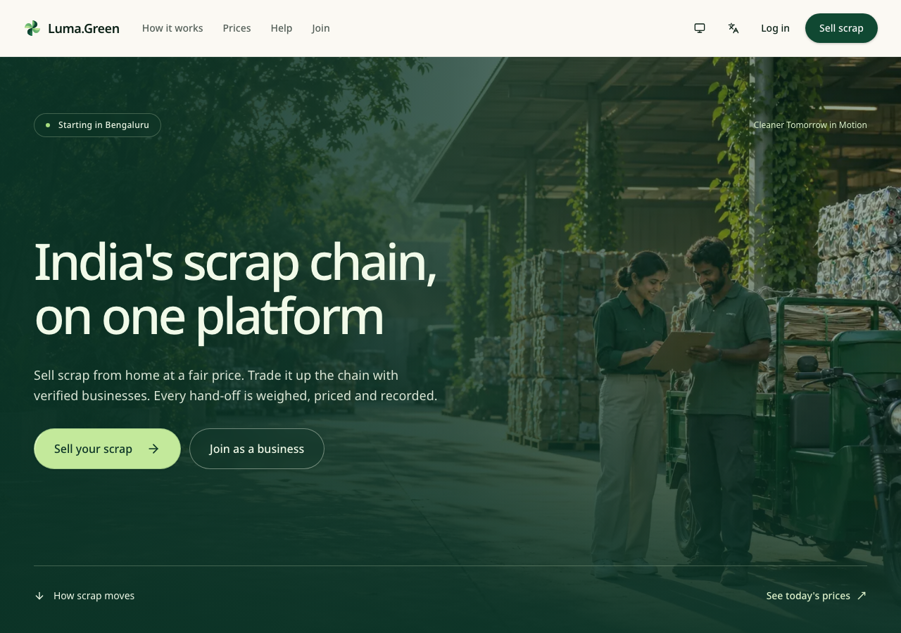

This guide explains the current application. It does not claim that the service is live. The signed mobile and desktop releases, live account setup and provider checks remain launch tasks.

---

## 01 / Start here

Luma.Green records scrap collection and movement through the recycling chain. A household sells scrap. A kabadiwala collects and sorts it. A yard buys and prepares bulk material. A recycler supplies recovered material. A manufacturer buys it. A Saathi takes local jobs.

### Read the screenshot labels

- Current local capture: an unchanged browser screenshot of the current app without a backend connection. Setup messages are real states, not errors added to the picture.
- Current configured local capture: the real app with test analytics keys. External browser requests are intercepted; no provider receives data.
- Synthetic documentation fixture: an unchanged browser screenshot of real application components supplied with sample records in a separate documentation server. It is not an authenticated session or proof of a working integration.

No screenshot is an AI-generated interface. The homepage contains generated decorative artwork, but the page screenshot itself comes from the browser. Text in the guide explains the controls; it does not paint controls over a screenshot.

### Explore the home page

The home page explains the service before you enter a workflow. The materials
section shows the main scrap groups. Use Sell scrap to select your own materials
and quantities. The pickup section explains the steps and links to the first
pickup guide.

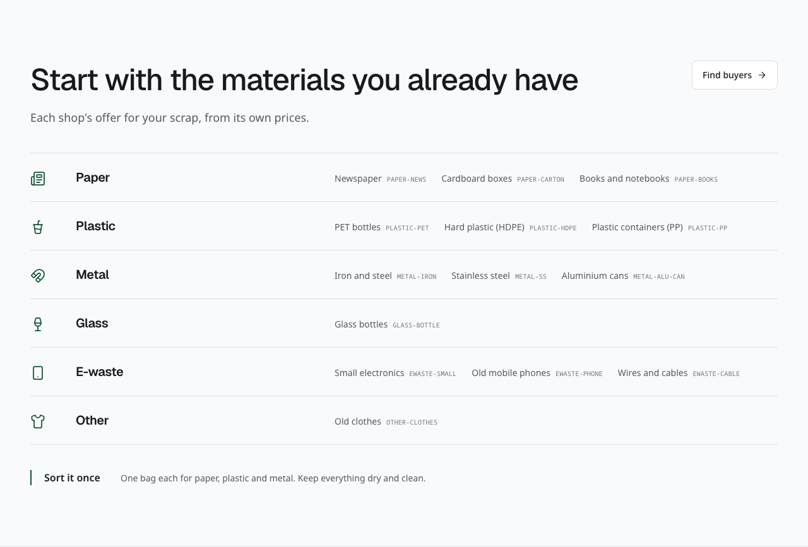

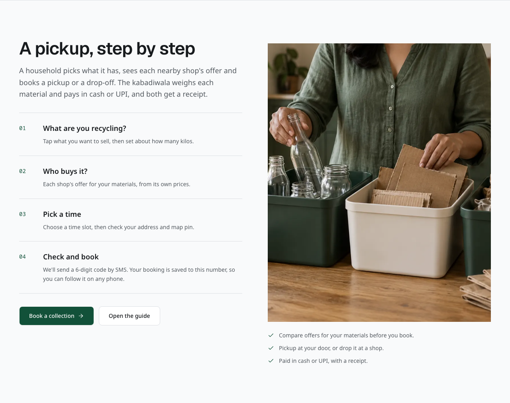

The shop section explains how a kabadiwala receives requests and records work.
Use its join link to start an application, or open the shop help page. The weighing
section explains how estimates become a final record. Payment takes place outside
the platform; the shop records the agreed amount after payment.

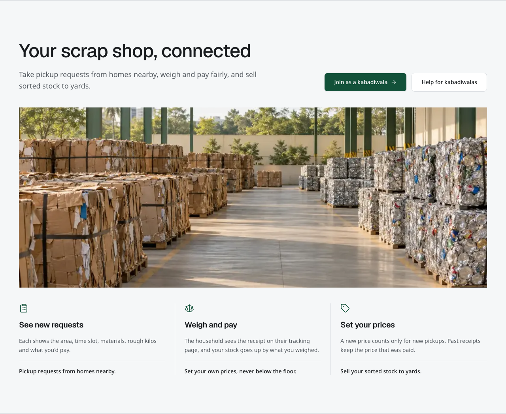

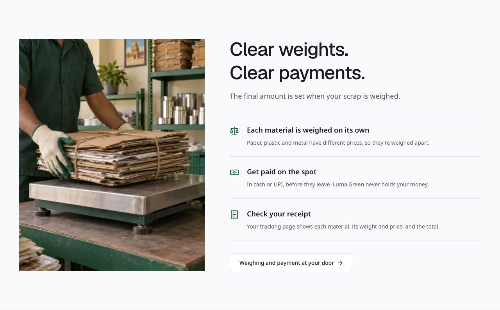

The records section explains the information kept as materials move through the
chain. Read Standards for material codes and trading rules. The questions section
opens short answers and links to role-specific help. Reading these sections does
not create an account, submit an application or book a pickup.

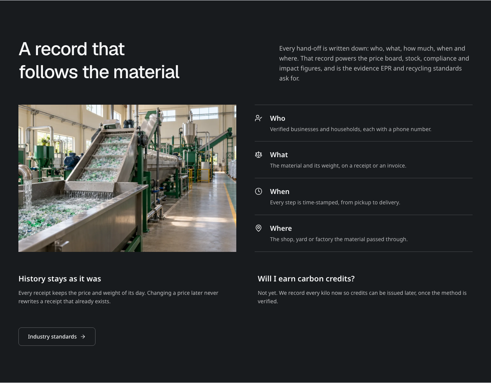

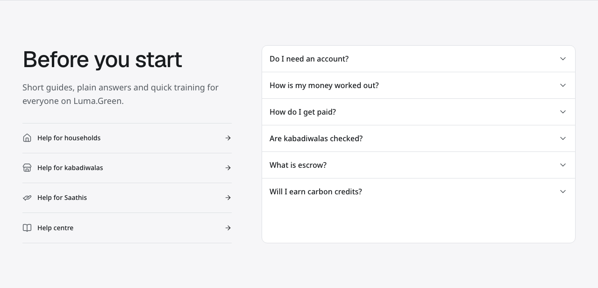

The moving material line names material groups; it is not a list of partners. Use its pause control to stop movement. Reduced-motion settings show the names without movement.

The testimonial section is labelled **Demo testimonials**. Its role-based quotes are sample content, not reviews from real customers.

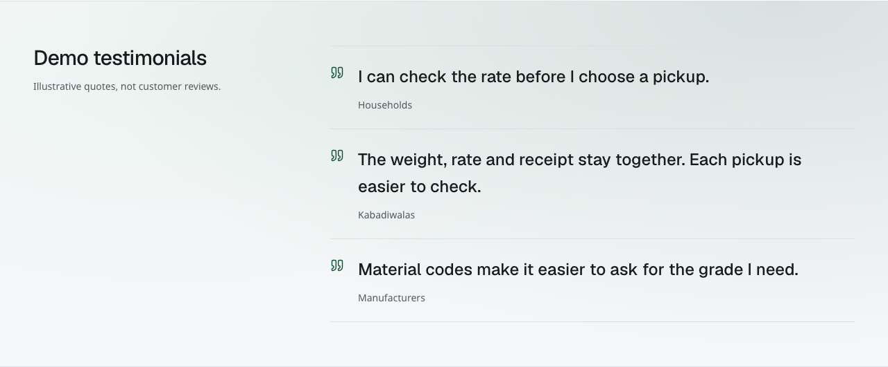

### Three limits to remember

1. Household payments are recorded after cash or UPI payment outside the platform.
2. Business escrow and payment steps are demonstrations. No real funds are held or transferred.
3. EPR and impact records are supporting records, not issued certificates or verified carbon credits.

All paths in this guide are relative to the correct deployment address. Use the address supplied by the platform owner. The local review address is http://localhost:3004. Do not assume a domain is live because it appears in source code.

---

## 02 / Choose your access

| User                         | Entry point        | What grants access                                 |
| ---------------------------- | ------------------ | -------------------------------------------------- |
| Visitor                      | /                  | No sign-in for public information                  |
| Household                    | /sell              | Confirm a phone number when booking                |
| Applicant                    | /join, then /login | Phone sign-in; application submission              |
| Kabadiwala                   | /app               | Approved shop application and phone sign-in        |
| Yard, recycler, manufacturer | /app               | Approved business application and phone sign-in    |
| Saathi                       | /app               | Approved Saathi application and phone sign-in      |
| Admin                        | /admin/login       | Configured admin email, password and authenticator |

An application awaiting review does not give operational access. Each business sees its own records. A link to another business's page does not grant permission. A household's contact details become available to the assigned shop after it accepts the booking.

### Before the owner opens the pilot

Connect the frontend to the intended Convex backend. Configure authentication. Enable the chosen SMS service only after its registration and templates are ready. Set actual prices and support contacts. Test the complete workflow with staging users. The end of this guide contains the owner checklist.

---

## 03 / Phone sign-in and languages

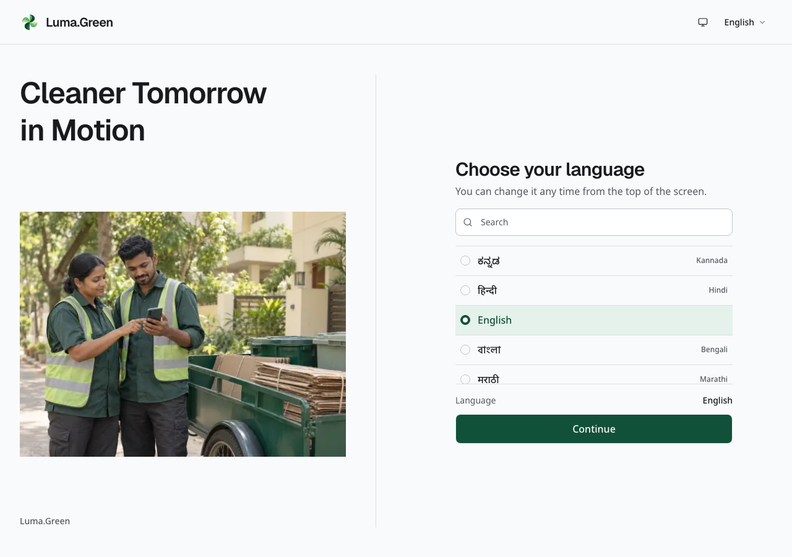

1. Open /login. If the language chooser appears, choose your language.
2. Enter your Indian mobile number. The form supplies the +91 country code.
3. When SMS is connected, request the code and enter the six digits from the message.
4. Wait for the session to finish loading before opening a protected page.
5. Continue to your approved role or application status.

If SMS is not configured, select Preview code screen after entering a valid mobile number. The next screen is labelled as a preview. You can inspect and enter the six code digits, but Verify and Resend are disabled. No SMS is sent, no account is created and no private page is opened. Use Change number to go back. The phone number stays in this browser tab, not in the address.

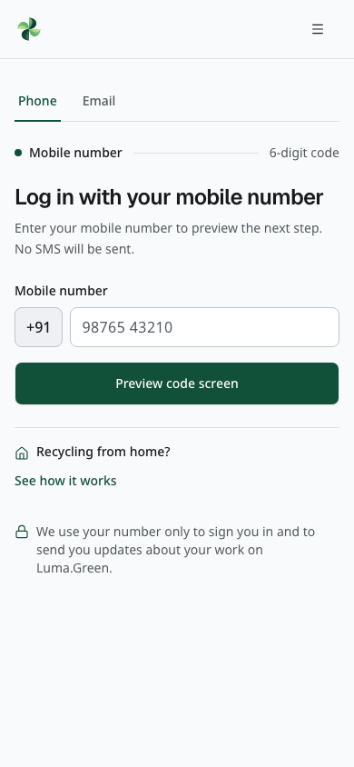

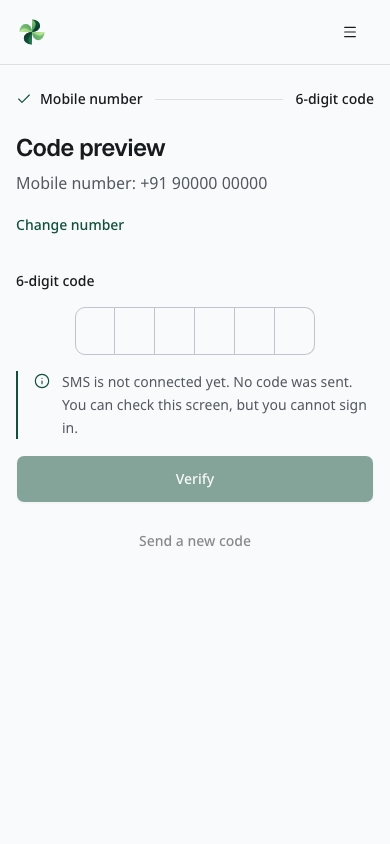

With SMS connected, codes last five minutes and allow five attempts. The resend control has a 30-second delay. Repeated requests also have server limits. Do not repeatedly request codes when delivery is slow. If a send fails, follow the displayed retry state.

Regular sessions last up to 30 days. Sign in again after expiry. Sign out on shared devices. Your identity follows your phone number; the browser language does not change your role.

The twelve languages are English, Hindi, Bengali, Marathi, Telugu, Tamil, Gujarati, Kannada, Malayalam, Punjabi, Urdu and Arabic. The header language control shows the current language in its own script, for example English or العربية. Open it to choose another language. On phones, the brand appears as its icon; the full name appears on wider screens. Arabic and Urdu use right-to-left layouts. The admin console is English-only.

---

## 04 / Household: sell scrap

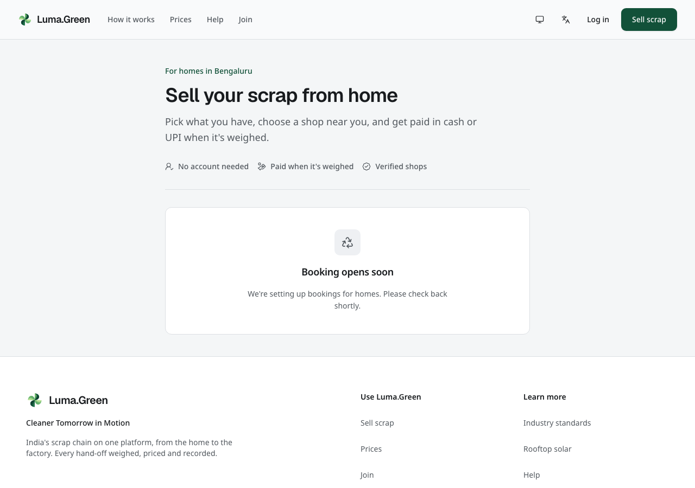

The household flow stays at /sell. Its address uses a step query parameter; there are no separate /sell/estimate or /sell/book pages.

1. Select the materials you have. Enter estimated quantities.
2. If photo estimates are enabled, take or select a photo. Check each suggested material and weight. Correct them before continuing. Manual entry remains available.
3. Choose a nearby shop. Compare its material prices and whether it offers pickup or drop-off.
4. Choose pickup or drop-off and the offered time. Supply the location and address required by the form.
5. Review the material list, estimate, shop and time.
6. Use Confirm and book with the SMS code. Successful verification submits the booking automatically. If already signed in, use the booking button once.
7. Save the tracking link shown after booking.

The estimate is not the final payment. The shop records the actual weight and the agreed material rate at collection. A photo estimate does not set a price and is not a certified measurement.

The draft is kept in this browser tab during the flow. A closed tab or reset can remove the draft. A submitted booking is a backend record. Do not treat a draft as a confirmed booking.

---

## 05 / Household: track, cancel and receive payment

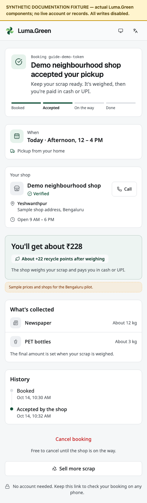

Open the saved /t/[token] link to see the booking status. Treat this link as private; do not post it publicly.

1. Check whether the request is waiting, accepted, complete or closed.
2. When accepted, check the assigned shop and the recorded visit details.
3. Use the contact action when it is available. Contact the shop if the time or address needs clarification.
4. At collection, check each material and the scale reading with the collector.
5. Check the final total. Receive cash or confirm the UPI payment outside Luma.Green.
6. Review the receipt and keep the tracking link for your records.

Use Cancel only when the page offers it and while signed in as the original household. A tracking link alone does not permit cancellation. Cancellation is available only before the shop is on its way. If no shop accepts the request, the dispatch logic can expire or reassign it within its limits. A notification is optional; the tracking page is the record to check.

A completed receipt preserves its recorded weights and prices. A later price change does not rewrite it. If the record is wrong, contact support. Do not create a second booking solely to correct a completed receipt.

---

## 06 / Join as a business or Saathi

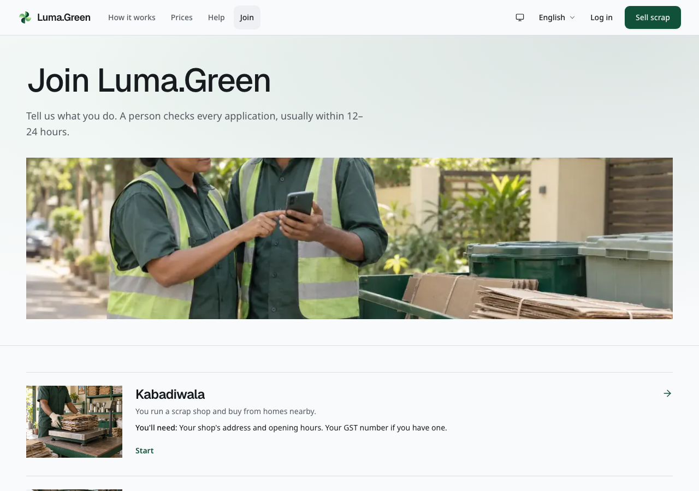

1. Open /join and read the role descriptions.
2. Choose Kabadiwala, Yard, Recycler, Manufacturer or Saathi.
3. Sign in with the phone number that will own the application.
4. Complete the role form. Use the location and contact details for the actual operation.
5. Upload the documents requested by that role.
6. Review the form and submit it for a person to check.
7. Open /join/status to follow the decision.

Households do not need to join as a business. They use /sell.

Kabadiwala forms ask about the shop, area, opening hours and collection options. Bulk businesses use /join/yard, /join/recycler or /join/manufacturer and then the documents step. Saathis use /join/saathi with an identity document and selfie.

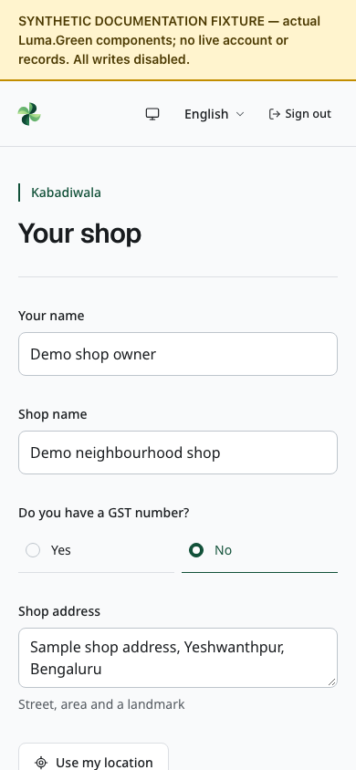

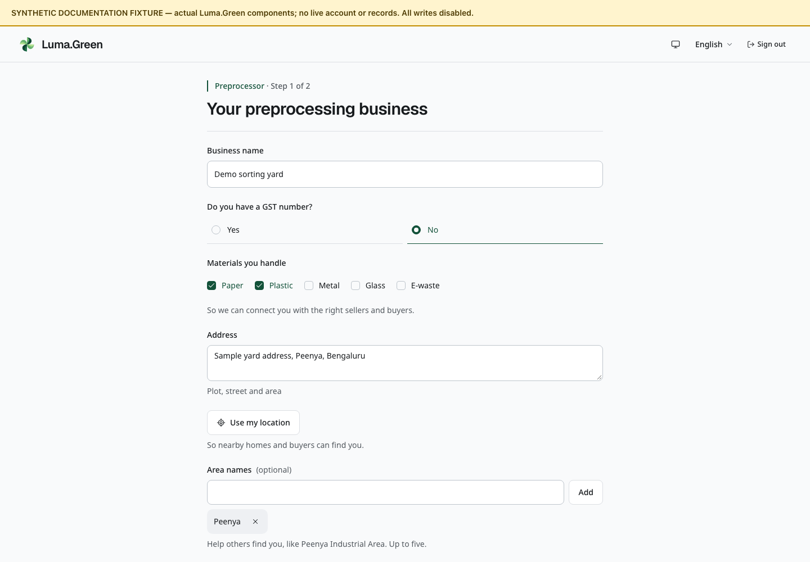

The interface describes review as usually taking 12-24 hours. This is an operational target, not a guaranteed response time.

---

## 07 / Documents and application status

Upload clear, readable files. For bulk businesses, supply the consent documents or exemption information requested by the form and photographs of the equipment. Supply GST information when applicable. For Saathi identity documents, mask an Aadhaar number except its last four digits.

Certificate PDFs, ID files, selfies and machine images are capped at 10 MiB each. Machine MP4/MOV videos are capped at 20 MiB, with at most ten machine files. JPEG/PNG preparation reduces large uploads automatically. The form remains the final authority for accepted file types.

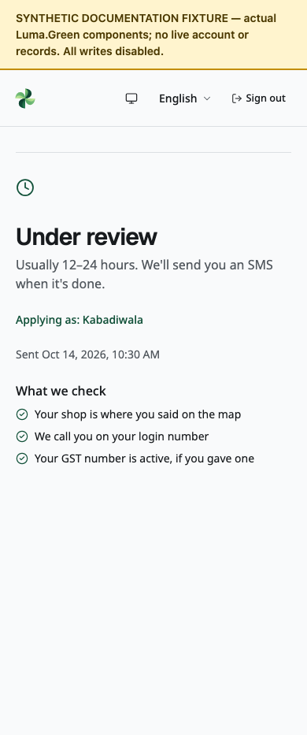

### Follow the status page

- Draft: finish and submit the application. A saved draft has not entered the review queue.
- Submitted: wait for the review. Check the page for a decision.
- Changes requested: read the admin's note, correct the listed items and submit again.
- Approved: continue to the operational app for your role.
- Rejected: read the reason and contact the owner if necessary. No self-service reopening control is provided.
- Suspended: operational access is unavailable. Contact the owner; the ordinary admin console has no suspension or reinstatement button.

Private files require a valid session and permission on every request. Do not share downloaded IDs or certificates. If a preview fails, sign in again if needed and use Try again. Large videos are not loaded until requested; video uploads are capped at 20 MB.

Files are not general attachments for customer conversations. Upload only what the application asks for. The mobile shell cannot open every private document path; use the authenticated browser or desktop flow when the app directs you there.

---

## 08 / Kabadiwala: start the working day

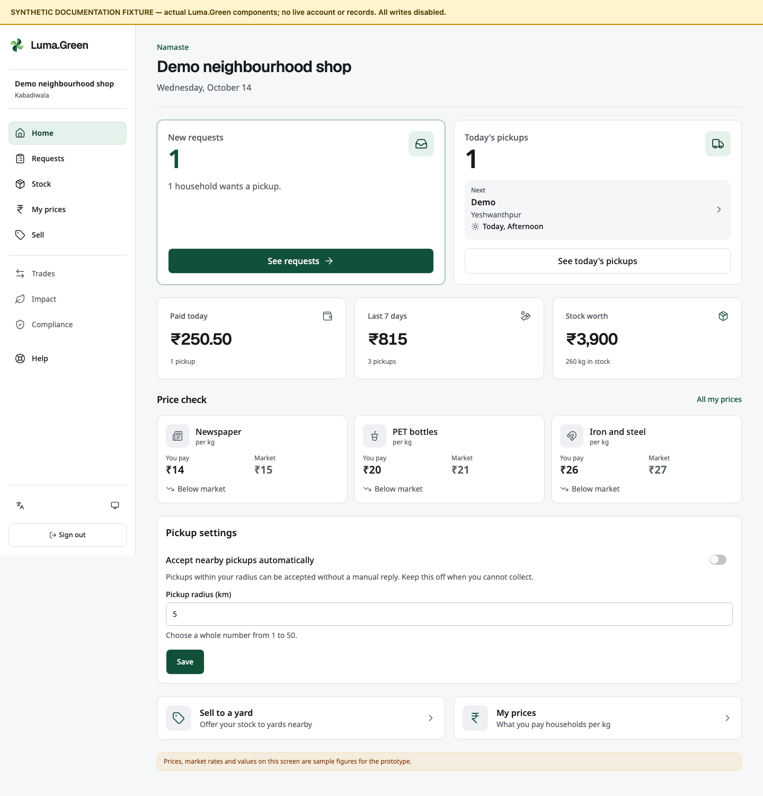

A kabadiwala is a local scrap shop. The approved shop uses /app to manage household requests, current stock, its rate card and onward trade.

1. Sign in with the phone number that owns the approved shop.
2. Open Home. Read the request and stock summary.
3. Check the Auto-accept setting and pickup radius. Enable auto-accept only when the shop can handle suitable work; location data is required.
4. Open Requests to check new bookings and the Today list.
5. Check Prices before accepting new work. A shop rate cannot be below the platform minimum.
6. Check Stock before offering material to another business.

Use the bottom navigation on a phone. Use More for the role's additional pages. On wider screens the same app can show side navigation. The available destinations follow the approved role; typing a route does not change permission.

Auto-accept can accept suitable bookings without a separate manual tap. Check the radius and location before enabling it. There is no separate Taking pickups availability switch. Changing auto-accept does not cancel bookings already accepted.

---

## 09 / Kabadiwala: accept and manage requests

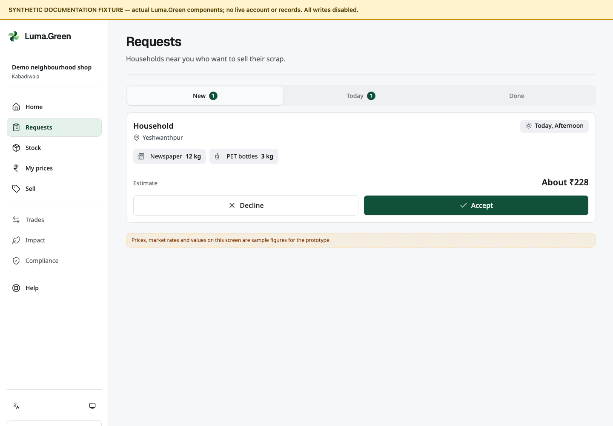

1. Open /app/requests.
2. Read each offered booking: area, estimated materials, time and collection mode.
3. Accept only if the shop can do the work. Use Decline when appropriate.
4. After acceptance, open the booking to see its permitted contact and address details.
5. Use the Today tab to find accepted work.
6. Open the accepted booking and use Start trip before travelling for a pickup. Open Weigh and pay when the material is ready.

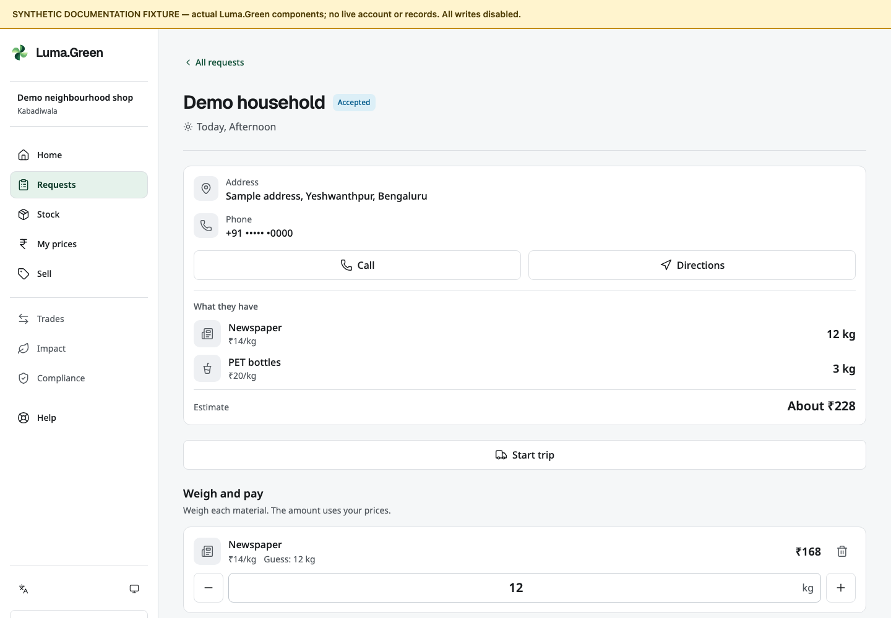

Only the assigned shop can accept or act on the booking. A request that expired or moved to another shop cannot be accepted from an old page. Read the current error or status and refresh the record if needed.

If accepted work cannot be completed, contact the household and support. The shop page has no accepted-booking release or cancellation-with-reason control. Do not leave the household waiting or record a false completion.

Avoid repeated taps while a request is being submitted. An offline screen does not prove that an action failed; reconnect and inspect the booking before trying again.

---

## 10 / Kabadiwala: weigh and pay

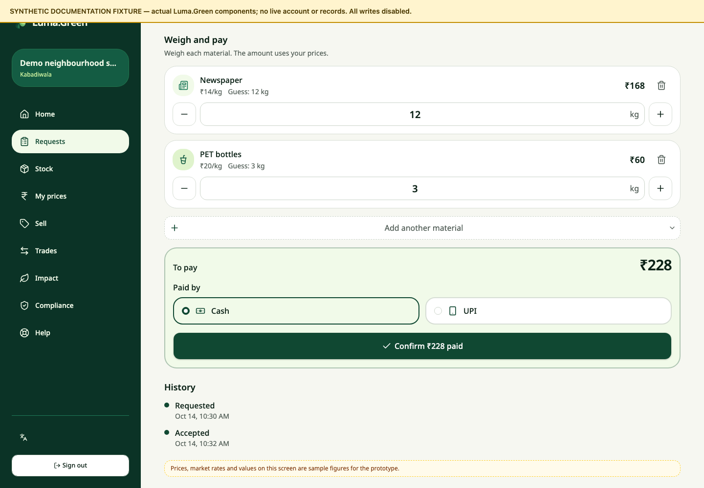

1. Open the accepted booking at /app/requests/[id].
2. Weigh each material on the shop's scale. Enter the actual quantity for that material.
3. Check the price and line total. Remove or correct material that was not supplied.
4. Read the total with the household. Resolve a disagreement before recording completion.
5. Pay the household in cash or UPI outside the platform.
6. Choose the payment method and record the payment information requested by the form.
7. Confirm completion once. Check the receipt and updated stock.

Luma.Green records the result. It does not make the cash or UPI transfer. A button labelled as a payment step must not be treated as bank confirmation.

The backend stores money in whole paise and mass in whole grams. The screen formats those values for the selected language. Review the displayed units before entering a number.

The final receipt is the record of that transaction. If a correction is needed after completion, contact the owner; do not silently alter another record to hide the difference.

---

## 11 / Kabadiwala: rate card and stock

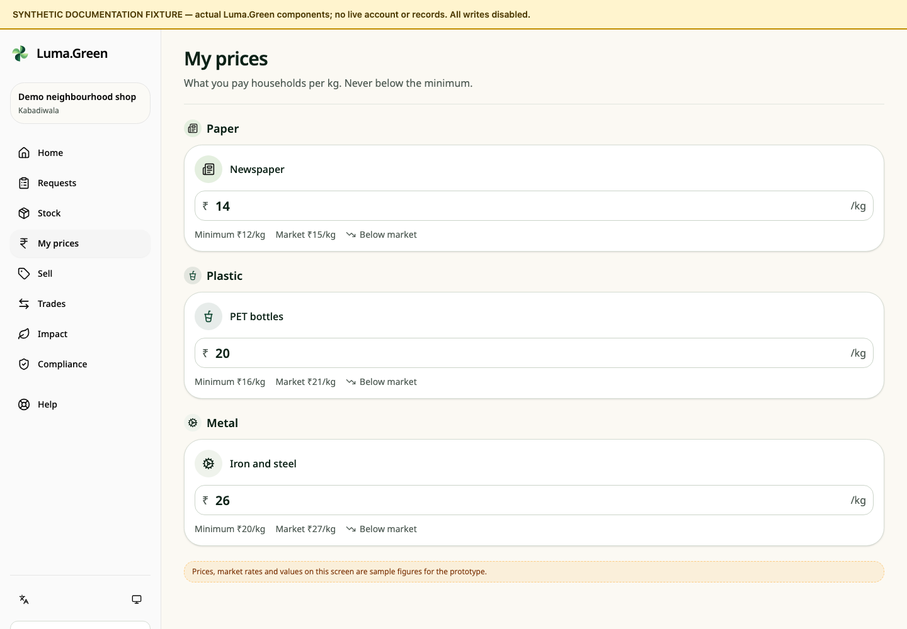

### Change a shop price

1. Open /app/prices.
2. Find the material and read the minimum price.
3. Enter the shop's price per kilogram. Keep it at or above the minimum.
4. Save the change and read the confirmation.
5. Check the updated row before leaving the page.

A fallback price applies where the shop has no custom rate. If the admin raises a minimum above a shop price, the backend can lift the stored shop rate to that minimum. Old receipts keep their earlier price.

### Check stock

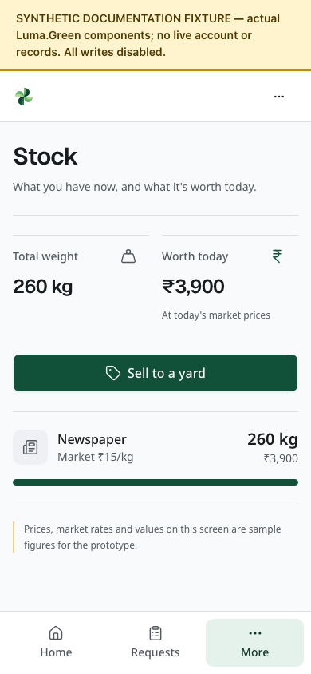

Open /app/stock to see recorded on-hand quantities and value. Completed pickups and trade movements update the records. Open the material chooser at /app/sell to see the quantity available to list. Reserved stock is not free stock; do not promise more than the available quantity.

To offer material onward, use /app/sell or the Sell action available to the role. To buy from a permitted supplier, use /app/market. The next chapter explains the common trade sequence.

---

## 12 / Business trade: buyer and seller

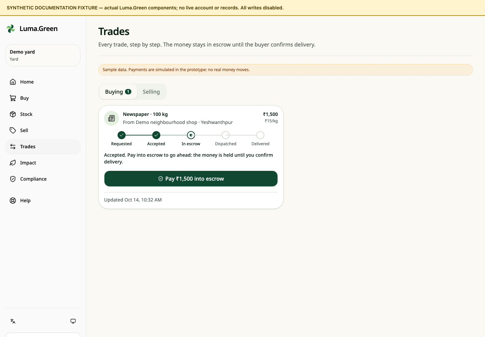

1. Seller: open /app/sell, select material, available quantity and asking price, add an optional note, then create the listing.
2. Buyer: open Market, choose a listing from an allowed supplier and inspect its material, available quantity and price.
3. Buyer: enter the requested quantity, review the offer and create the order.
4. Seller: open Trades, inspect the new order and accept or reject it as offered by the current state.
5. Buyer: complete the displayed demo payment step when it becomes available. This records a state only.
6. Seller: dispatch the material when the page offers Dispatch. Confirm the quantity and destination.
7. Buyer: check the delivered material and select Confirm delivery when the page offers it.
8. Both parties: inspect the completed trade and its receipt.

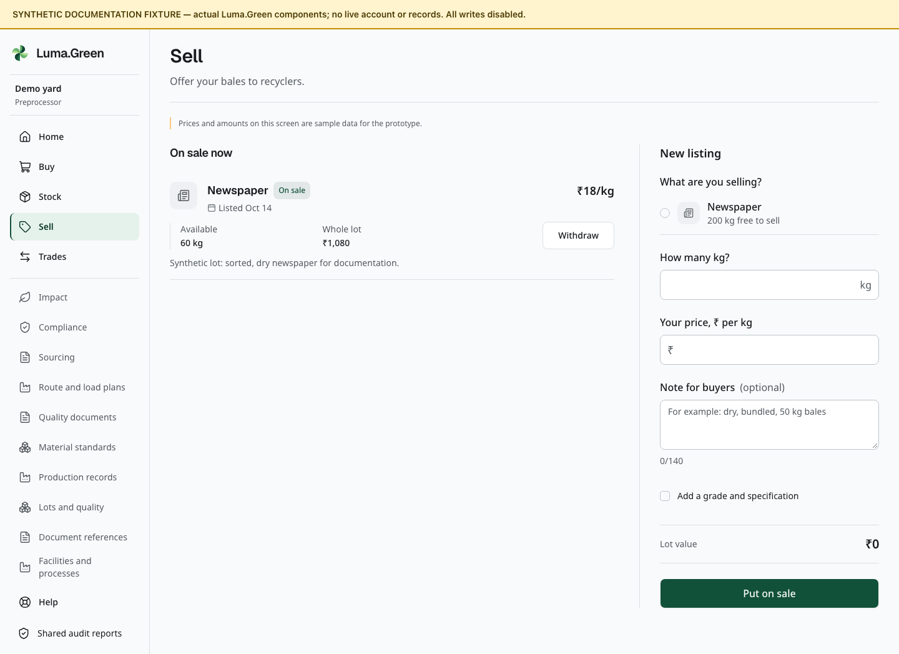

For an active listing you no longer want to offer, select Withdraw and confirm. Read the resulting listing state.

The sequence is state-driven. Only a permitted participant can use a transition. Stock is reserved and moved according to those transitions. Do not use screenshots as authority to skip an action in the current interface.

### Payment boundary

There is no live escrow or provider payment transfer. Adding payment keys does not turn the demonstration into a live payment service. Arrange real commercial terms outside this prototype until a reviewed payment implementation is released.

/app/trades/[id]/invoice is a printable trade receipt. It is not a GST tax invoice. It does not replace the supplier's required tax or transport documents.

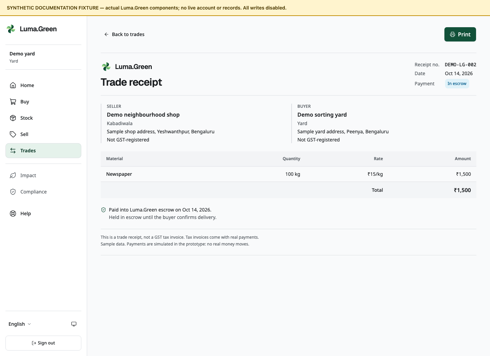

---

## 13 / Yard: buy, sort and sell onward

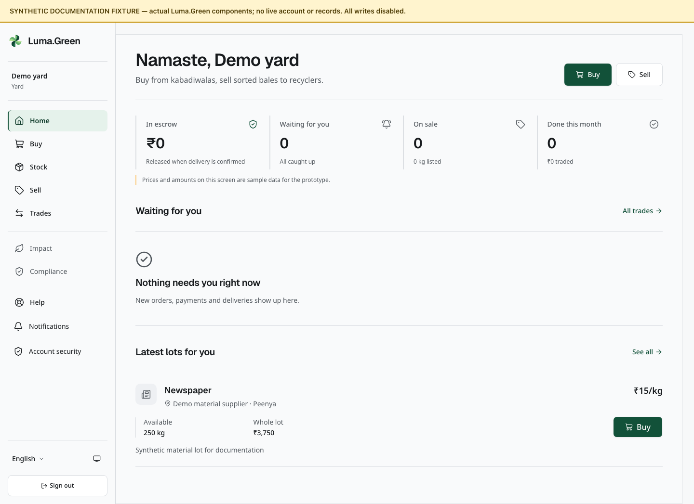

A yard buys from kabadiwalas and supplies material onward to recyclers. Its screens use the same stock and trade records as the rest of the chain.

1. Open /app/market to inspect stock from permitted upstream businesses.
2. Check material, quantity and supplier before placing an order.
3. Follow the trade sequence in chapter 12.
4. Inspect /app/stock after dispatch and receipt events.
5. Use /app/sell to offer available material to the next permitted part of the chain.
6. Use /app/trades to follow orders that need a decision or movement.

Physical sorting, grading and baling happen outside the app. The current interface does not provide a complete industrial processing or mass-balance production system. Do not describe a sorting activity as a recorded processing batch unless there is an actual record for it.

Keep documentary evidence required by the business outside the demo payment flow. Review the relevant Standards information before making a certification claim.

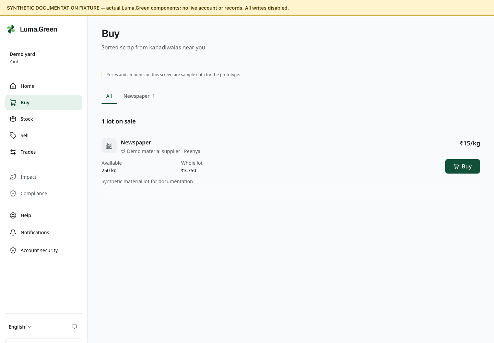

---

## 14 / Recycler: supply recovered material

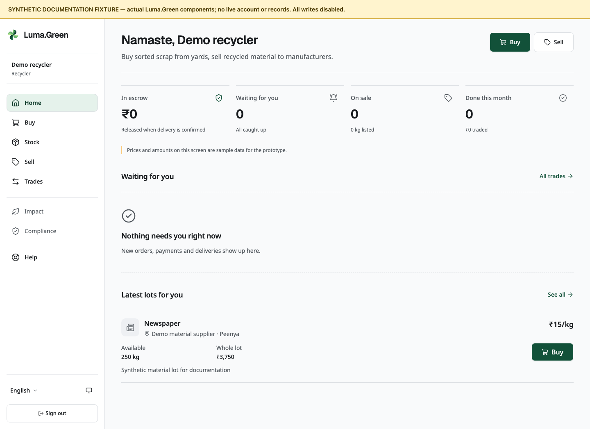

1. Open Home to see the role's summary.
2. Use Market to inspect available material from yards.
3. Use Trades to accept, dispatch or receive orders when the state allows it.
4. Use Stock to inspect recorded scrap and recycled-material groups.
5. Use Sell to offer available output to manufacturers.
6. Open /app/compliance and /app/impact where the role menu provides them.

There is no standalone Convert batch or Record processing run screen in this version. The guide does not infer one from the recycler role or from the fact that stock has several material groups.

Compliance totals depend on the recorded transactions. They are supporting information. Check the date range, categories and underlying receipts before using them in an external report. No automated regulatory filing is performed.

---

## 15 / Manufacturer: buy and review compliance

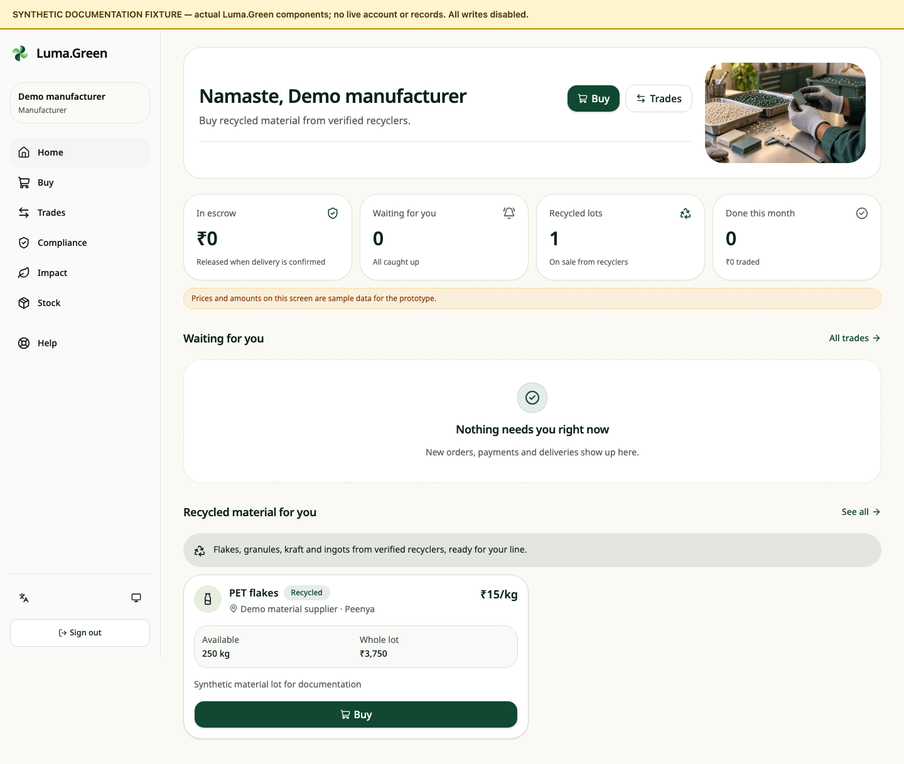

1. Open Market to inspect permitted recycled-material suppliers.
2. Check material, grade, quantity and price before placing an order.
3. Follow the trade state and receive the delivery only after the business checks it.
4. Open the printable trade receipt for the recorded transaction.
5. Open /app/compliance to inspect the recorded recycled-material and EPR information.
6. Check the displayed financial year and the transactions behind the total.

Manufacturers buy from recyclers; manufacturer selling is not supported in this version.

The platform supplies records, not a certification. It does not automatically file EPR returns, issue carbon credits or approve the business's environmental claims. The current payment path is still a demonstration.

Do not treat the trade receipt as a GST invoice. Obtain the actual supplier invoice and other required documents through the business's normal process.

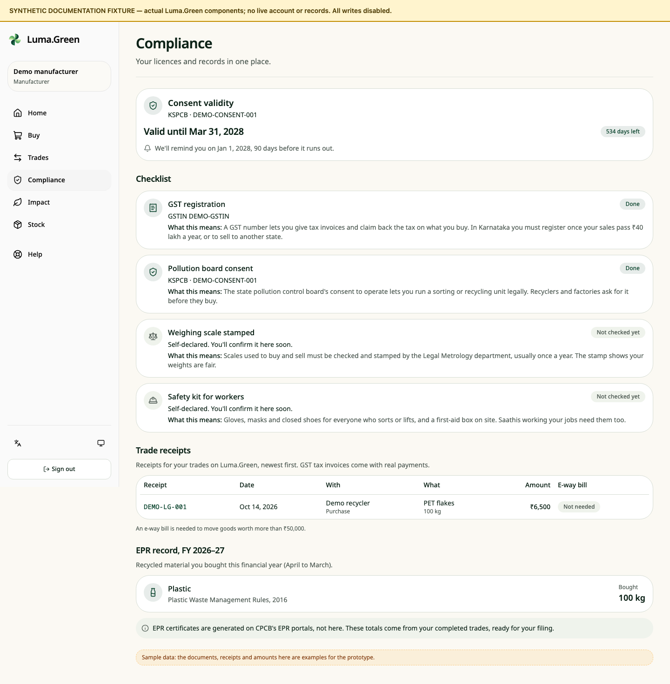

---

## 16 / Saathi: local work and earnings records

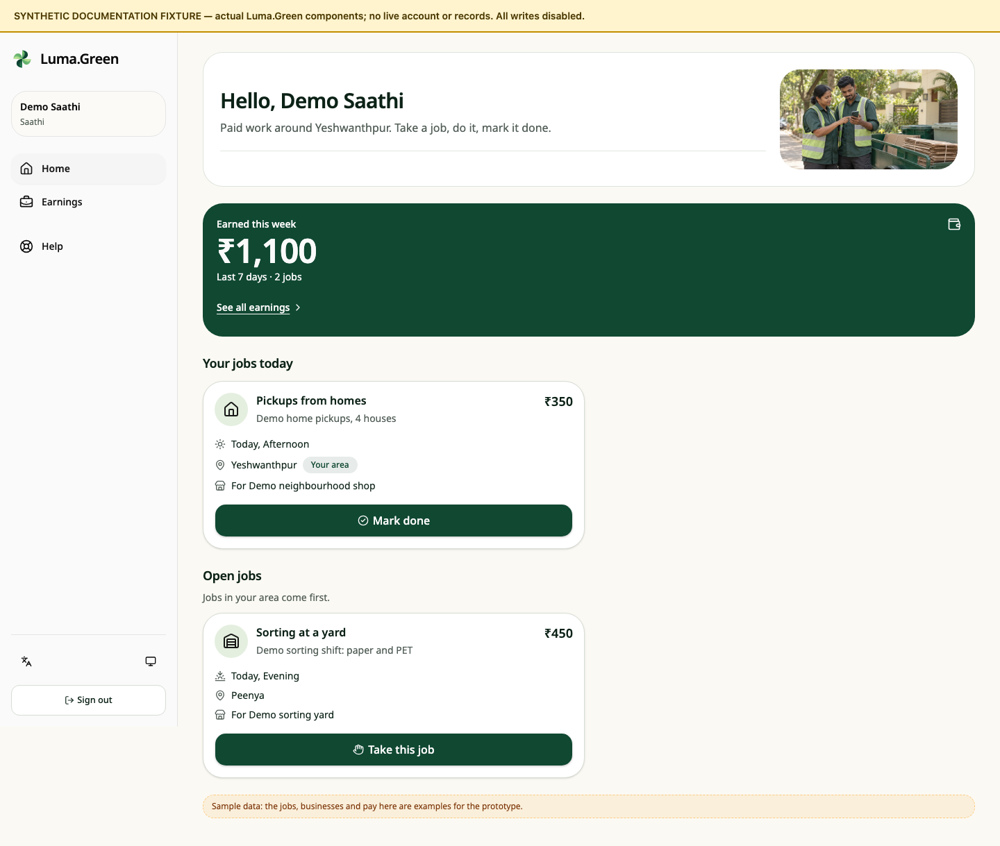

A Saathi is an approved worker who can take pickup, sorting or shift work offered by the platform's job flow.

1. Sign in with the approved Saathi phone number.
2. Open /app to view the job board.
3. Read the job's location, work, time and offered amount.
4. Accept only work you can attend.
5. Use the current job's action when the work is complete.
6. Open /app/impact to inspect the earnings record shown for the role.

Finish marks the job done and records that action. It does not call a payout provider. Confirm actual payment through the agreed payment method outside the platform.

The Saathi home is /app. There is no /app/saathi page. If an application is not approved, follow /join/status instead of trying to open another role's route.

---

## 17 / Admin: create access once

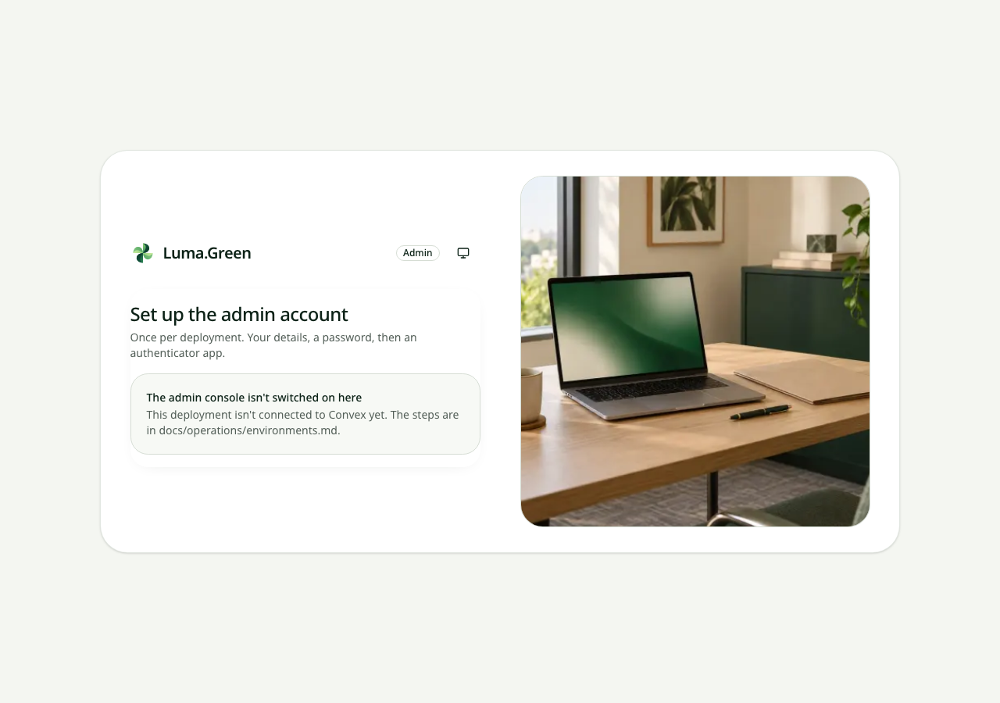

The system has one configured admin. There is no staff invitation screen. Phone sign-in never grants admin access.

1. Owner: confirm the intended frontend and Convex deployment.
2. Configure the backend authentication settings and the allowed ADMIN_EMAIL. Set that address only when ready to complete setup immediately.
3. Open /admin/setup.
4. Enter the full name, Indian mobile number, date of birth and only the last four Aadhaar digits.
5. Enter the configured email address. Set and confirm a password of 12-128 characters.
6. Select Create the admin account.
7. Scan the authenticator QR code or enter its key in an authenticator app.
8. Enter the current six-digit code and turn on the authenticator.
9. Save the one-time backup codes securely. Confirm that they are stored, then go to the console.
10. Sign out and test a normal sign-in.

Do not include a real password, authenticator key, QR code, backup code or identity file in a screenshot or this guide. Setup checks the configured email address; it does not prove mailbox ownership through a verification email. If an unexpected person claimed it, stop and use an owner-led recovery procedure.

---

## 18 / Admin: sign in and recover access

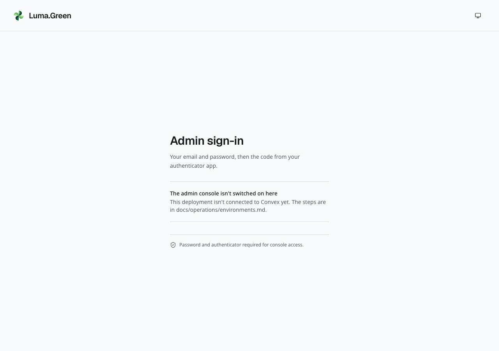

1. Open /admin/login on the intended deployment.
2. Enter Email and Password. Select Continue.
3. Enter the current authenticator code. Six digits can submit automatically.
4. If the authenticator is unavailable, select Use a backup code. Enter one unused code and select Sign in.
5. Use Start again to return to password entry.
6. Select Sign out when finished, particularly on a shared device.

Admin sessions last at most 12 hours. Activity does not extend that limit. The console is English-only and has no locale prefix.

If setup was interrupted, reopen /admin/setup and complete the remaining profile or authenticator step. If signed in as a phone member, sign out before starting admin setup.

No password-reset screen, recovery-email workflow, staff invitation or backup-code management screen is implemented. If the password is lost, or neither an authenticator nor an unused backup code is available, arrange owner-led recovery. A backup code replaces the authenticator step, not the password. Changing ADMIN_EMAIL is not a safe way to invite another operator.

---

## 19 / Admin: daily overview

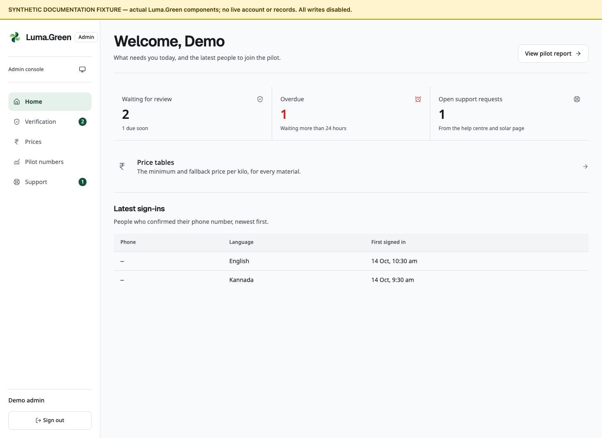

Open /admin. Check Waiting for review, Overdue and Open support requests. Use the console navigation to open Verification, Prices, Pilot numbers or Support.

1. Process the oldest submitted applications first.
2. Treat 18 hours as due soon and 24 hours as overdue.
3. Check applications returned for changes in With the applicant.
4. Review support requests and the current reference prices.
5. Review current booking outcome totals and the count sent to another shop. Investigate individual cases through the operator workflow or an authorised backend review.

The Latest sign-ins list reflects first profile creation, not a complete login audit. The summary counts and queue reads are bounded for the pilot. They are not unlimited exports.

The console does not include a maintenance switch, staff invitation, suspension/reinstatement action, SMS resend tool or a report export button. Older plans that mention those actions are not instructions for this version.

---

## 20 / Admin: review an application

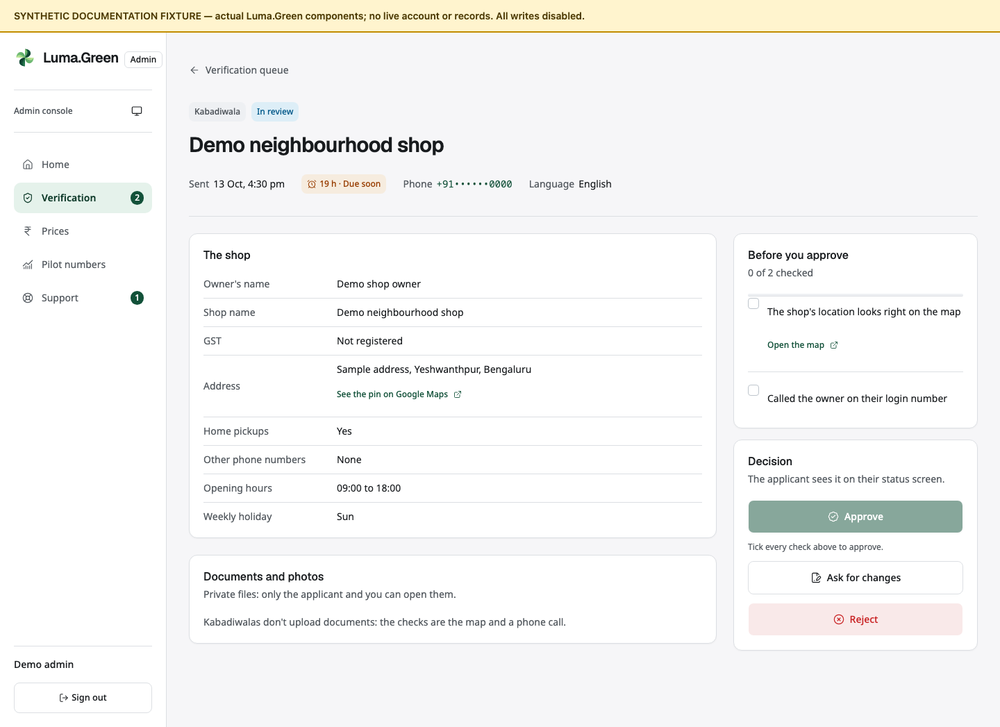

1. Open /admin/verification. Select Review on a submitted application.
2. Check the applicant, role, phone, language, submission time and version.
3. Inspect the form, files and any changes from a previous submission.
4. Complete the role checklist below.
5. Choose Approve, Ask for changes or Reject.
6. Read the confirmation and enter a note if required.
7. Confirm once, check success, then return to the queue.

| Role                       | Manual checks                                                                                                                                         |
| -------------------------- | ----------------------------------------------------------------------------------------------------------------------------------------------------- |
| Kabadiwala                 | Check map location; call the login number; GSTIN, if supplied, must be active and match the business                                                  |
| Yard/recycler/manufacturer | Check active matching GSTIN if supplied; valid consent matching business, address and activity, or checked exemption; working-unit photos; call owner |
| Saathi                     | Readable ID; matching name; masked Aadhaar if used; selfie match; call applicant                                                                      |

Approve becomes available after every checklist item is ticked. Checklist ticks are temporary page notes; they are not stored as an evidence checklist. Decisions are recorded in the audit trail. Change and rejection notes must contain 5-1,000 trimmed characters.

Already decided applications show status. There is no reopening or suspend button. Approved kabadiwalas start with fallback prices.

---

## 21 / Admin: reference prices

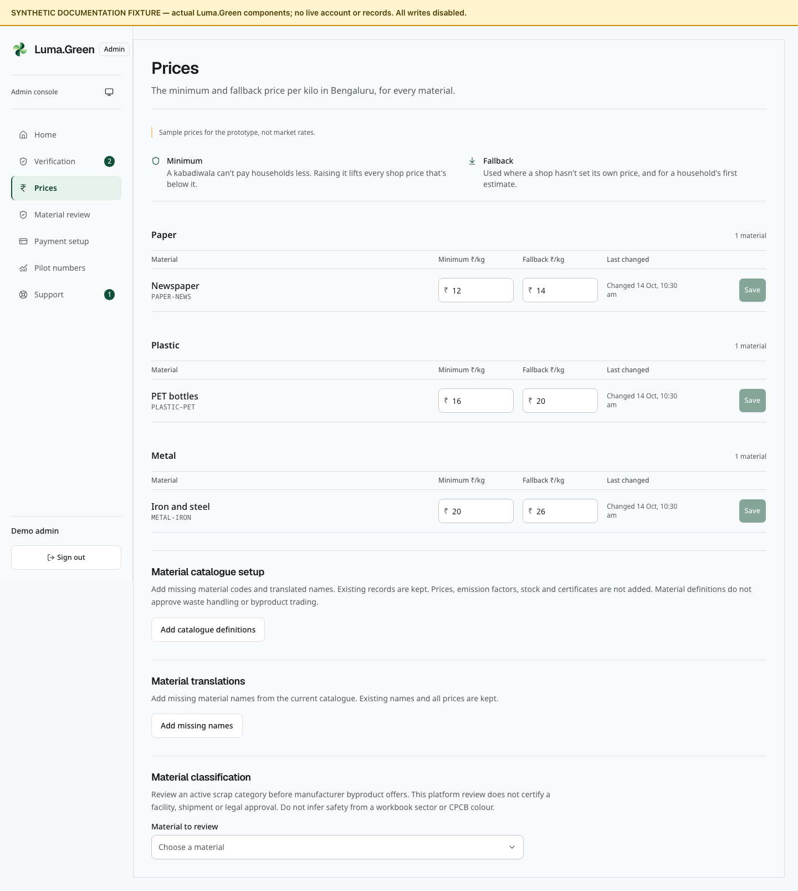

Open /admin/prices. The screen is fixed to Bengaluru and identifies its values as prototype sample prices. The owner must validate launch prices.

1. Find the material row.
2. Enter Minimum and Fallback in rupees per kilogram.
3. Check that both are positive and the minimum does not exceed the fallback.
4. Use at most two decimal places; the maximum is 10,000 rupees per kilogram.
5. Select that row's Save. Read the confirmation and any count of shop rates raised.
6. Use Undo only to discard unsaved edits.

Raising a minimum can raise stored shop rates below it. This operation has pilot query bounds; it is not an unlimited bulk rewrite. Fallback prices apply where a shop has not supplied its own rate and to the first household estimate. Old receipts keep their original values.

Add missing names fills missing catalogue names from the bundled translations. It preserves existing names and prices. It is not an online translation service. There is no city selector or price-history export control.

---

## 22 / Admin: pilot numbers

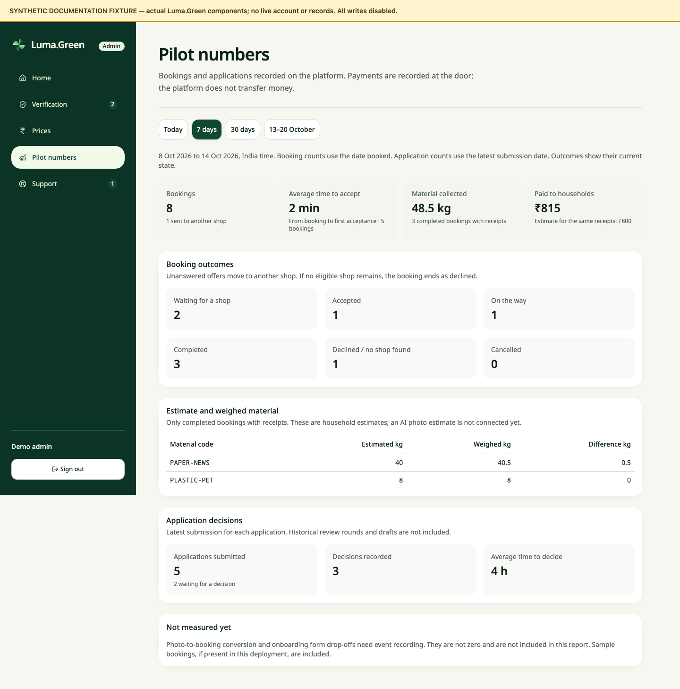

Open /admin/pilot. Choose Today, 7 days, 30 days or the fixed 13-20 October 2026 pilot period. Read the displayed date range in India time.

1. Check whether Partial report is shown. Choose a shorter period if it is.
2. Review booking count, reassignment count and average acceptance time.
3. Review collected kilograms and recorded payments.
4. Compare estimated and weighed kilograms for completed bookings with receipts.
5. Review booking outcomes and application decisions.

### Read the charts

The Booking outcomes chart compares the six current booking states. Read the
counts beside the chart for exact values. A zero count has no visible bar.
The Estimate and weighed material chart compares the two weights for each
material code. The table below gives the same values in kilograms.

Hover a bar to read its tooltip. The written counts and table are also available
without a mouse. The charts use records from the selected report period. They do
not create a price history or show a trend over time. If a report has no bookings
or material rows, the related chart is not shown.

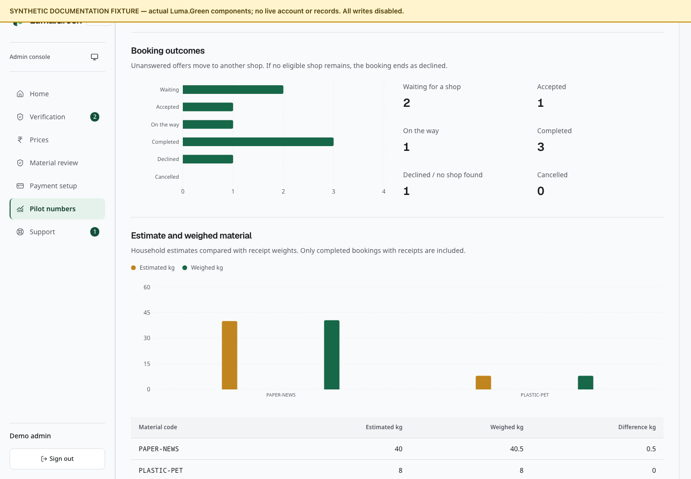

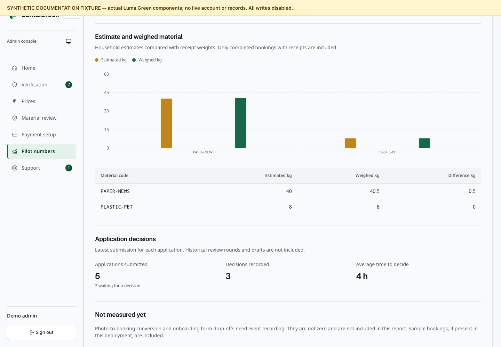

### What these numbers mean

Bookings are selected by date booked. Applications are selected by their latest submission date. Outcomes are the current record state, not a historical snapshot at the selected end date. The report reads at most 1,000 bookings and 1,000 applications; the backend accepts a maximum 31-day range.

Recorded payment is not proof of a provider transfer. Demo rows are included if present in the deployment. Drafts and previous review rounds are not complete application-funnel counts. The report does not measure photo-to-booking conversion, form abandonment or original AI accuracy. A basket weight can have been edited manually.

There is no CSV or PDF export control on this page. This user guide does not add one.

---

## 23 / Admin: support and private files

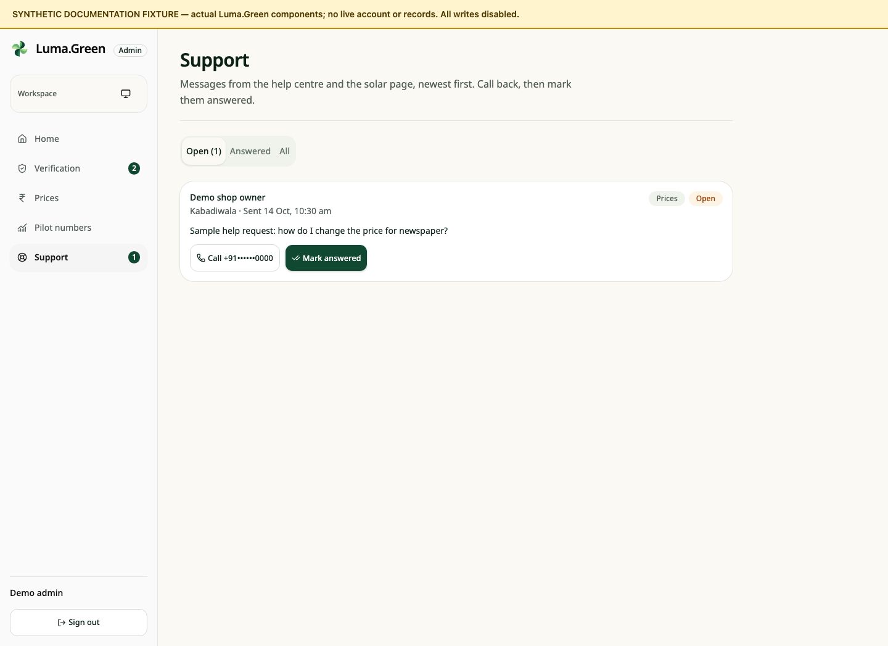

### Support inbox

1. Open /admin/support.
2. Select Open, Answered or All.
3. Read the requester, topic, role, message and time.
4. Use Call to open the device's telephone handler, then handle the conversation outside the app.
5. Select Mark answered after the matter is handled. Check the Answered tab.

The inbox includes help and solar enquiries and reads the newest 200 records. Mark answered changes the status only. It does not send an email or SMS. There is no reply composer, internal note, assignment, reopen or delete control.

### Private files

Use the application's image/PDF preview. Select Load the video before a video is fetched. Open or Download only when necessary. A valid session and permission are required on each file request. If the session has ended, sign in again. For a network error, use Try again.

Store downloaded identity documents only in an approved secure location. Do not add them to Git, this guide, a public support thread or a screenshot set. Temporary browser preview caching is not a document archive.

---

## 24 / Help, contact and training

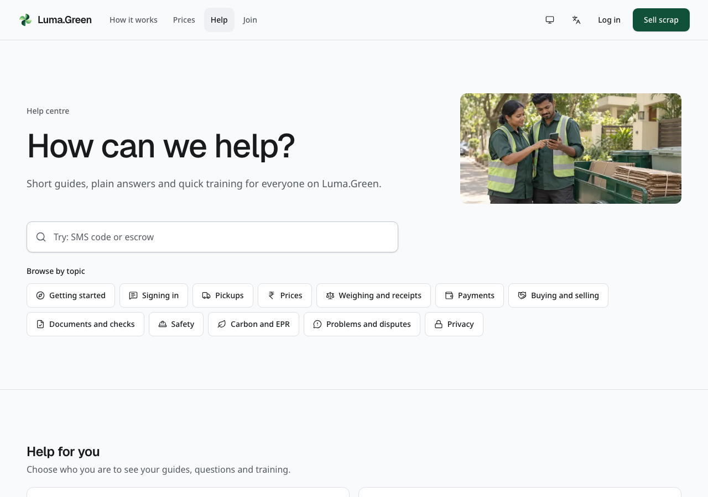

1. Open /help and search for the task or problem.
2. Filter by topic or choose your role.
3. Open a guide and follow its steps.
4. Use /help/contact if the guide does not solve the problem.
5. Enter the requested contact information and a clear message. Submit once and read the result.

Training completion is stored in this browser's local storage. It is not a certificate and does not automatically follow the account to another device. Clearing browser data can remove the mark.

The current Call and WhatsApp number is a placeholder: +91 80 0000 0000. It is not an active support number. The owner must replace it before launch. When connected, the contact form creates a support request; it does not prove that a person has replied or that an SMS/email was delivered.

---

## 25 / Standards, impact and rooftop solar

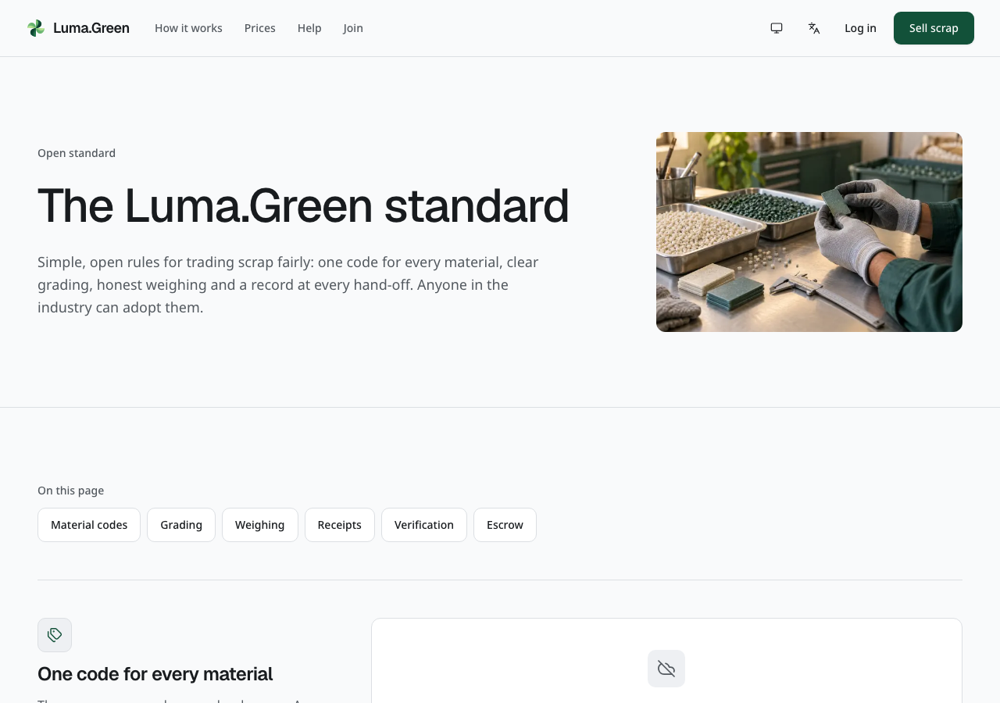

Use /standards for information about the material chain and industry schemes. Check the relevant official scheme before making an external claim. A platform record does not itself certify a business or issue a credit.

Use /app/impact for the summary available to your role. Keep recorded collection quantities, estimated impact and verified carbon credits separate. Carbon-credit issuance, trading and retirement are later product work.

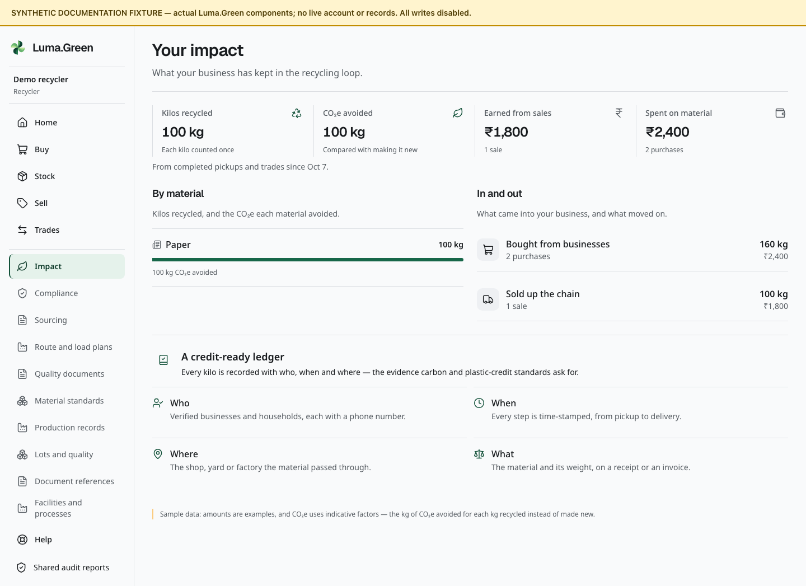

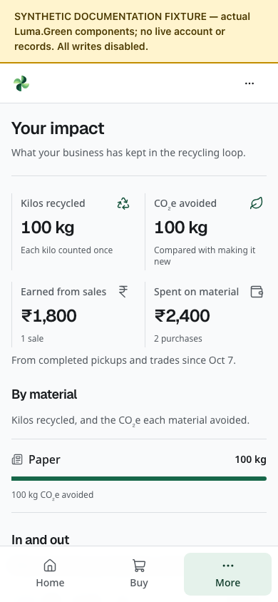

Use /solar to explore the rooftop-solar information and estimator. Treat estimates as planning inputs, not an installation quote or guaranteed return. Send an enquiry through the form if enabled. It enters the support workflow; no installer booking, finance approval or electricity connection is completed by that form.

The platform does not replace business compliance advice, physical inspection, product testing or a supplier's official documents.

---

## 26 / Mobile and desktop apps

The repository contains an Expo/React Native shell for Android and iOS and an Electron shell for macOS and Windows. They use the same hosted operational UI and backend. Signed, installable releases and store acceptance are still release tasks.

### When an approved release is available

1. Install the signed app from the owner's approved distribution channel.
2. Open the app and sign in to the correct service.
3. Grant camera or location access only when needed for the current task. If location is denied, use the form's available manual choice.
4. On desktop, choose an existing photo; direct camera capture is not enabled.
5. Follow a browser handoff for admin pages or private documents when requested. The external browser can require a separate sign-in.
6. If disconnected, restore the connection and inspect the current record before repeating an action.

Hosted website changes can update the shared UI. Compatible signed JavaScript updates and desktop updates have separate release paths. Mobile shell updates can apply at a later cold start; an immediate restart requires a choice. Desktop updates can install on normal quit or through the offered restart action. Select Later while a form is in progress. New native capabilities can still require a binary or store update; permanent freedom from updates is not promised.

There is no offline write queue, background location service or independent native ledger. A mobile JavaScript export is not an APK or IPA installer.

### Local desktop demonstration

The separate Luma.Green Demo app is available as an unsigned Apple Silicon Mac
build and a Windows x64 folder. Windows execution still needs a Windows test.
Start the built website on the same computer with `pnpm exec next start --port
3004`, then open the demo app. Copy the entire Windows folder, not only its EXE.
The app loads localhost:3004; it does not contain an offline copy of the website.

Rebuild with `pnpm --filter @luma/desktop demo:pack:mac` or
`pnpm --filter @luma/desktop demo:pack:win`. Demo cookies are separate from the
production app. Updates are disabled in the demo profile. It does not bypass
sign-in or make a disconnected backend work. Show public pages first; use only
an approved test backend and test account for protected workflows.

### Android and iOS demonstration

Run `pnpm --filter @luma/mobile demo:ios --check` or
`pnpm --filter @luma/mobile demo:android --check` to check the local web origin.
Omit `--check` to start Metro for an installed development build. iOS simulator
uses localhost; Android emulator uses 10.0.2.2 to reach the computer.

A real device needs a tested HTTPS origin, the matching development build and
native tools or an approved EAS build. Set EXPO_PUBLIC_APP_ORIGIN before building
and launching; then use `pnpm --filter @luma/mobile demo:device`. The app cannot
assume that any Expo Go installation contains its native modules. Full Xcode is
required for local iOS builds; Android needs the supported JDK and Android SDK.

This machine exported both JavaScript bundles and tested the launcher. It did
not produce an APK or IPA, and no phone or simulator acceptance was completed.
See apps/mobile/README.md and docs/operations/app-releases.md for build, signing
and device checks.

---

## 27 / Troubleshooting

| What you see                      | What to do                                                                                                          |
| --------------------------------- | ------------------------------------------------------------------------------------------------------------------- |
| Code-entry preview                | You can inspect the phone and code screens. The owner must connect auth/SMS before verification works.              |
| Admin console is not switched on  | Check the frontend/backend setup; no admin action can fix a missing connection from this screen.                    |
| SMS code is late                  | Check the number and resend timer. Avoid repeated sends. Check provider acceptance and handset delivery separately. |
| Code expired or attempts used     | Follow the screen to request a new code after the permitted delay.                                                  |
| Protected page redirects          | Sign in again; confirm that the correct role is approved.                                                           |
| Application requests changes      | Read the note, correct the specified fields and resubmit.                                                           |
| Booking cannot be accepted        | It may have expired or been reassigned. Read the current status.                                                    |
| File will not open                | Confirm session and permission; use Try again, or the browser/desktop path.                                         |
| Price cannot be saved             | Check units, decimal places and the minimum/fallback rule.                                                          |
| Pilot report is partial           | Select a shorter date range. Do not use a truncated total as complete.                                              |
| Payment button did not move money | Business payment steps are demonstrations; household payment happens outside the app.                               |
| App shows an update               | Finish or save your work, then use the offered restart action.                                                      |

For an uncertain submit, reconnect and inspect the record first. Do not repeatedly create a booking, trade or payment record. Provide the route, visible status, time and non-sensitive record identifier when reporting a fault. Never send passwords or recovery codes.

---

## 28 / Owner launch and account checklist

This is an owner/developer checklist, not a list of admin console buttons. The exact environment names and release commands live in the repository runbooks.

| Service or task     | Required setup                                                                                       |
| ------------------- | ---------------------------------------------------------------------------------------------------- |
| Hosting and domain  | Intended HTTPS origin; frontend deployment; NEXT_PUBLIC_SITE_URL                                     |
| Convex              | Correct deployment and URLs; deployment-specific keys; schema/functions deployed before dependent UI |
| Authentication      | SITE_URL, BETTER_AUTH_SECRET and ADMIN_EMAIL in the intended backend; immediate admin setup          |
| Phone SMS           | MSG91 account, DLT/template approval and OTP limits; configured OTP values                           |
| Optional status SMS | Separate approved Flow templates and outbox configuration; verify handset delivery                   |
| Analytics/errors    | Optional PostHog, GA4 and Sentry projects; telemetry switch, service keys and provider settings      |
| Search ownership    | Optional Google Search Console and Bing ownership tokens; deployed sitemap submission                |
| Optional AI         | OpenRouter credentials or authenticated HTTPS model gateway; quotas and evaluated model              |
| Android/iOS         | Expo/EAS project, Apple/Google developer accounts, signing credentials and physical-device checks    |
| macOS/Windows       | Stable signing identities, notarization where required and signed update feeds                       |
| Support and prices  | Real contact details; verified pilot prices; staffed review/support process                          |
| Operations          | Measured backups and restore drill, provider cost limits and incident procedure                      |

Use docs/operations/launch-checklist.md, app-releases.md, low-cost-operation.md and sms-notifications.md. Keep secrets outside Git and the guide. AUTH_DEV_MODE belongs only to a development or preview environment.

A branch push is not deployment. A build is not provider approval. A provider accepting a message is not proof that a handset received it. Test each boundary before opening the pilot.

---

## 29 / Route reference

| Area                   | Routes                                                                                             |
| ---------------------- | -------------------------------------------------------------------------------------------------- |
| Public                 | /, /how-it-works, /participants, /prices, /contact                                                 |
| Household              | /sell; /t/[token]                                                                                  |
| Sign-in                | /login; /login/verify                                                                              |
| Onboarding             | /join; /join/kabadiwala; /join/yard; /join/recycler; /join/manufacturer; /join/saathi              |
| Onboarding documents   | /join/[business]/documents; /join/status                                                           |
| Role home and requests | /app; /app/requests; /app/requests/[id]                                                            |
| Stock and prices       | /app/stock; /app/prices                                                                            |
| Business trade         | /app/market; /app/sell; /app/trades; /app/trades/[id]/invoice                                      |
| Reporting              | /app/impact; /app/compliance                                                                       |
| Help                   | /help; /help/[role]; /help/[role]/[guide]; /help/contact                                           |
| Reference/enquiry      | /standards; /solar                                                                                 |
| Admin access           | /admin/setup; /admin/login                                                                         |
| Admin work             | /admin; /admin/verification; /admin/verification/[id]; /admin/prices; /admin/pilot; /admin/support |

Replace bracketed parts with the real record, role or guide value. They are not literal links. User-facing routes support locale prefixes such as /kn, /hi and /ar. English normally uses no prefix. Admin routes never use a locale prefix. Unknown routes show a not-found page.

App routes have no organisation slug. In particular, do not use /app/[org]/stock, /app/saathi, /sell/estimate or /sell/book from older plans.

---

## 30 / Glossary and working rules

| Term           | Meaning in this platform                                                 |
| -------------- | ------------------------------------------------------------------------ |
| Kabadiwala     | A local scrap shop that buys from households                             |
| Yard           | A bulk sorting/preprocessing business                                    |
| Saathi         | An approved worker who takes local jobs                                  |
| Minimum        | Lowest permitted shop price for a material                               |
| Fallback       | Reference price where a shop has no custom rate                          |
| Estimate       | A starting quantity/value that must be checked                           |
| Receipt        | Recorded material, weight, price and transaction details                 |
| Reserved stock | Quantity committed to an active trade                                    |
| EPR            | Extended Producer Responsibility; platform records can support reporting |
| Escrow         | Planned holding of business payments; simulated in this version          |
| TOTP           | Time-based code from an authenticator app                                |
| Partial report | A bounded report that did not include every matching record              |

Check the material, unit, quantity and price before you confirm an action. Keep real payment confirmation separate from a recorded payment state. Use the correct account and deployment. Preserve private files and recovery codes. Resolve errors through a correcting operation that keeps the audit history.

---

## 31 / Screenshot reference: prices and solar

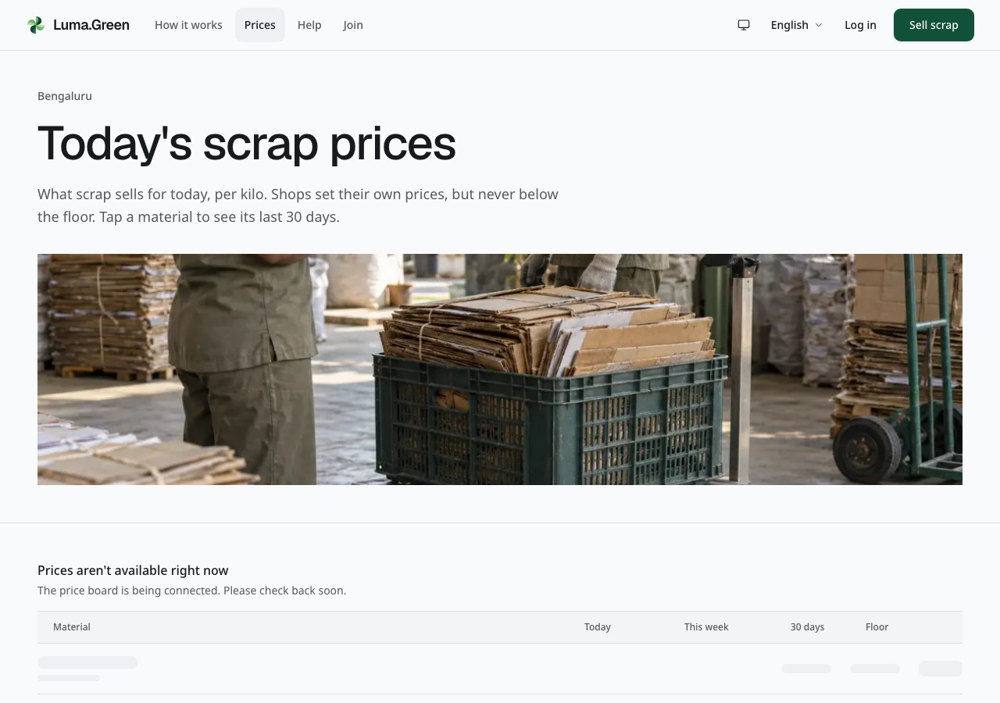

Open /prices before comparing a shop offer. When data is available, choose a material to inspect its price detail and history. Check the city, unit and sample-data notice. This board is not independent market-price advice.

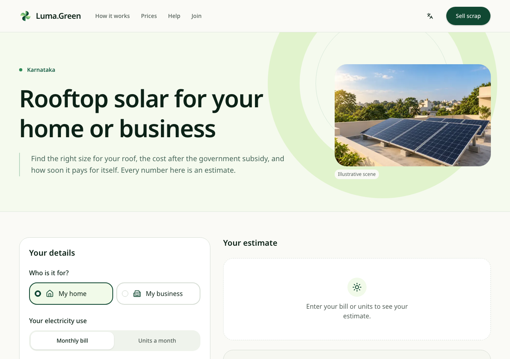

---

## 32 / Screenshot reference: language and contact

Use the header language control to change language. The same workflows remain available; text direction and number formatting follow the locale. The admin console stays English-only.

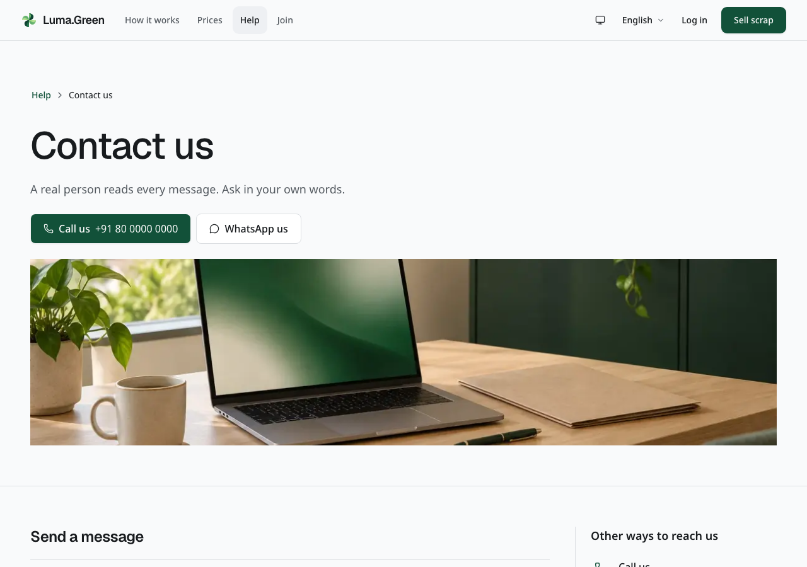

---

## 33 / Screenshot reference: chain and review queue

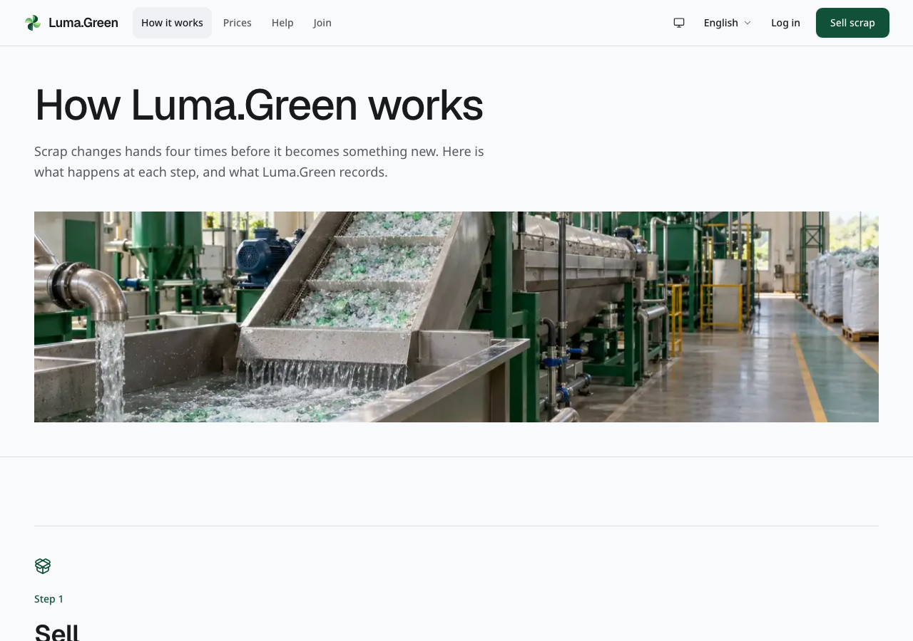

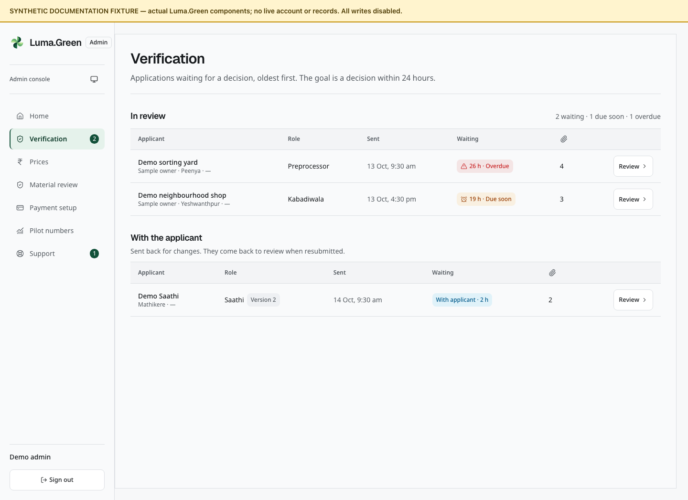

The queue is an example of the current interface. It does not establish that a real application has been reviewed or approved. Follow chapter 20 for the decision process.

---

## 34 / Optional analytics and error reports

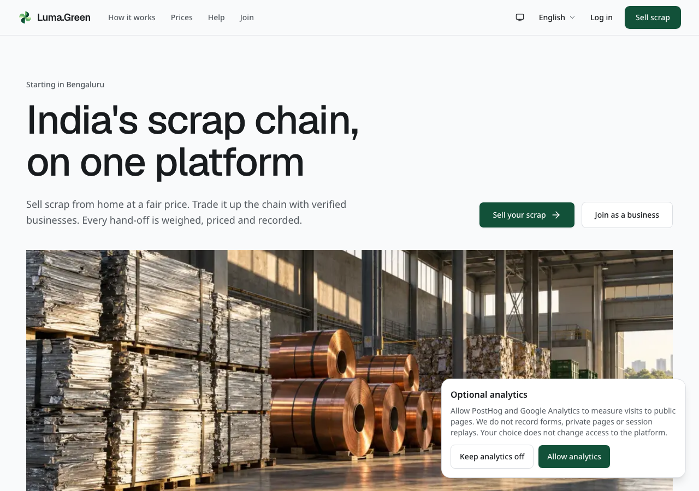

When the owner enables analytics, public information pages show Optional analytics. Select Allow analytics to enable PostHog and Google Analytics page-visit measurements, or Keep analytics off to continue without them. Both choices keep the platform available. Use Analytics settings to change the choice later. A successful change from allow to off reloads the page to remove loaded analytics scripts.

The choice stays on this browser/device. A blocked storage message means the choice could not be saved and analytics stay off in the current visit. Retry when storage is available. A different device or cleared browser storage needs a new choice.

---

## 35 / Analytics privacy, errors and owner setup

Only the home, how-it-works, participants, prices, standards, solar and help landing pages are measured. Sign-in, booking, tracking, onboarding forms, the business app and admin pages are excluded. Events omit query strings, tracking tokens, customer records, form text and full referrers. Session replay, autocapture and user profiles are off. These limited page counts do not replace the admin pilot report.

### Error reports and owner settings

Sentry error reports are separate from optional visit analytics. When the owner configures Sentry, it receives error types and scrubbed code locations. Reports remove error messages, request details, user data and breadcrumbs. Performance tracing and replay are off. If the application shows its general failure screen, use the retry control; it does not submit the failed operation again automatically.

The general failure screen uses the same appearance and translated retry control. Its safe retry and accessibility behavior are covered by tests. This guide does not include a forced-failure browser capture.

The owner supplies the telemetry switch and each service key in the web deployment, then rebuilds it. GA4 Enhanced Measurement must be switched off in the property settings. Do not install a second tag through Google Tag Manager. Use docs/operations/observability.md for exact settings, tests, and spend controls. Empty keys keep services disabled. Browser/Next.js Sentry setup does not capture Convex backend or native-shell errors.

Google Search Console and Bing verification tags are optional ownership checks. Configure their tokens, deploy, verify ownership and submit sitemap.xml. These tags do not collect visit analytics and do not prove search indexing. See docs/operations/seo.md. Existing language alternates, canonical URLs and private-page noindex rules remain in place.

---

## 36 / Appearance and role pages

The interface uses neutral light surfaces and charcoal dark surfaces. Green marks
the main action and selected states. Public pages have wider spacing; workspaces
keep records and controls closer together. Buttons, form fields and panels use
consistent shapes across roles. Read the text label before selecting an icon.

Geist supplies the large display headings. Noto supplies body text and the script
fallbacks for all twelve languages. The language control changes text, direction
and number formatting; it does not change access or stored records.

Use Appearance in the header or workspace controls to select Light, Dark or
System. System follows the device setting. Your selection stays in this browser
when browser storage is available. It does not change another person's account
or device. Admin and public pages use the same local preference.

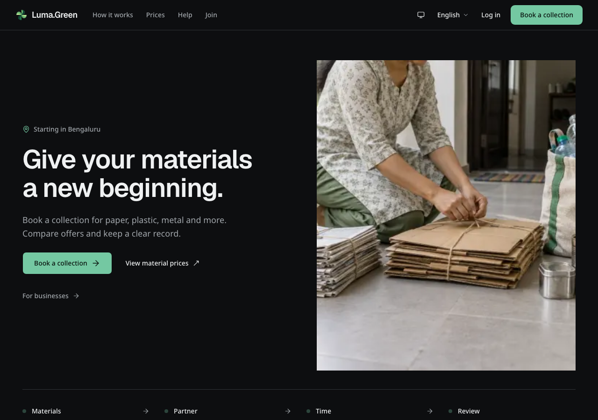

The desktop header shows the main navigation links. On a phone, open the menu
for links and sign-in. The language and appearance controls remain in the header.
Use the page's Sell scrap, Join and help links to open a workflow.

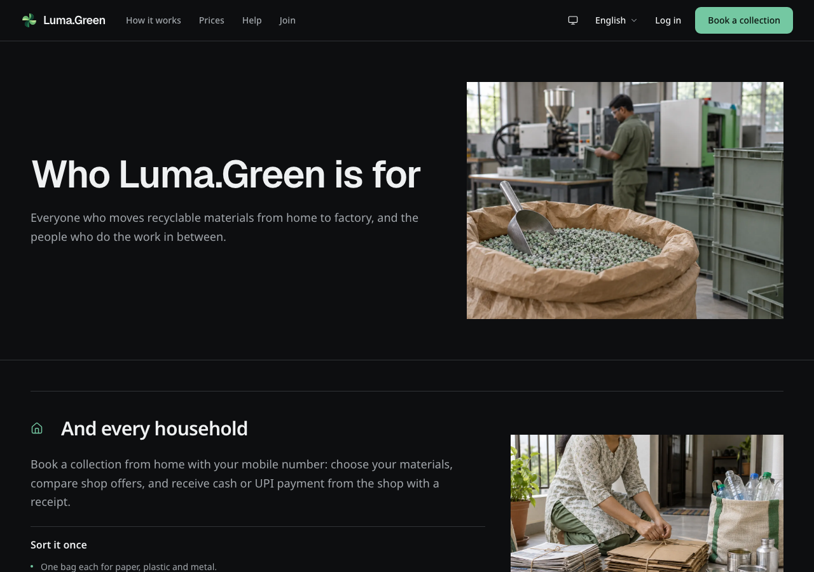

The Participants and role-help pages explain each role with work scenes and
written guidance. There are no phone or laptop mockups. The generated photos
provide context; they are not evidence of actual staff, facilities, customers,
safety certification or operational results. Tables and transaction records
remain the source for operational activity.

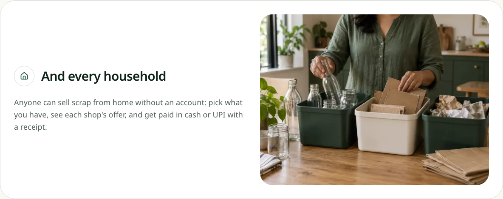

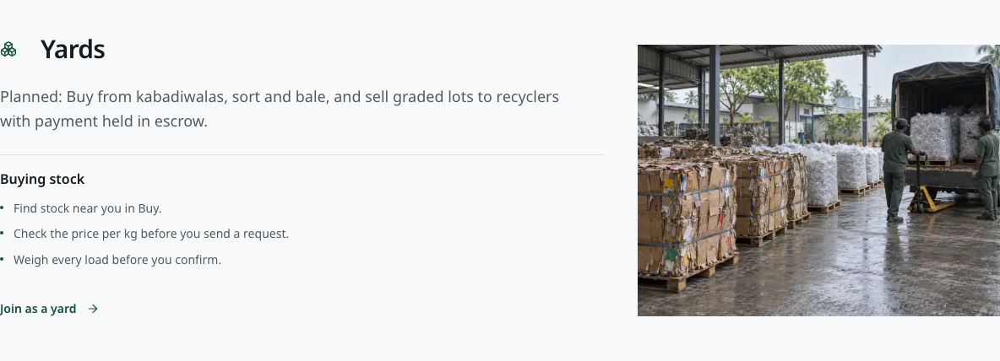

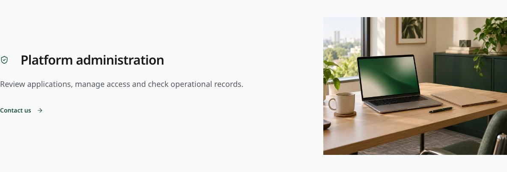

On a role-help page, use the links at the top to jump to guides, questions or
training. Decorative images do not sign you in or create a record. Reduced
motion settings stop the decorative scroll effects.

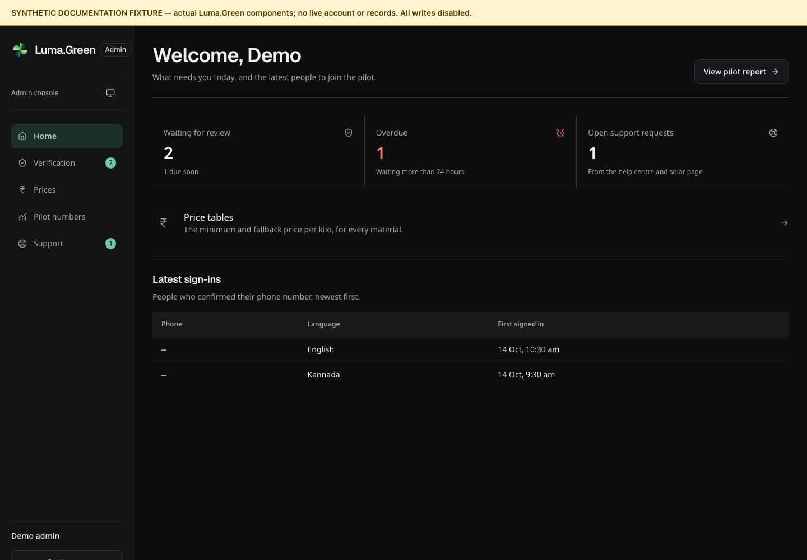

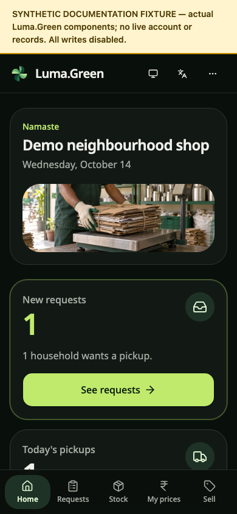

---

## 37 / Evidence and maintenance

The editable repository source is docs/user-guide/guide.md. The maintained Word document is output/docx/luma-green-user-guide.docx. The old PDF is an archived edition. Screenshots and their capture manifests live with the source. The repository README in that folder gives capture and rebuild commands.

The guide is based on the current route files, operational components, Convex functions and the native release runbooks. Primary owners include src/components/sell, app, market, saathi, join and admin; convex/households.ts, review.ts, adminPrices.ts, pilot.ts and support.ts; and docs/operations/app-releases.md.

Screenshots are retained as browser-produced PNG files. Public capture metadata records the route, capture time, Git revision and image hash. Protected-screen fixture metadata records the component and sample-data boundary. All guide figures were captured from the current build or its actual components. Replace protected-screen fixtures with authenticated captures when an approved staging environment is available; retain the evidence distinction until then.

### Required update procedure

When a route, role, permission, workflow, visible control, setup requirement or app update behavior changes, update the matching chapter. Re-capture changed screens with synthetic or approved test data. Update the capture metadata. Rebuild the Word document, check every rendered page, and commit source, screenshots, build record and Word document together. Once the Google Drive connection and document import are set up, update the same Google Docs document and retain its existing sharing settings and link. A UI commit alone does not automatically update an external document.

Do not silently substitute a mock for an authenticated screenshot. Do not claim provider delivery or account approval from a fixture. Keep the chapter's current limitations until a real verification record replaces them.
